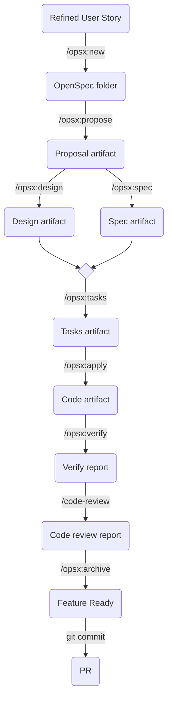
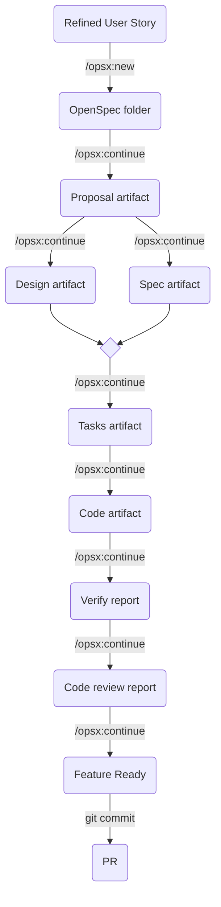

# Openspec Demo

[](https://github.com/sjexpos/openspec-demo/releases/latest)
[](https://github.com/sjexpos/openspec-demo/actions?workflow=CI)
[](https://codecov.io/gh/sjexpos/openspec-demo)
[](https://github.com/sjexpos/openspec-demo/issues)
[](https://github.com/sjexpos/openspec-demo/commits)

[](https://hub.docker.com/r/sjexpossdd/openspec-demo)
[](https://hub.docker.com/r/sjexpossdd/openspec-demo/tags)


## 📋 Overview

This repository is a demo to learn OpenSpec framework and IA Agents. The application is a microservice which handles products in a cannabis e-commerce.

### 🏗️ Architecture

The system follows **Domain-Driven Design (DDD)** principles with a clean, layered architecture:

```
┌─────────────────────────────────────────────────────────┐
│                    Presentation Layer                   │
│  ┌───────────────────────────────────────────────────┐  │
│  │              SpringBoot Controllers               │  │
│  │                     (REST API)                    │  │
│  └───────────────────────────────────────────────────┘  │
└─────────────────────────────────────────────────────────┘
┌─────────────────────────────────────────────────────────┐
│                   Application Layer                     │
│  ┌───────────────────────────────────────────────────┐  │
│  │              Services & Use Cases                 │  │
│  │     (addressService, dispensaryService, etc.)     │  │
│  └───────────────────────────────────────────────────┘  │
└─────────────────────────────────────────────────────────┘
┌─────────────────────────────────────────────────────────┐
│                     Domain Layer                        │
│  ┌───────────────────────────────────────────────────┐  │
│  │         Domain Models & Business Logic            │  │
│  │      (Address, Dispensary, LicenseStatus)         │  │
│  └───────────────────────────────────────────────────┘  │
└─────────────────────────────────────────────────────────┘
┌─────────────────────────────────────────────────────────┐
│                  Infrastructure Layer                   │
│  ┌─────────────────────┐    ┌────────────────────────┐  │
│  │   PostgreSQL        │    │      Hibernate ORM     │  │
│  │   (Database)        │    │    (Data Access)       │  │
│  └─────────────────────┘    └────────────────────────┘  │
└─────────────────────────────────────────────────────────┘
```

### 🛠️ Technologies

#### Backend
- **Java 21** - Server-side runtime and type safety
- **SpringBoot** - Web and application framework for REST API
- **Hibernate ORM** - Type-safe database client 
- **Flyway** - database script migrations
- **PostgreSQL** - Primary database for data persistence
- **JUnit** - Unit and integration testing framework

### 📁 Folder Structure

```
openspec-demo/
├── 📁 src/
|   ├── 📁 main/
|   |   ├── 📁 java/
│   |   |   └── 📁 com/example/demo/
│   |   |       ├── 📁 presentation/      # Controllers & Routes
│   |   |       │   ├── 📁 controllers/   # REST API controllers
│   |   |       │   └── 📁 api/           # HTTP request handlers and controllers
│   |   |       │       └── 📁 model/     # Http request/response DTOs
│   |   |       ├── 📁 application/       # Application services
│   |   |       │   ├── 📁 exceptions/    # Business errors
│   |   |       │   └── 📁 services/      # Business logic services interfaces
│   |   |       │       └── 📁 impl/      # Business logic services implementations
│   |   |       ├── 📁 domain/            # Domain layer
│   |   |       │   ├── 📁 models/        # Domain entities
│   |   |       │   └── 📁 repositories/  # Repository interfaces
│   |   |       ├── 📁 infrastructure/    # Infrastructure layer
│   |   |       │   ├── 📁 adapters/      # third-party access implementations, and repositories implementation
│   |   |       │   └── 📁 config/        # SpringBoot setup
│   |   |       └── DemoApplication       # Application entry point
|   |   └── 📁 resources/ 
|   |       └── application.yml           # Springboot properties for development
|   ├── 📁 test/
|   |   ├── 📁 java/
|   |   |   └── 📁 com/example/demo/
|   |   |       ├── 📁 application/
|   |   |       |   └── 📁 services/      # Unit tests (with mocked dependencies) for services and use cases
|   |   |       ├── 📁 presentation/
|   |   |       |   └── 📁 controllers/   # Unit tests (with mocked dependencies) for REST API controllers
|   |   |       └── 📁 integration/
|   |   |           ├── 📁 endpoints/     # Full integration tests for http endpoints
|   |   |           └── 📁 repositories/  # Repository tests with real postgres and rollback between tests
|   |   └── 📁 resources/ 
|   |       └── application.yml           # Springboot properties for unit and integration tests
|   └── 📁 site/
|       ├── site.xml                      # site maven plugin configuration
|       └── sonar-report.groovy           # Groovy script to add sonar report in site generation
│
├── 📁 docs/                              # Project documentation
|   ├── backend-standards.md              # All backend rules to apply when a feature is developed
│   ├── data-model.md                     # Data model and entity documentation
│   └── documentation-standards.md        # Rules to apply when this documentation is updated
│
├── 📁 flyway/                            # Flyway database scripts migration
|
├── 📁 openspec/                          # OpenSpec structure
|   ├── 📁 schemas
|   |   └── story-sdd                     # Custom OpenSpec schema (support for extended testing tasks)
|   ├── 📁 changes                        # OpenSpec historical specifications
|   └── config.yaml                       # OpenSpec configuration file 
│
├── 📁 .agents/                           # Reusable agentic artifacts
|   ├── 📁 agents                         # Extra agents definitions
|   ├── 📁 claude
|   |   ├── 📁 commands                   # OpenSpec improved commands to be replaced by symlink in subfolder commands in Claude Code configuration (.claude/commands)
|   |   └── 📁 skills                     # OpenSpec improved skills to be replaced by symlink in subfolder skills in Claude Code configuration (.claude/skills)
|   ├── 📁 opencode
|   |   ├── 📁 commands                   # OpenSpec improved commands to be replaced by symlink in subfolder commands in Opencode configuration (.opencode/commands)
|   |   ├── 📁 skills                     # OpenSpec improved skills to be replaced by symlink in subfolder skills in Opencode configuration (.opencode/commands)
|   |   └── opencode.json                     # Opencode configuration file
|   ├── 📁 openspec
|   ├── 📁 prompts                        # Agent prompts to be used in SDD agentic flow
|   |   ├── 📁 opsx                       # Subagent to be triggered by opsx-orchestrator when it wants to run each OpenSpec step
|   |   ├── code-review.md                # Subagent to be triggered by opsx-orchestrator when it wants to run a code review
|   |   └── opsx-orchestrator.md          # Main agent to orchestrate OpenSpec flow. It can run step by step or full automatic
|   ├── 📁 skills                         # All available skills in the project
│
├── 📁 .opencode/                         # Opencode project configuration
|   ├── 📁 agents                         # symlink to `.agents/agents`
|   ├── 📁 commands                       # Openspec commands and symlinks to `.agents/opencode/commands`
|   ├── 📁 skills                         # Openspec skills and symlinks to `.agents/opencode/skills`
|   └── opencode.json                     # symlink to .agents/opencode/opencode.json
│
├── AGENTS.md                             # Agent agnostic instructions file
├── CLAUDE.md                             # Claude Code instructions file
├── .coderabbit.yaml                      # Coderabbit code review configuration for Github
├── docker-compose.yml                    # Services containerization
├── docker-compose-pg-init.sh             # PostgreSQL container initialization
├── docker-compose-sonar-init.sh          # Sonar container initialization
├── Dockerfile                            # Containerization for this application
├── LICENSE                               # License file
├── license-header.txt                    # Header to use in all java source files
├── pom.xml                               # Apache Maven configuration file
├── spotbugs-exclude.xml                  # Spotbugs tool configuration file
└── README.md                             # This file
```

## 🤖 Agentic layer

- **[OpenSpec](https://github.com/Fission-AI/OpenSpec)** - Spec Driven Development framework v1.10.0
- **[OpenCode](https://github.com/anomalyco/opencode)** - Agent tool
  - [Subagents Monitor for OpenCode](https://github.com/Joaquinvesapa/sub-agent-statusline)
- **[CodeRabbit](https://www.coderabbit.ai/)** - agentic review on pull requests

### Jira MCP

This project uses a [local MCP](https://github.com/sooperset/mcp-atlassian) to connect to Jira Cloud. OpenCode configuration is expecting the following environment variables:

```text
JIRA_USERNAME=
JIRA_API_TOKEN=
CONFLUENCE_USERNAME=
CONFLUENCE_API_TOKEN=
```

### How to use

There are two main agents, `product-strategy-analyst` and `opsx-orchestrator`. Both agent can be chosen from the agentic tools OpenCode or Claude Code, orchestrator is default one.

#### Improve Jira User Story

The agent `product-strategy-analyst` picks up user stories from a Jira which are short requirement description, and enrich it to get a detailed user story with technical information and acceptance criteria.
After this agent runs, the user story will have two tagged sections in the description, **Original** and **Enhanced**. And it also stores a copy of the enhanced version in a local folder tmp.

```prompt
enrich KAN-123
```
or Spanish
```prompt
enriquecer KAN-123
```

This prompt is enough to trigger an user story improvement.

#### Implement Jira User Story.

The agent `opsx-orchestrator` will guide you for a Spec Drive Development process which can be manual (default) or automatic. The process can be showed like following chart:



The `new` command creates a couple of folder which will have all OpenSpec generated documents. The `propose` command reads the refined user story (it is the output of agent `product-strategy-analyst`) and will create a proposal markdown file. Next 2 command (`design` and `spec`) will pick up the proposal and will create design and specification markdown files (both documents can be created in parallel). When design and spec files are created, the command `tasks` will create a tasks markdown file with all tasks to be done to implement the feature. `Apply` command will pick up the list of tasks and execute them one by one.
`Verify` command will analyse if the implemente code matches with the definition in files propose, design, spec and tasks.
`Code-review` command will check if the generated code fulfills best practices. And the last command `archive` merges all generated documentation with previuos feature documentation.

The `apply` command will do:
- branch
- tests (unit and integration)
- documentation
- code
- testing reports
- specification updates

and it will generate the following documents:
- proposal.md
- tasks.md
- design.md
- spec.md
- apply-progress.md
- archive-report.md
- unit-test-and-db-verification.md
- manual-curl-verification.md

There are 3 meta-commands (new, ff, continue) which are shortcut and allows us to go forward in the process.



If we want agent `opsx-orchestrator` to guide us through the workflow, we should write a prompt like:

```prompt
implement tmp/<enriched user story file> using SDD
```
or Spanish
```prompt
implementar tmp/<enriched user story file> usando SDD
```
and the agent will start the process and will stop after run each step

Otherwise, if we want agent `opsx-orchestrator` to run the workflow for us:

```prompt
implement tmp/<enriched user story file> using automtic SDD
```
or Spanish
```prompt
implementar tmp/<enriched user story file> usando SDD automatico
```
and the agent will start the workflow running one step behind the other. It will stop when the feature is ready or un unrecoverable error happens. If the agent reaches feature ready state, you will be able to read the reports, and if you agree, you will create the PR. If you disagree, you can ask for changes and the agent will update proposal and rerun the workflow.

The feature implementation has an extra and automatic code-review by CodeRabbit when the CI process run.
