# Data Model Documentation

This document describes the data model for the application, including entity descriptions, field definitions, relationships, and an entity-relationship diagram.

## Model Descriptions

### 1. Addresses

Stores geographic address information for dispensaries and other entities requiring location data.

**Fields:**

- `id`: Unique identifier for the address (Primary Key, auto-increment)
- `address`: Street address line (varchar, required)
- `zip_code_id`: Reference to zip code / postal code (int, required)
- `longitude`: Geographic longitude coordinate (numeric, required)
- `latitude`: Geographic latitude coordinate (numeric, required)

**Validation Rules:**
- All fields are required (no nullable columns)
- `longitude` and `latitude` must be valid geographic coordinate values
- `address` must not be empty

**Relationships:**
- `dispensaries`: One-to-many relationship — an address can be the location of one or more dispensaries

### 2. Dispensaries

Represents a cannabis dispensary or retail store within the platform.

**Fields:**
- `id`: Unique identifier for the dispensary (Primary Key, auto-increment)
- `name`: Dispensary business name (varchar, required)
- `logo_image_url`: URL to the dispensary's logo image (varchar, required)
- `description`: Detailed description of the dispensary (text, optional)
- `license`: Official license number (varchar, required)
- `license_status_id`: Reference to the current license status (int, required)
- `phone`: Contact phone number (varchar, required)
- `email`: Contact email address (varchar, required)
- `instagram_url`: Instagram profile URL (varchar, optional)
- `twitter_url`: Twitter profile URL (varchar, optional)
- `facebook_url`: Facebook profile URL (varchar, optional)
- `website_url`: Business website URL (varchar, optional)
- `address_id`: Reference to the physical address (int, required)
- `commission`: Commission rate applied (numeric, required)
- `admin_id`: Reference to the administrator user (int, required)
- `enabled`: Whether the dispensary is active and visible (boolean, optional)
- `created_at`: Timestamp of record creation (timestamp, required, defaults to now)
- `created_by`: Username or identifier of who created the record (varchar, optional)
- `modified_at`: Timestamp of last modification (timestamp, optional)
- `modified_by`: Username or identifier of who last modified the record (varchar, optional)
- `deleted_at`: Timestamp of soft deletion (timestamp, optional)
- `deleted_by`: Username or identifier of who deleted the record (varchar, optional)

**Validation Rules:**
- `name`, `license`, `phone`, `email` are required and must not be empty
- `email` should follow a valid email format
- `phone` should follow a valid phone number format
- `commission` must be a non-negative numeric value
- If `enabled` is not set, the dispensary is considered disabled
- Social media URLs (`instagram_url`, `twitter_url`, `facebook_url`) should match their respective domain patterns

**Relationships:**
- `license_status_id`: Many-to-one relationship with **License Statuses** — a dispensary has one license status
- `address_id`: Many-to-one relationship with **Addresses** — a dispensary is located at one address
- `working_hours`: One-to-many relationship — a dispensary has multiple working hour entries
- `reviews_dispensary`: One-to-many relationship — a dispensary can receive multiple reviews
- `dispensary_images`: One-to-many relationship — a dispensary can have multiple images
- `dispensary_products`: One-to-many relationship — a dispensary can offer multiple products

### 3. License Statuses

Lookup table for dispensary license statuses (e.g., active, pending, suspended, expired).

**Fields:**
- `id`: Unique identifier for the license status (Primary Key, auto-increment)
- `state`: Name or description of the status (varchar, required)
- `tag_icon`: Icon identifier for UI representation (varchar, required)
- `tag_color`: Color code for UI representation (varchar, required)

**Validation Rules:**
- `state` is required and must be unique
- `tag_icon` and `tag_color` must not be empty

**Relationships:**
- `dispensaries`: One-to-many relationship — a license status can apply to multiple dispensaries

### 4. Working Hours

Stores the operating hours for each dispensary throughout the week.

**Fields:**
- `id`: Unique identifier for the working hours entry (Primary Key, auto-increment)
- `dispensary_id`: Reference to the dispensary (int, required)
- `day`: Day of the week (varchar, required)
- `from`: Opening time (time, required)
- `to`: Closing time (time, required)

**Validation Rules:**
- `day` must be a valid day name (e.g., Monday, Tuesday, etc.)
- `from` must be before `to`
- Each dispensary should have at most one entry per day
- `from` and `to` must be valid time values

**Relationships:**
- `dispensary_id`: Many-to-one relationship with **Dispensaries** — each working hours entry belongs to one dispensary

### 5. Reviews Dispensary

Stores user reviews and ratings for dispensaries.

**Fields:**
- `id`: Unique identifier for the review (Primary Key, auto-increment)
- `dispensary_id`: Reference to the dispensary being reviewed (int, required)
- `title`: Review title (varchar, required)
- `description`: Review content or body text (varchar, required)
- `stars`: Numerical rating (int, required)
- `user_id`: Reference to the user who wrote the review (int, required)
- `created_at`: Timestamp when the review was submitted (timestamp, required, defaults to now)

**Validation Rules:**
- `stars` must be an integer between 1 and 5
- `title` and `description` are required and must not be empty
- A user can only submit one review per dispensary
- `created_at` is set automatically on creation and cannot be modified

**Relationships:**
- `dispensary_id`: Many-to-one relationship with **Dispensaries** — each review belongs to one dispensary

### 6. Dispensary Images

Stores image URLs associated with a dispensary (e.g., photos of the storefront, interior).

**Fields:**
- `id`: Unique identifier for the image entry (Primary Key, auto-increment)
- `dispensary_id`: Reference to the dispensary (int, required)
- `image_url`: URL to the image file (varchar, required)

**Validation Rules:**
- `image_url` is required and must be a valid URL
- Each image URL for a dispensary should be unique

**Relationships:**
- `dispensary_id`: Many-to-one relationship with **Dispensaries** — each image belongs to one dispensary

### 7. Brands

Represents a cannabis product brand that manufactures or supplies products.

**Fields:**
- `id`: Unique identifier for the brand (Primary Key, auto-increment)
- `name`: Brand name (varchar, required)
- `description`: Detailed brand description (text, required)
- `email`: Contact email address (varchar, required)
- `state_license`: State-issued license number (varchar, required)
- `brand_type_id`: Reference to the brand type (int, required)
- `logo_image_url`: URL to the brand's logo image (varchar, required)
- `instagram_url`: Instagram profile URL (varchar, optional)
- `twitter_url`: Twitter profile URL (varchar, optional)
- `facebook_url`: Facebook profile URL (varchar, optional)
- `website_url`: Business website URL (varchar, optional)
- `admin_id`: Reference to the administrator user (int, required)
- `enabled`: Whether the brand is active and visible (boolean, optional)
- `created_at`: Timestamp of record creation (timestamp, required, defaults to now)
- `created_by`: Username or identifier of who created the record (varchar, optional)
- `modified_at`: Timestamp of last modification (timestamp, optional)
- `modified_by`: Username or identifier of who last modified the record (varchar, optional)
- `deleted_at`: Timestamp of soft deletion (timestamp, optional)
- `deleted_by`: Username or identifier of who deleted the record (varchar, optional)

**Validation Rules:**
- `name`, `email`, `state_license`, `description` are required and must not be empty
- `email` must follow a valid email format
- `state_license` must follow the state's license format
- If `enabled` is not set, the brand is considered disabled
- Social media URLs should match their respective domain patterns

**Relationships:**
- `brand_type_id`: Many-to-one relationship with **Brand Types** — a brand belongs to one brand type
- `brand_images`: One-to-many relationship — a brand can have multiple images
- `brand_videos`: One-to-many relationship — a brand can have multiple videos
- `brand_featured_products`: One-to-many relationship — a brand can feature multiple products
- `products`: One-to-many relationship — a brand can produce multiple products

### 8. Brand Types

Lookup table for categorizing brands (e.g., grower, processor, distributor).

**Fields:**
- `id`: Unique identifier for the brand type (Primary Key, auto-increment)
- `name`: Brand type name (varchar, required)

**Validation Rules:**
- `name` is required and must be unique

**Relationships:**
- `brands`: One-to-many relationship — a brand type can have multiple brands

### 9. Brand Images

Stores image URLs associated with a brand (e.g., logos, marketing materials).

**Fields:**
- `id`: Unique identifier for the image entry (Primary Key, auto-increment)
- `brand_id`: Reference to the brand (int, required)
- `image_url`: URL to the image file (varchar, required)

**Validation Rules:**
- `image_url` is required and must be a valid URL
- Each image URL for a brand should be unique

**Relationships:**
- `brand_id`: Many-to-one relationship with **Brands** — each image belongs to one brand

### 10. Brand Videos

Stores video URLs associated with a brand (e.g., promotional videos, product demos).

**Fields:**
- `id`: Unique identifier for the video entry (Primary Key, auto-increment)
- `brand_id`: Reference to the brand (int, required)
- `video_url`: URL to the video file (varchar, required)

**Validation Rules:**
- `video_url` is required and must be a valid URL
- Each video URL for a brand should be unique

**Relationships:**
- `brand_id`: Many-to-one relationship with **Brands** — each video belongs to one brand

### 11. Brand Featured Products

Junction table that highlights featured products for a brand.

**Fields:**
- `id`: Unique identifier for the featured product entry (Primary Key, auto-increment)
- `brand_id`: Reference to the brand (int, required)
- `product_id`: Reference to the featured product (int, required)

**Validation Rules:**
- Each combination of `brand_id` and `product_id` should be unique

**Relationships:**
- `brand_id`: Many-to-one relationship with **Brands** — each featured product belongs to one brand
- `product_id`: Many-to-one relationship with **Products** — each featured product entry references one product

### 12. Conditions

Lookup table for medical conditions that strains can help alleviate.

**Fields:**
- `id`: Unique identifier for the condition (Primary Key, auto-increment)
- `name`: Condition name (varchar, required)
- `tag_icon`: Icon identifier for UI representation (varchar, required)

**Validation Rules:**
- `name` is required and must be unique
- `tag_icon` must not be empty

**Relationships:**
- `strain_conditions`: One-to-many relationship — a condition can be associated with multiple strains

### 13. Effects

Lookup table for effects that cannabis strains can produce.

**Fields:**
- `id`: Unique identifier for the effect (Primary Key, auto-increment)
- `name`: Effect name (varchar, required)
- `tag_icon`: Icon identifier for UI representation (varchar, required)

**Validation Rules:**
- `name` is required and must be unique
- `tag_icon` must not be empty

**Relationships:**
- `strain_effects`: One-to-many relationship — an effect can be associated with multiple strains

### 14. Flavors

Lookup table for flavor profiles of cannabis strains.

**Fields:**
- `id`: Unique identifier for the flavor (Primary Key, auto-increment)
- `name`: Flavor name (varchar, required)
- `tag_icon`: Icon identifier for UI representation (varchar, required)

**Validation Rules:**
- `name` is required and must be unique
- `tag_icon` must not be empty

**Relationships:**
- `strain_flavors`: One-to-many relationship — a flavor can be associated with multiple strains

### 15. Categories

Lookup table for product categories (e.g., flower, edibles, concentrates).

**Fields:**
- `id`: Unique identifier for the category (Primary Key, auto-increment)
- `name`: Category name (varchar, required)
- `image_url`: URL to the category image (varchar, required)
- `tag_icon`: Icon identifier for UI representation (varchar, required)
- `tag_color`: Color code for UI representation (varchar, required)

**Validation Rules:**
- `name` is required and must be unique
- `image_url`, `tag_icon`, and `tag_color` must not be empty

**Relationships:**
- `subcategories`: One-to-many relationship — a category can contain multiple subcategories
- `products`: One-to-many relationship — a category can contain multiple products

### 16. Subcategories

Lookup table for product subcategories within a category (e.g., pre-rolls under flower).

**Fields:**
- `id`: Unique identifier for the subcategory (Primary Key, auto-increment)
- `name`: Subcategory name (varchar, required)
- `category_id`: Reference to the parent category (int, required)
- `image_url`: URL to the subcategory image (varchar, required)
- `tag_icon`: Icon identifier for UI representation (varchar, required)
- `tag_color`: Color code for UI representation (varchar, required)

**Validation Rules:**
- `name` is required
- `image_url`, `tag_icon`, and `tag_color` must not be empty
- The combination of `category_id` and `name` should be unique

**Relationships:**
- `category_id`: Many-to-one relationship with **Categories** — each subcategory belongs to one category
- `products`: One-to-many relationship — a subcategory can contain multiple products

### 17. Uses

Lookup table for product use types (e.g., medicinal, recreational).

**Fields:**
- `id`: Unique identifier for the use (Primary Key, auto-increment)
- `name`: Use name (varchar, required)
- `image_url`: URL to the use image (varchar, required)

**Validation Rules:**
- `name` is required and must be unique
- `image_url` must not be empty

**Relationships:**
- `product_uses`: One-to-many relationship — a use can be associated with multiple products

### 18. Strains

Represents a cannabis strain with its cannabinoid profile and properties.

**Fields:**
- `id`: Unique identifier for the strain (Primary Key, auto-increment)
- `ucpc`: Universal Cannabis Product Code — a unique standardized identifier (varchar, required)
- `name`: Strain name (varchar, required)
- `description`: Strain description (varchar, required)
- `strain_type_id`: Reference to the strain type (indica/sativa/hybrid) (int, required)
- `seed_company_id`: Reference to the seed company that developed the strain (int, required)
- `calming_energizing_value`: Numeric value indicating calming vs energizing effect on a spectrum (int, required)
- `thc`: THC percentage or content value (int, optional)
- `cbd`: CBD percentage or content value (int, optional)
- `cbg`: CBG percentage or content value (int, optional)
- `thcv`: THCV percentage or content value (int, optional)
- `enabled`: Whether the strain is active and visible (boolean, optional)
- `created_at`: Timestamp of record creation (timestamp, required, defaults to now)
- `created_by`: Username or identifier of who created the record (varchar, optional)
- `modified_at`: Timestamp of last modification (timestamp, optional)
- `modified_by`: Username or identifier of who last modified the record (varchar, optional)
- `deleted_at`: Timestamp of soft deletion (timestamp, optional)
- `deleted_by`: Username or identifier of who deleted the record (varchar, optional)

**Validation Rules:**
- `ucpc` must be unique across all strains
- `calming_energizing_value` should be within a defined range (e.g., 0–10 or similar scale)
- Cannabinoid values (`thc`, `cbd`, `cbg`, `thcv`) should be non-negative when provided
- If `enabled` is not set, the strain is considered disabled

**Relationships:**
- `strain_type_id`: Many-to-one relationship with **Strain Types** — a strain belongs to one strain type
- `seed_company_id`: Many-to-one relationship with **Seed Companies** — a strain is developed by one seed company
- `products`: One-to-many relationship — a strain can be used in multiple products
- `strain_images`: One-to-many relationship — a strain can have multiple images
- `strain_terpenes`: One-to-many relationship — a strain can contain multiple terpenes
- `strain_effects`: One-to-many relationship — a strain can produce multiple effects
- `strain_conditions`: One-to-many relationship — a strain can help with multiple conditions
- `strain_flavors`: One-to-many relationship — a strain can have multiple flavor profiles

### 19. Terpenes

Lookup table for aromatic terpene compounds found in cannabis strains.

**Fields:**
- `id`: Unique identifier for the terpene (Primary Key, auto-increment)
- `name`: Terpene name (varchar, required)

**Validation Rules:**
- `name` is required and must be unique

**Relationships:**
- `strain_terpenes`: One-to-many relationship — a terpene can be present in multiple strains

### 20. Strain Terpenes

Junction table linking strains to their terpene profiles.

**Fields:**
- `id`: Unique identifier (Primary Key, auto-increment)
- `strain_id`: Reference to the strain (int, required)
- `terpene_id`: Reference to the terpene (int, required)

**Validation Rules:**
- Each combination of `strain_id` and `terpene_id` should be unique

**Relationships:**
- `strain_id`: Many-to-one relationship with **Strains** — each entry belongs to one strain
- `terpene_id`: Many-to-one relationship with **Terpenes** — each entry references one terpene

### 21. Seed Companies

Lookup table for seed companies / breeders that develop cannabis strains.

**Fields:**
- `id`: Unique identifier for the seed company (Primary Key, auto-increment)
- `name`: Seed company name (varchar, required)

**Validation Rules:**
- `name` is required and must be unique

**Relationships:**
- `strains`: One-to-many relationship — a seed company can develop multiple strains

### 22. Strain Types

Lookup table for cannabis strain classifications (e.g., Indica, Sativa, Hybrid).

**Fields:**
- `id`: Unique identifier for the strain type (Primary Key, auto-increment)
- `name`: Strain type name (varchar, required)

**Validation Rules:**
- `name` is required and must be unique
- Expected values: Indica, Sativa, Hybrid

**Relationships:**
- `strains`: One-to-many relationship — a strain type can classify multiple strains

### 23. Strain Images

Stores image URLs associated with a cannabis strain.

**Fields:**
- `id`: Unique identifier for the image entry (Primary Key, auto-increment)
- `strain_id`: Reference to the strain (int, required)
- `image_url`: URL to the image file (varchar, required)

**Validation Rules:**
- `image_url` is required and must be a valid URL
- Each image URL for a strain should be unique

**Relationships:**
- `strain_id`: Many-to-one relationship with **Strains** — each image belongs to one strain

### 24. Products

Represents a cannabis product for sale, linking brands, strains, categories, and pricing metadata.

**Fields:**
- `id`: Unique identifier for the product (Primary Key, auto-increment)
- `ocpc`: Open Cannabis Product Code — a unique standardized product identifier (varchar, required)
- `title`: Product title (varchar, required)
- `description`: Product description (text, optional)
- `collection_id`: Reference to the product collection (int, required)
- `category_id`: Reference to the product category (int, required)
- `subcategory_id`: Reference to the product subcategory (int, required)
- `brand_id`: Reference to the brand that produces the product (int, required)
- `strain_id`: Reference to the strain used (int, required)
- `format_value`: Numeric value for the product format/size (int, required)
- `format_unit_id`: Reference to the unit of measurement for format (int, required)
- `content_value`: Numeric value for the content amount (int, required)
- `content_unit_id`: Reference to the unit of measurement for content (int, required)
- `is_core_product`: Whether this is a core/essential product listing (boolean, optional)
- `approved`: Whether the product has been approved for listing (boolean, optional)
- `thc`: THC percentage or content value (int, optional)
- `cbd`: CBD percentage or content value (int, optional)
- `enabled`: Whether the product is active and visible (boolean, optional)
- `created_at`: Timestamp of record creation (timestamp, required, defaults to now)
- `created_by`: Username or identifier of who created the record (varchar, optional)
- `modified_at`: Timestamp of last modification (timestamp, optional)
- `modified_by`: Username or identifier of who last modified the record (varchar, optional)
- `deleted_at`: Timestamp of soft deletion (timestamp, optional)
- `deleted_by`: Username or identifier of who deleted the record (varchar, optional)

**Validation Rules:**
- `ocpc` must be unique across all products
- `title` is required and must not be empty
- `format_value` and `content_value` must be positive integers
- Cannabinoid values (`thc`, `cbd`) should be non-negative when provided
- If `enabled` is not set, the product is considered disabled

**Relationships:**
- `collection_id`: Many-to-one relationship with **Collections** — a product belongs to one collection
- `category_id`: Many-to-one relationship with **Categories** — a product belongs to one category
- `subcategory_id`: Many-to-one relationship with **Subcategories** — a product belongs to one subcategory
- `brand_id`: Many-to-one relationship with **Brands** — a product is produced by one brand
- `strain_id`: Many-to-one relationship with **Strains** — a product uses one strain
- `format_unit_id`: Many-to-one relationship with **Units** — format measurement unit
- `content_unit_id`: Many-to-one relationship with **Units** — content measurement unit
- `reviews_product`: One-to-many relationship — a product can receive multiple reviews
- `product_images`: One-to-many relationship — a product can have multiple images
- `product_available_states`: One-to-many relationship — a product can be available in multiple states
- `product_uses`: One-to-many relationship — a product can have multiple uses
- `dispensary_products`: One-to-many relationship — a product can be sold in multiple dispensaries
- `brand_featured_products`: One-to-many relationship — a product can be featured by multiple brands

### 25. Collections

Lookup table for grouping products into collections or series.

**Fields:**
- `id`: Unique identifier for the collection (Primary Key, auto-increment)
- `name`: Collection name (varchar, required)

**Validation Rules:**
- `name` is required and must be unique

**Relationships:**
- `products`: One-to-many relationship — a collection can contain multiple products

### 26. Reviews Product

Stores user reviews and ratings for products.

**Fields:**
- `id`: Unique identifier for the review (Primary Key, auto-increment)
- `product_id`: Reference to the product being reviewed (int, required)
- `title`: Review title (varchar, required)
- `description`: Review content or body text (varchar, required)
- `image_url`: URL to an image attached to the review (varchar, optional)
- `stars`: Numerical rating (int, required)
- `user_id`: Reference to the user who wrote the review (int, required)
- `created_at`: Timestamp when the review was submitted (timestamp, required, defaults to now)

**Validation Rules:**
- `stars` must be an integer between 1 and 5
- `title` and `description` are required and must not be empty
- A user can only submit one review per product
- `image_url` must be a valid URL if provided
- `created_at` is set automatically on creation and cannot be modified

**Relationships:**
- `product_id`: Many-to-one relationship with **Products** — each review belongs to one product

### 27. Units

Lookup table for units of measurement (e.g., grams, ounces, milliliters).

**Fields:**
- `id`: Unique identifier for the unit (Primary Key, auto-increment)
- `name`: Unit name (varchar, required)

**Validation Rules:**
- `name` is required and must be unique

**Relationships:**
- `products`: One-to-many relationship for `format_unit_id` — a unit can be used as product format unit for multiple products
- `products`: One-to-many relationship for `content_unit_id` — a unit can be used as product content unit for multiple products

### 28. Product Available States

Junction table linking products to the states where they are available for sale.

**Fields:**
- `id`: Unique identifier (Primary Key, auto-increment)
- `product_id`: Reference to the product (int, required)
- `state_id`: Reference to the state (int, required)

**Validation Rules:**
- Each combination of `product_id` and `state_id` should be unique

**Relationships:**
- `product_id`: Many-to-one relationship with **Products** — each entry belongs to one product

### 29. Product Images

Stores image URLs associated with a product.

**Fields:**
- `id`: Unique identifier for the image entry (Primary Key, auto-increment)
- `product_id`: Reference to the product (int, required)
- `image_url`: URL to the image file (varchar, required)

**Validation Rules:**
- `image_url` is required and must be a valid URL
- Each image URL for a product should be unique

**Relationships:**
- `product_id`: Many-to-one relationship with **Products** — each image belongs to one product

### 30. Product Uses

Junction table linking products to their intended uses (e.g., medicinal, recreational).

**Fields:**
- `id`: Unique identifier (Primary Key, auto-increment)
- `product_id`: Reference to the product (int, required)
- `use_id`: Reference to the use type (int, required)

**Validation Rules:**
- Each combination of `product_id` and `use_id` should be unique

**Relationships:**
- `product_id`: Many-to-one relationship with **Products** — each entry belongs to one product
- `use_id`: Many-to-one relationship with **Uses** — each entry references one use type

### 31. Strain Effects

Junction table linking strains to their associated effects.

**Fields:**
- `id`: Unique identifier (Primary Key, auto-increment)
- `strain_id`: Reference to the strain (int, required)
- `effect_id`: Reference to the effect (int, required)

**Validation Rules:**
- Each combination of `strain_id` and `effect_id` should be unique

**Relationships:**
- `strain_id`: Many-to-one relationship with **Strains** — each entry belongs to one strain
- `effect_id`: Many-to-one relationship with **Effects** — each entry references one effect

### 32. Strain Conditions

Junction table linking strains to the medical conditions they help with.

**Fields:**
- `id`: Unique identifier (Primary Key, auto-increment)
- `strain_id`: Reference to the strain (int, required)
- `condition_id`: Reference to the medical condition (int, required)

**Validation Rules:**
- Each combination of `strain_id` and `condition_id` should be unique

**Relationships:**
- `strain_id`: Many-to-one relationship with **Strains** — each entry belongs to one strain
- `condition_id`: Many-to-one relationship with **Conditions** — each entry references one condition

### 33. Strain Flavors

Junction table linking strains to their flavor profiles.

**Fields:**
- `id`: Unique identifier (Primary Key, auto-increment)
- `strain_id`: Reference to the strain (int, required)
- `flavor_id`: Reference to the flavor (int, required)

**Validation Rules:**
- Each combination of `strain_id` and `flavor_id` should be unique

**Relationships:**
- `strain_id`: Many-to-one relationship with **Strains** — each entry belongs to one strain
- `flavor_id`: Many-to-one relationship with **Flavors** — each entry references one flavor

### 34. Fav User Products

Junction table storing user favorite products.

**Fields:**
- `id`: Unique identifier (Primary Key, auto-increment)
- `user_id`: Reference to the user (int, required)
- `product_id`: Reference to the favorited product (int, required)

**Validation Rules:**
- Each combination of `user_id` and `product_id` should be unique
- `user_id` references an external user management system

**Relationships:**
- `product_id`: Many-to-one relationship with **Products** — each favorite references one product

### 35. Fav User Brands

Junction table storing user favorite brands.

**Fields:**
- `id`: Unique identifier (Primary Key, auto-increment)
- `user_id`: Reference to the user (int, required)
- `brand_id`: Reference to the favorited brand (int, required)

**Validation Rules:**
- Each combination of `user_id` and `brand_id` should be unique
- `user_id` references an external user management system

**Relationships:**
- `brand_id`: Many-to-one relationship with **Brands** — each favorite references one brand

### 36. Dispensary Products

Junction table linking dispensaries to the products they offer, including pricing and stock information.

**Fields:**
- `id`: Unique identifier (Primary Key, auto-increment)
- `dispensary_id`: Reference to the dispensary (int, required)
- `product_id`: Reference to the product (int, required)
- `price`: Selling price of the product at this dispensary (numeric, required)
- `stock`: Current stock quantity (int, required)
- `enabled`: Whether this product is currently available at this dispensary (boolean, optional)
- `created_at`: Timestamp of record creation (timestamp, required, defaults to now)
- `created_by`: Username or identifier of who created the record (varchar, optional)
- `modified_at`: Timestamp of last modification (timestamp, optional)
- `modified_by`: Username or identifier of who last modified the record (varchar, optional)
- `deleted_at`: Timestamp of soft deletion (timestamp, optional)
- `deleted_by`: Username or identifier of who deleted the record (varchar, optional)

**Validation Rules:**
- Each combination of `dispensary_id` and `product_id` should be unique
- `price` must be a non-negative numeric value
- `stock` must be a non-negative integer
- If `enabled` is not set, the product-dispensary link is considered disabled

**Relationships:**
- `dispensary_id`: Many-to-one relationship with **Dispensaries** — each entry belongs to one dispensary
- `product_id`: Many-to-one relationship with **Products** — each entry references one product
- `stock_traces`: One-to-many relationship — a dispensary product can have multiple stock movement traces

### 37. Stock Traces

Records changes in stock levels for products at dispensaries (audit trail).

**Fields:**
- `id`: Unique identifier (Primary Key, auto-increment)
- `dispensary_product_id`: Reference to the dispensary-product link (int, required)
- `stock`: Stock level recorded at this point in time (int, required)
- `date`: Timestamp of the stock event (timestamp, required, defaults to now)
- `stock_origin_id`: Reference to the origin of the stock change (int, required)
- `order_id`: Reference to an associated order, if applicable (int, optional)

**Validation Rules:**
- `stock` must be a non-negative integer
- `order_id` is optional and only required when the stock change originates from an order

**Relationships:**
- `dispensary_product_id`: Many-to-one relationship with **Dispensary Products** — each trace belongs to one dispensary-product link
- `stock_origin_id`: Many-to-one relationship with **Stock Origins** — each trace references one stock origin type

### 38. Stock Origins

Lookup table for stock change origins or reasons (e.g., initial stock, purchase order, adjustment, return).

**Fields:**
- `id`: Unique identifier for the stock origin (Primary Key, auto-increment)
- `name`: Origin name or description (varchar, required)

**Validation Rules:**
- `name` is required and must be unique

**Relationships:**
- `stock_traces`: One-to-many relationship — a stock origin can be associated with multiple stock traces

### 39. Configs

Key-value store for system configuration settings.

**Fields:**
- `id`: Unique identifier (Primary Key, auto-increment)
- `key`: Configuration key name (varchar, required)
- `value`: Configuration value (varchar, required)

**Validation Rules:**
- `key` is required and must be unique
- `value` is required

**Relationships:**
- None (independent configuration store)

## Entity Relationship Diagram

```mermaid
erDiagram
    %% ========================================================================
    %% 1. DISPENSARY DOMAIN
    %% ========================================================================
    ADDRESSES ||--o{ DISPENSARIES : "ubica"
    LICENSE_STATUSES ||--o{ DISPENSARIES : "clasifica"
    DISPENSARIES ||--o{ WORKING_HOURS : "tiene_horarios"
    DISPENSARIES ||--o{ REVIEWS_DISPENSARY : "recibe_reviews"
    DISPENSARIES ||--o{ DISPENSARY_IMAGES : "tiene_imagenes"
    DISPENSARIES ||--o{ DISPENSARY_PRODUCTS : "ofrece_productos"

    %% ========================================================================
    %% 2. BRAND DOMAIN
    %% ========================================================================
    BRAND_TYPES ||--o{ BRANDS : "categoriza"
    BRANDS ||--o{ BRAND_IMAGES : "tiene_imagenes"
    BRANDS ||--o{ BRAND_VIDEOS : "tiene_videos"
    BRANDS ||--o{ BRAND_FEATURED_PRODUCTS : "destaca"
    BRANDS ||--o{ PRODUCTS : "produce"

    %% ========================================================================
    %% 3. PRODUCT DOMAIN
    %% ========================================================================
    COLLECTIONS ||--o{ PRODUCTS : "agrupa"
    CATEGORIES ||--o{ SUBCATEGORIES : "contiene"
    CATEGORIES ||--o{ PRODUCTS : "clasifica"
    SUBCATEGORIES ||--o{ PRODUCTS : "subclasifica"
    UNITS ||--o{ PRODUCTS : "formato_unidad"
    UNITS ||--o{ PRODUCTS : "contenido_unidad"
    PRODUCTS ||--o{ REVIEWS_PRODUCT : "recibe_reviews"
    PRODUCTS ||--o{ PRODUCT_IMAGES : "tiene_imagenes"
    PRODUCTS ||--o{ PRODUCT_AVAILABLE_STATES : "disponible_en"
    PRODUCTS ||--o{ PRODUCT_USES : "tiene_usos"
    PRODUCTS ||--o{ DISPENSARY_PRODUCTS : "se_vende_en"
    PRODUCTS ||--o{ BRAND_FEATURED_PRODUCTS : "destacado_en"
    USES ||--o{ PRODUCT_USES : "usado_por"

    %% ========================================================================
    %% 4. STRAIN DOMAIN
    %% ========================================================================
    STRAIN_TYPES ||--o{ STRAINS : "categoriza"
    SEED_COMPANIES ||--o{ STRAINS : "desarrollada_por"
    STRAINS ||--o{ PRODUCTS : "se_usa_en"
    STRAINS ||--o{ STRAIN_IMAGES : "tiene_imagenes"
    STRAINS ||--o{ STRAIN_TERPENES : "contiene"
    STRAINS ||--o{ STRAIN_EFFECTS : "produce"
    STRAINS ||--o{ STRAIN_CONDITIONS : "ayuda_con"
    STRAINS ||--o{ STRAIN_FLAVORS : "tiene_sabores"
    TERPENES ||--o{ STRAIN_TERPENES : "presente_en"
    EFFECTS ||--o{ STRAIN_EFFECTS : "asociado_a"
    CONDITIONS ||--o{ STRAIN_CONDITIONS : "asociado_a"
    FLAVORS ||--o{ STRAIN_FLAVORS : "asociado_a"

    %% ========================================================================
    %% 5. STOCK / INVENTORY DOMAIN
    %% ========================================================================
    DISPENSARY_PRODUCTS ||--o{ STOCK_TRACES : "registra_movimientos"
    STOCK_ORIGINS ||--o{ STOCK_TRACES : "origen_del_stock"

    %% ========================================================================
    %% 6. FAVORITES (external user references)
    %% ========================================================================
    PRODUCTS ||--o{ FAV_USER_PRODUCTS : "fav_de_usuarios"
    BRANDS ||--o{ FAV_USER_BRANDS : "fav_de_usuarios"

    %% ========================================================================
    %% 7. SUBCATEGORIES
    %% ========================================================================
    SUBCATEGORIES }o--|| CATEGORIES : "pertenece_a"

    %% ========================================================================
    %% ENTITY DEFINITIONS
    %% ========================================================================

    %% -------------------- ADDRESS --------------------
    ADDRESSES {
        int id PK
        varchar address "NOT NULL"
        int zip_code_id "NOT NULL"
        numeric longitude "NOT NULL"
        numeric latitude "NOT NULL"
    }

    %% -------------------- LICENSE STATUS --------------------
    LICENSE_STATUSES {
        int id PK
        varchar state "NOT NULL"
        varchar tag_icon "NOT NULL"
        varchar tag_color "NOT NULL"
    }

    %% -------------------- DISPENSARY --------------------
    DISPENSARIES {
        int id PK
        varchar name "NOT NULL"
        varchar logo_image_url "NOT NULL"
        text description
        varchar license "NOT NULL"
        int license_status_id FK "NOT NULL"
        varchar phone "NOT NULL"
        varchar email "NOT NULL"
        varchar instagram_url
        varchar twitter_url
        varchar facebook_url
        varchar website_url
        int address_id FK "NOT NULL"
        numeric commission "NOT NULL"
        int admin_id FK "NOT NULL"
        boolean enabled
        timestamp created_at "NOT NULL DEFAULT now()"
        varchar created_by
        timestamp modified_at
        varchar modified_by
        timestamp deleted_at
        varchar deleted_by
    }

    %% -------------------- WORKING HOURS --------------------
    WORKING_HOURS {
        int id PK
        int dispensary_id FK "NOT NULL"
        varchar day "NOT NULL"
        time from "NOT NULL"
        time to "NOT NULL"
    }

    %% -------------------- DISPENSARY REVIEWS --------------------
    REVIEWS_DISPENSARY {
        int id PK
        int dispensary_id FK "NOT NULL"
        varchar title "NOT NULL"
        varchar description "NOT NULL"
        int stars "NOT NULL"
        int user_id FK "NOT NULL"
        timestamp created_at "NOT NULL DEFAULT now()"
    }

    %% -------------------- DISPENSARY IMAGES --------------------
    DISPENSARY_IMAGES {
        int id PK
        int dispensary_id FK "NOT NULL"
        varchar image_url "NOT NULL"
    }

    %% -------------------- BRAND TYPE --------------------
    BRAND_TYPES {
        int id PK
        varchar name "NOT NULL"
    }

    %% -------------------- BRAND --------------------
    BRANDS {
        int id PK
        varchar name "NOT NULL"
        text description "NOT NULL"
        varchar email "NOT NULL"
        varchar state_license "NOT NULL"
        int brand_type_id FK "NOT NULL"
        varchar logo_image_url "NOT NULL"
        varchar instagram_url
        varchar twitter_url
        varchar facebook_url
        varchar website_url
        int admin_id FK "NOT NULL"
        boolean enabled
        timestamp created_at "NOT NULL DEFAULT now()"
        varchar created_by
        timestamp modified_at
        varchar modified_by
        timestamp deleted_at
        varchar deleted_by
    }

    %% -------------------- BRAND IMAGES --------------------
    BRAND_IMAGES {
        int id PK
        int brand_id FK "NOT NULL"
        varchar image_url "NOT NULL"
    }

    %% -------------------- BRAND VIDEOS --------------------
    BRAND_VIDEOS {
        int id PK
        int brand_id FK "NOT NULL"
        varchar video_url "NOT NULL"
    }

    %% -------------------- BRAND FEATURED PRODUCTS --------------------
    BRAND_FEATURED_PRODUCTS {
        int id PK
        int brand_id FK "NOT NULL"
        int product_id FK "NOT NULL"
    }

    %% -------------------- COLLECTION --------------------
    COLLECTIONS {
        int id PK
        varchar name "NOT NULL"
    }

    %% -------------------- CATEGORY --------------------
    CATEGORIES {
        int id PK
        varchar name "NOT NULL"
        varchar image_url "NOT NULL"
        varchar tag_icon "NOT NULL"
        varchar tag_color "NOT NULL"
    }

    %% -------------------- SUBCATEGORY --------------------
    SUBCATEGORIES {
        int id PK
        varchar name "NOT NULL"
        int category_id FK "NOT NULL"
        varchar image_url "NOT NULL"
        varchar tag_icon "NOT NULL"
        varchar tag_color "NOT NULL"
    }

    %% -------------------- UNIT --------------------
    UNITS {
        int id PK
        varchar name "NOT NULL"
    }

    %% -------------------- PRODUCT --------------------
    PRODUCTS {
        int id PK
        varchar ocpc "NOT NULL"
        varchar title "NOT NULL"
        text description
        int collection_id FK "NOT NULL"
        int category_id FK "NOT NULL"
        int subcategory_id FK "NOT NULL"
        int brand_id FK "NOT NULL"
        int strain_id FK "NOT NULL"
        int format_value "NOT NULL"
        int format_unit_id FK "NOT NULL"
        int content_value "NOT NULL"
        int content_unit_id FK "NOT NULL"
        boolean is_core_product
        boolean approved
        int thc
        int cbd
        boolean enabled
        timestamp created_at "NOT NULL DEFAULT now()"
        varchar created_by
        timestamp modified_at
        varchar modified_by
        timestamp deleted_at
        varchar deleted_by
    }

    %% -------------------- PRODUCT REVIEWS --------------------
    REVIEWS_PRODUCT {
        int id PK
        int product_id FK "NOT NULL"
        varchar title "NOT NULL"
        varchar description "NOT NULL"
        varchar image_url
        int stars "NOT NULL"
        int user_id FK "NOT NULL"
        timestamp created_at "NOT NULL DEFAULT now()"
    }

    %% -------------------- PRODUCT IMAGES --------------------
    PRODUCT_IMAGES {
        int id PK
        int product_id FK "NOT NULL"
        varchar image_url "NOT NULL"
    }

    %% -------------------- PRODUCT AVAILABLE STATES --------------------
    PRODUCT_AVAILABLE_STATES {
        int id PK
        int product_id FK "NOT NULL"
        int state_id FK "NOT NULL"
    }

    %% -------------------- USE --------------------
    USES {
        int id PK
        varchar name "NOT NULL"
        varchar image_url "NOT NULL"
    }

    %% -------------------- PRODUCT USES --------------------
    PRODUCT_USES {
        int id PK
        int product_id FK "NOT NULL"
        int use_id FK "NOT NULL"
    }

    %% -------------------- STRAIN TYPE --------------------
    STRAIN_TYPES {
        int id PK
        varchar name "NOT NULL"
    }

    %% -------------------- SEED COMPANY --------------------
    SEED_COMPANIES {
        int id PK
        varchar name "NOT NULL"
    }

    %% -------------------- STRAIN --------------------
    STRAINS {
        int id PK
        varchar ucpc "NOT NULL"
        varchar name "NOT NULL"
        varchar description "NOT NULL"
        int strain_type_id FK "NOT NULL"
        int seed_company_id FK "NOT NULL"
        int calming_energizing_value "NOT NULL"
        int thc
        int cbd
        int cbg
        int thcv
        boolean enabled
        timestamp created_at "NOT NULL DEFAULT now()"
        varchar created_by
        timestamp modified_at
        varchar modified_by
        timestamp deleted_at
        varchar deleted_by
    }

    %% -------------------- TERPENE --------------------
    TERPENES {
        int id PK
        varchar name "NOT NULL"
    }

    %% -------------------- STRAIN TERPENES (junction) --------------------
    STRAIN_TERPENES {
        int id PK
        int strain_id FK "NOT NULL"
        int terpene_id FK "NOT NULL"
    }

    %% -------------------- STRAIN IMAGES --------------------
    STRAIN_IMAGES {
        int id PK
        int strain_id FK "NOT NULL"
        varchar image_url "NOT NULL"
    }

    %% -------------------- EFFECT --------------------
    EFFECTS {
        int id PK
        varchar name "NOT NULL"
        varchar tag_icon "NOT NULL"
    }

    %% -------------------- STRAIN EFFECTS (junction) --------------------
    STRAIN_EFFECTS {
        int id PK
        int strain_id FK "NOT NULL"
        int effect_id FK "NOT NULL"
    }

    %% -------------------- CONDITION --------------------
    CONDITIONS {
        int id PK
        varchar name "NOT NULL"
        varchar tag_icon "NOT NULL"
    }

    %% -------------------- STRAIN CONDITIONS (junction) --------------------
    STRAIN_CONDITIONS {
        int id PK
        int strain_id FK "NOT NULL"
        int condition_id FK "NOT NULL"
    }

    %% -------------------- FLAVOR --------------------
    FLAVORS {
        int id PK
        varchar name "NOT NULL"
        varchar tag_icon "NOT NULL"
    }

    %% -------------------- STRAIN FLAVORS (junction) --------------------
    STRAIN_FLAVORS {
        int id PK
        int strain_id FK "NOT NULL"
        int flavor_id FK "NOT NULL"
    }

    %% -------------------- DISPENSARY PRODUCT --------------------
    DISPENSARY_PRODUCTS {
        int id PK
        int dispensary_id FK "NOT NULL"
        int product_id FK "NOT NULL"
        numeric price "NOT NULL"
        int stock "NOT NULL"
        boolean enabled
        timestamp created_at "NOT NULL DEFAULT now()"
        varchar created_by
        timestamp modified_at
        varchar modified_by
        timestamp deleted_at
        varchar deleted_by
    }

    %% -------------------- STOCK ORIGIN --------------------
    STOCK_ORIGINS {
        int id PK
        varchar name "NOT NULL"
    }

    %% -------------------- STOCK TRACE --------------------
    STOCK_TRACES {
        int id PK
        int dispensary_product_id FK "NOT NULL"
        int stock "NOT NULL"
        timestamp date "NOT NULL DEFAULT now()"
        int stock_origin_id FK "NOT NULL"
        int order_id FK
    }

    %% -------------------- FAV USER PRODUCTS --------------------
    FAV_USER_PRODUCTS {
        int id PK
        int user_id FK "NOT NULL"
        int product_id FK "NOT NULL"
    }

    %% -------------------- FAV USER BRANDS --------------------
    FAV_USER_BRANDS {
        int id PK
        int user_id FK "NOT NULL"
        int brand_id FK "NOT NULL"
    }

    %% -------------------- CONFIG --------------------
    CONFIGS {
        int id PK
        varchar key "NOT NULL"
        varchar value "NOT NULL"
    }
```

## Key Design Principles

1. **Referential Integrity**: All foreign key relationships ensure data consistency across the system.

2. **Extensibility**: The modular design allows for easy addition of new features and data points.

3. **Data Normalization**: The model follows database normalization principles to minimize redundancy and ensure data integrity.

## Notes

- All `id` fields serve as primary keys with auto-increment functionality
- Foreign key relationships maintain referential integrity
- Optional fields allow for flexible data entry while maintaining required core information
- Email fields have unique constraints to prevent duplicate accounts 
