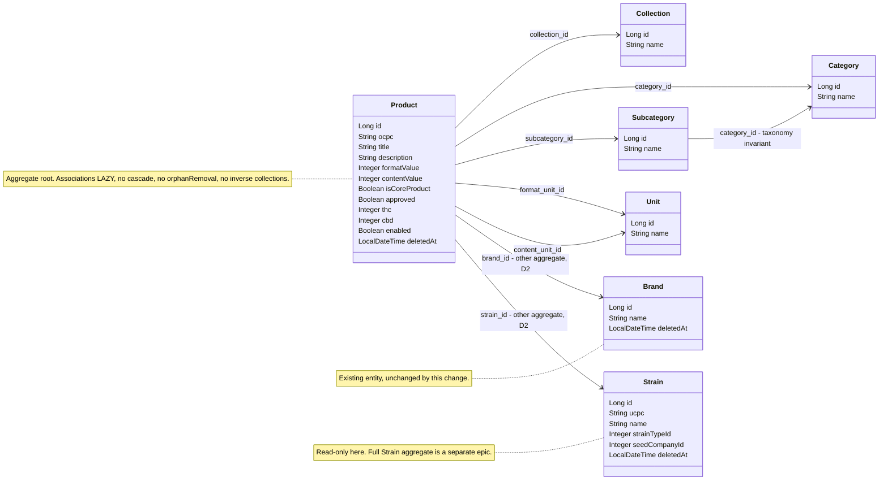

# KAN-8: Create Product (`POST /api/products`) — Technical Design

## Context

Motivation and scope: see `proposal.md` (*Why* / *What Changes*). Behavior contract: see
`specs/products-management/spec.md` (8 requirements, 18 scenarios). This document only covers **how** the
slice is built and the decisions the spec deliberately left open.

The change bootstraps the first write operation of the `Product` aggregate on top of tables that already
exist, mirroring the KAN-6 Brand vertical slice. Everything below was re-verified against the current tree
(the draft sketch in `tmp/KAN-8-enriched-us.md` §3–§4 was written before that re-check; the corrections are
called out explicitly).

### Current state verified against the codebase

| Concern | Verified state |
|---|---|
| `products` table | `flyway/release_0.1/V0.1.0__initialData_SM.sql:205` — `id SERIAL PK`, `ocpc varchar NOT NULL`, `title varchar NOT NULL`, `description text`, 7 `int NOT NULL` FK columns (`collection_id`, `category_id`, `subcategory_id`, `brand_id`, `strain_id`, `format_unit_id`, `content_unit_id`), `format_value`/`content_value int NOT NULL`, `is_core_product`/`approved`/`enabled boolean` nullable, `thc`/`cbd int` nullable, plus the six audit columns including `deleted_at` |
| FK constraints | All seven product FKs exist (`fk_products_collections`, `…_categories`, `…_subcategories`, `…_brands`, `…_strains`, `…_units_format`, `…_units_content`). Soft-deleted `brands`/`strains` rows remain **physically present**, so the DB will happily accept a product pointing at a soft-deleted parent — the application guard is the only protection |
| Lookup tables | `collections(id, name)`, `categories(id, name, image_url, tag_icon, tag_color)`, `subcategories(id, name, category_id, image_url, tag_icon, tag_color)`, `units(id, name)` — **no `deleted_at`, no audit columns** |
| `strains` table | `id`, `ucpc NOT NULL`, `name NOT NULL`, `description NOT NULL`, `strain_type_id int NOT NULL` (FK → `strain_types`), `seed_company_id int NOT NULL` (FK → `seed_companies`), `calming_energizing_value int NOT NULL`, nullable `thc/cbd/cbg/thcv/enabled`, full audit block incl. `deleted_at` |
| Indexes on `ocpc` | **None.** No unique index, no plain index (uniqueness is application-level and racy — carried from the proposal) |
| Seed data | Only `license_statuses` is seeded (`V0.1.0:41`). `collections`, `categories`, `subcategories`, `units`, `strain_types`, `seed_companies`, `strains`, `brand_types` are all empty on a fresh database |
| Soft-delete pattern | `Brand` / `Dispensary`: `extends BaseEntity` + `@SQLDelete(sql = "UPDATE … SET deleted_at = now() WHERE id = ?")` + `@SQLRestriction("deleted_at IS NULL")` |
| `@SQLRestriction` on `findById` | **Confirmed by an existing passing test**: `BrandRepositoryTests.findByIdAndDeletedAtIsNull_when_softDeleted_returnsEmpty` proves `brandRepository.findById(id)` returns `Optional.empty()` for a soft-deleted row (after `entityManager.clear()`, because the persistence context would otherwise answer from the first-level cache). `findAll()` filtering is proven by `sanitizedBrands_whenDeleted_excluded` |
| Lookup entity pattern | `BrandType` / `LicenseStatus`: plain `@Entity`, **no** `BaseEntity`, `@EqualsAndHashCode(onlyExplicitlyIncluded = true)`, `Long id` on a `SERIAL` (`int4`) column, `ddl-auto: none` |
| Service pattern | Interface in `application/services`, impl in `application/services/impl`, `@Service`, constructor injection, `@Slf4j` (Brand only), positional parameters (Brand 12, Dispensary 15), `@Transactional(rollbackFor = Exception.class, propagation = Propagation.REQUIRED)` on mutating methods only |
| Error handling | `GlobalExceptionHandler` (plain `@RestControllerAdvice`): `NotFoundException` → 404, `ConflictException` → 409, `MethodArgumentNotValidException` → 400 (one `FieldError` per field), `DataIntegrityViolationException` → 409 **echoing `ex.getMessage()`**, catch-all `Exception` → 500 with a static message. `NotFoundException`/`ConflictException` extend `DomainException extends RuntimeException` |
| Envelopes | `DataResponse<T>(T data)`, `ErrorResponse(timestamp, status, path, errors)`, `FieldError(field, message)` |
| Test infrastructure | **No Testcontainers** (contrary to the draft sketch): `src/test/resources/application.yml` points at a real local PostgreSQL `jdbc:postgresql://localhost:5432/tests` with Flyway enabled (`docker-compose.yml`). Bases: `ServiceTest` (`@ExtendWith(SpringExtension.class)` + `@MockitoBean` repositories), `RepositoryTest` (`@DataJpaTest` + `TestEntityManager`), `EndpointIntegrationTest` (`@SpringBootTest(MOCK)` + `@AutoConfigureMockMvc`) |
| Runtime config | `spring.jpa.hibernate.ddl-auto: none`, `spring.jpa.open-in-view: true` |
| Stale premise removed | `BrandRepository` is an empty `JpaRepository<Brand, Long>`; there is no `existsProductUsingBrand` anywhere. Sketch item 19 / DoD item 7 are dropped, as the proposal already established |
| Documentation drift found | `docs/data-model.md:497` states *"`ocpc` must be unique across all products"*, while the spec requires uniqueness **among non-deleted products only**, and the category/subcategory coherence rule is not documented at all → both need a wording fix (see D13) |

### Constraints that shape the approach

1. No Flyway migration, no schema drift, `ddl-auto: none` — the mapping must fit the existing DDL exactly.
2. The 7 references make this the widest create payload in the codebase (17 request fields, 8 point lookups
   plus one insert), which is what forces D1, D3 and D4.
3. `collections`, `categories`, `subcategories` and `units` have no deletion state; only `brands`, `strains`
   and `products` do. The spec's resolvability rules are already worded accordingly.
4. Purely additive: no existing entity, service, controller or DTO is rewritten (the single exception is
   the additive exception handler in D9).

## Goals / Non-Goals

**Goals**

- A `Product` aggregate root mapped to the existing `products` table with soft-delete semantics, plus the
  minimum supporting reference entities needed to resolve its seven references.
- One transactional application-layer operation that enforces, in a **fixed and documented order**, the three
  invariants the spec requires (OCPC uniqueness, reference resolvability, taxonomy coherence) before any row
  is written.
- A presentation slice (`ProductApi` + `ProductController` + request/response DTOs) that produces exactly the
  `201/400/404/409` outcomes of the spec through the **existing** envelopes and handlers.
- Design-level decisions recorded for the six points the spec left as implementation detail (D1–D6), each with
  the alternatives considered.
- Test design that maps 1:1 onto the 18 spec scenarios, including the row-count-before/after rollback proof,
  on the real infrastructure this repo actually has (local PostgreSQL + Flyway, not Testcontainers).

**Non-Goals (design level, beyond the proposal's scope boundary)**

- No refactor of `BrandService` / `DispensaryService` to the command-object style chosen in D3 (follow-up).
- No promotion of the taxonomy invariant into the aggregate root itself (see D15 — blocked by the fact that
  `DomainException` lives in the application layer).
- No sanitisation of the existing `DataIntegrityViolationException` handler (pre-existing leak, tracked as a
  security follow-up in the proposal); this design only ensures the Product paths never depend on it.
- No inverse `@OneToMany` collections on `Brand` or `Strain` (would enlarge those aggregates and modify an
  existing file for no functional gain).
- No index on `products.ocpc`, no read/update/delete endpoints, no nested product collections, no auth.

## Decisions

### D1 — Guard order: OCPC uniqueness (409) → reference resolution (404) → taxonomy coherence (409) → persist

**Decision.** `ProductServiceImpl.create` evaluates, in this exact order:

1. `productRepository.existsByOcpc(command.ocpc())` → `ConflictException` (409).
2. Reference resolution, in the request's declaration order: `collection`, `category`, `subcategory`,
   `brand`, `strain`, `formatUnit`, `contentUnit` → first unresolvable one throws `NotFoundException` (404),
   naming that reference.
3. Taxonomy coherence: `subcategory.getCategory().getId()` vs. `category.getId()` → `ConflictException` (409).
4. Build the `Product` and `save` it.

Bean validation (400) happens earlier still, at the presentation boundary, before the service — and therefore
before any transaction exists.

**Rationale.**

- **Determinism over "best" ordering.** The spec is silent, so what matters most is that a payload with
  several defects always yields the *same* status. A single fixed order makes every one of the 18 scenarios
  independently testable without "and also make sure nothing else is wrong" caveats.
- **Cheapest rejection first.** The uniqueness guard is one query. Duplicate-OCPC is the most probable
  conflict in practice (client retry / re-import of a catalogue feed), and putting it first skips seven point
  lookups on that path (1 query instead of 8).
- **Coarsest scope first.** A duplicated `ocpc` is a statement about the *whole* request ("this product
  already exists"), while 404s are statements about individual fields of the payload; rejecting at the
  aggregate-identity level before assembling the aggregate reads naturally and mirrors "validate identity,
  then assemble".
- **Step 3 must follow step 2** — the invariant needs the loaded `subcategory` to know its parent, so it
  cannot be evaluated earlier.
- Resolving all seven references *before* the coherence check (rather than checking as soon as `subcategory`
  is loaded) keeps the method's structure as three named phases (assert identity → resolve → assert
  invariants), which is what the tests and the log messages follow. Cost of the extra lookups on that path is
  4 primary-key selects — irrelevant next to the readability gain.

**Alternatives considered.**

- *Resolution (404) first, uniqueness last* — arguably friendlier ("your references are wrong" before "it
  already exists"), but it makes the most common rejection the most expensive one (8 queries instead of 1)
  and gives 404 precedence over a conflict that no payload fix can resolve. Rejected.
- *Check coherence immediately after `subcategory` resolves* — one fewer query on the incoherent-taxonomy
  path; rejected because it interleaves the two concerns for no measurable gain.
- *Collect all violations and return them together* — would need a multi-status error contract the spec does
  not define (`404` and `409` cannot be merged into one status). Rejected.

### D2 — Product holds JPA object associations to all seven references, not bare FK ids

**Decision.** All seven references are mapped as `@ManyToOne(fetch = FetchType.LAZY)` with
`@JoinColumn(name = "…", nullable = false)`, including the two references to *other aggregates*
(`Brand`, `Strain`). This is a **deliberate deviation** from the DDD rule "reference other aggregates by ID
only" (`.agents/skills/domain-driven-design/references/building-blocks.md`, Aggregate Rule 3), and it is
already flagged as open item 9 in the proposal.

**Rationale.**

- **Consistency with the only precedent that exists.** `Brand → BrandType` and `Dispensary → LicenseStatus`
  / `Address` are object associations. KAN-8 is the *second* slice of a young codebase; a second slice that
  reinforces one pattern is worth more than a locally purer model that leaves two mapping styles in the tree.
  A future ADR can migrate all of them at once.
- **The invariant that matters is preserved behaviourally.** The DDD rule protects against cross-aggregate
  coupling and multi-aggregate transactions. Here the association is *read-only from Product's side*, which
  is enforced structurally: no `cascade`, no `orphanRemoval`, no inverse collections, all `LAZY`. The create
  transaction therefore still writes exactly one aggregate — `Brand` and `Strain` are only loaded, never
  mutated.
- **Type safety.** Seven adjacent `Long` FKs are a transposition accident waiting to happen
  (`formatUnitId` ↔ `contentUnitId` is invisible to the compiler); `Unit formatUnit` / `Unit contentUnit`
  at least prevents cross-type mix-ups, and Hibernate validates the target entity type.
- **The lookups happen anyway.** Every reference must be loaded to satisfy the spec's 404 requirement
  (existence, plus soft-delete state for brand/strain), so mapping bare ids would save no query — it would
  only discard the object already in hand.
- **Future read endpoints.** Product listing needs brand/category names; with associations that is an
  `@EntityGraph` or a DTO projection join. With bare ids it needs a second round of queries or hand-written
  joins that Spring Data derived queries cannot express.

**Guard rails written into the mapping (non-negotiable).** No `CascadeType.*` anywhere on `Product`; no
`orphanRemoval`; every association `FetchType.LAZY`; no `@OneToMany` added to `Brand`/`Strain`/lookups; the
service never calls a setter on a resolved reference.

**Alternatives considered.**

- *Bare `Long brandId` / `Long strainId` (DDD-pure) with associations for the in-capability reference data* —
  the purist option, and the one the DDD skill prescribes. Rejected because it puts **two mapping styles
  inside a single entity** (the worst of both worlds for a reader), still needs the same repository lookups,
  loses the type check, and diverges from the codebase precedent that KAN-6 has just established.
- *Bare ids for all seven* — internally consistent and the cheapest mapping, but it makes `Product` a pure
  row DTO, blocks join-fetch on the upcoming read endpoints, and maximises the divergence from `Brand`.
  Rejected.
- *Value-object identifiers (`BrandId`, `StrainId`)* — best expressiveness, but it introduces a JPA
  `@Embeddable`/`AttributeConverter` layer that nothing else in the codebase uses. Rejected as premature.

### D3 — Service signature: `CreateProductCommand` record instead of 17 positional parameters

**Decision.** `application/services/model/CreateProductCommand.java` — an immutable `record` with the 17
request fields (ids as `Long`, `formatValue`/`contentValue`/`thc`/`cbd` as `Integer`, flags as `Boolean`).
The service contract is a single method:

```java
public interface ProductService {
  Product create(CreateProductCommand command) throws NotFoundException, ConflictException;
}
```

(`throws` is documentary — both exceptions are unchecked, exactly as `BrandService.update` declares
`throws NotFoundException`.) Package `application/services/model` mirrors the existing
`presentation/api/model` convention.

**Rationale.** 17 parameters, of which 7 are consecutive `Long`, 4 consecutive `Boolean` and 2 `Integer` —
positional calls are silently transposable and the compiler cannot help; the Brand (12) and Dispensary (15)
signatures are already past the readability limit and this one would be worse. A record also gives the
controller a named-field construction site, makes the 11 service unit tests readable, and lets future fields
be added without touching every call site. Deviation from the precedent is intentional and is already listed
in the proposal's deferred work ("aligning `BrandService`/`DispensaryService` on a command-object signature
style").

**Alternatives considered.**

- *Positional parameters (precedent)* — rejected per above; a 17-argument call is the single most likely
  place for a silent defect in this slice.
- *Pass `CreateProductRequest` (the presentation DTO) into the service* — fewer classes, but it inverts the
  Clean Architecture dependency direction (the application layer would depend on `jakarta.validation` and
  `io.swagger` annotated presentation types) and couples the service contract to the HTTP payload. Rejected.
- *Let the controller build the `Product` entity and have the service persist it* — the controller cannot
  resolve the references, and it would assemble an aggregate with no invariant enforced. Rejected.
- *Command object placed in the domain layer* — rejected: a command is an application-layer concept; the
  domain must not know about request shapes.

### D4 — DRY: one private generic `resolveOrNotFound` helper inside `ProductServiceImpl`

**Decision.** A single private generic method in the impl, used seven times:

```java
private <T> T resolveOrNotFound(JpaRepository<T, Long> repository, Long id, String referenceName) {
  return repository
      .findById(id)
      .orElseThrow(() -> new NotFoundException(referenceName + " not found with ID: " + id));
}
```

Call sites read `resolveOrNotFound(this.brandRepository, command.brandId(), "Brand")`, which produces
`"Brand not found with ID: 99"` — the exact message style already used by `BrandServiceImpl` /
`BrandController` (`"Brand not found with ID: " + id`), so the spec's *"descriptive standard error response
naming the offending reference"* is satisfied uniformly for all seven references.

**Rationale.** Seven identical `orElseThrow` chains in one method is duplication by any standard (the DRY
skill's rule-of-three is satisfied twice over *within a single method*). Keeping the helper **private to the
impl** rather than promoting it to a shared utility respects the same skill's warning against premature
shared abstractions: there is exactly one consumer today, and the externally visible error wording stays
owned by the service that produces it. Promotion to a shared component is a one-line move once a second
service needs it.

**Alternatives considered.**

- *Shared `ReferenceResolver` utility / `@Component` in `application/support`* — rejected: one consumer, and
  it would scatter user-visible error wording away from the service.
- *`default` `findByIdOrThrow` on each repository interface, or a common `BaseRepository`* — rejected: pushes
  application-layer error semantics (`NotFoundException`, message wording) into the domain repository
  contracts, and needs the same code in six places or a new inheritance layer.
- *`Function<Long, Optional<T>>` finder parameter (`resolveOrNotFound(brandRepository::findById, id, "Brand")`)* —
  decouples the helper from Spring Data, but the project already accepts `JpaRepository` in its domain
  repository contracts, so the indirection buys nothing and reads worse. Rejected.
- *Seven explicit `orElseThrow` blocks* — rejected (≈21 duplicated lines, seven chances to get the message
  format wrong).

### D5 — `Strain`: minimal, insertable, read-only mapping with soft-delete filtering

**Decision.** `domain/models/strain/Strain.java` maps only what this slice needs:

| Mapped | Why |
|---|---|
| `id` (`@Id`, `IDENTITY`) | the FK target |
| `extends BaseEntity` + `@SQLRestriction("deleted_at IS NULL")` | **required** by the spec: a soft-deleted strain must resolve as non-existent (404) |
| `@SQLDelete(sql = "UPDATE strains SET deleted_at = now() WHERE id = ?")` | defence in depth: guarantees no code path can ever hard-delete a row of a soft-delete table, even though no delete path exists today |
| `ucpc`, `name`, `description`, `strainTypeId`, `seedCompanyId`, `calmingEnergizingValue` | the table's remaining `NOT NULL` columns — see below |
| *not mapped* | `thc`, `cbd`, `cbg`, `thcv`, `enabled` (all nullable and unused here), and the `strain_terpenes` / `strain_effects` / `strain_conditions` / `strain_images` collections |

`strain_type_id` and `seed_company_id` are mapped as **bare `Integer` columns, not associations**:
`StrainType` and `SeedCompany` belong to the future Strain epic and are deliberately not modelled here.
(Note the symmetry with D2: referencing an *unmodelled* aggregate by id is the only option available, which
is exactly the DDD-pure style — the deviation in D2 is limited to aggregates this codebase already maps.)

**Why map the `NOT NULL` columns at all** — the risk the proposal phase flagged, resolved. `Strain` is
read-only *in production*: nothing in this slice inserts a strain, and with no cascade from `Product`
(D2 guard rails) Hibernate never emits a `strains` INSERT. But **the tests must create strain rows**, and an
entity that maps only `id` cannot be persisted through `TestEntityManager` without violating six `NOT NULL`
constraints, forcing every fixture into native SQL. Mapping exactly the `NOT NULL` set makes the entity
insertable from fixtures while still pulling nothing extra into scope. The two FK parents
(`strain_types`, `seed_companies` — both just `(id, name)`) are seeded with native SQL in the test fixtures,
since we intentionally do not map them.

**Alternatives considered.** *Map `id` only* — smallest surface, but pushes all strain fixtures into native
SQL and makes the entity a trap for the next developer. *Map the whole `strains` table (+ `StrainType`,
`SeedCompany`, terpenes/effects/…)* — that is the deferred Strain epic; rejected as scope creep. *Skip
`@SQLRestriction` and filter in the service* — rejected: it duplicates the `Brand` mechanism and the spec
requires identical treatment for both.

### D6 — Transaction boundary: `@Transactional` on the service implementation method only

**Decision.** `@Transactional(rollbackFor = Exception.class, propagation = Propagation.REQUIRED)` on
`ProductServiceImpl.create` — matching `BrandServiceImpl.create` / `DispensaryServiceImpl.create`. Not on
the interface, not on the controller, no `@Transactional` reads (there are none in this slice).

**How this satisfies "Atomicity of product creation" for each rejection path:**

| Rejection | Where it happens | Why nothing is persisted |
|---|---|---|
| `400` bean validation | `@Valid` at the presentation boundary | The service is never entered; **no transaction is ever opened** |
| `400` unreadable body | argument resolution (D9) | Same |
| `409` duplicated OCPC | guard 1, before any write | The transaction contains only `SELECT`s and is rolled back (`ConflictException` is a `RuntimeException`; `rollbackFor = Exception.class` covers checked ones too) |
| `404` unresolved reference | guard 2, before any write | Same |
| `409` incoherent taxonomy | guard 3, before any write | Same |
| `500` unexpected failure | anywhere, including at `save`/flush/commit | Declarative rollback of the single-statement unit of work; the only write in the transaction is the one `INSERT`, so rollback restores the exact prior row count |

Two properties are worth stating because they are what makes the spec's *"the number of stored products
SHALL be identical"* scenario provable: (a) **all guards run before `save`**, so on every deterministic
rejection path the transaction never issues an `INSERT` at all — rollback is belt-and-braces, not the primary
mechanism; and (b) the aggregate is written by a **single** `save`, so there is no window in which a
partially populated product could be observable, even to a concurrent reader (the insert becomes visible only
at commit).

**Alternatives considered.** *`@Transactional` on the controller* — rejected: the presentation layer would
own the unit of work and the transaction would span JSON serialisation. *`@Transactional` on the interface* —
works with Spring proxies but hides the boundary from the implementation reader and diverges from the
precedent. *`TransactionTemplate` inside the method* — no requirement justifies programmatic demarcation.
*Relying on `SERIALIZABLE` isolation to close the OCPC race* — rejected: the fix is the deferred partial
unique index, not a global isolation change (see Risks).

**Note on test coverage of this decision (2026-09-10, third code-review Minor m2).** No current test
exercises the `@Transactional` rollback mechanism itself: deleting the annotation entirely from
`ProductServiceImpl.create` leaves all 112 (now 115) tests green, because every guard already rejects
*before* any write is attempted (property (a) above), so there is nothing for the annotation to roll
back in any scenario the current suite sends. `tasks.md` task 8.11's
`should_leaveProductCountUnchanged_when_requestIsRejected` proves spec requirement R7 (a rejected
request persists nothing) end-to-end — it does **not** prove the transaction boundary is what makes
that true, and it was previously mis-described in `tasks.md` as "the end-to-end proof of D6" (corrected
in the same pass that added this note). The annotation remains the correct defensive choice: it is
belt-and-braces for (b) future guard reordering that might place a check after a partial write, or (c)
a mid-transaction failure between multiple writes if `create` ever evolves beyond a single `INSERT`.
Neither scenario exists in the code today, so neither is provably exercised by any test — this is
disclosed here rather than left as an implicit assumption.

### D7 — OCPC uniqueness query: `existsByOcpc` relying on `@SQLRestriction`

`ProductRepository extends JpaRepository<Product, Long>` with one added method,
`boolean existsByOcpc(String ocpc)`. Because `Product` carries `@SQLRestriction("deleted_at IS NULL")`,
Hibernate appends that predicate to every generated query for the entity, so `existsByOcpc` answers
*"is this OCPC used by a **live** product?"* — precisely the spec's rule, including the
*"OCPC of a soft-deleted product is reusable"* scenario. This is not an assumption: the equivalent behaviour
is pinned today by `BrandRepositoryTests` (`findAll()` excludes soft-deleted rows; `findById` returns empty
for them), and a dedicated repository integration test will pin it for `Product` as well, so the behaviour
survives any future change to the mapping.

*Alternative considered:* an explicitly named `existsByOcpcAndDeletedAtIsNull` — more self-documenting, but
it emits `deleted_at is null and deleted_at is null` and implies the restriction is not trusted. Rejected in
favour of the derived-query-plus-integration-test combination.

### D8 — Request validation: `@NotBlank` (not `@NotEmpty`), `@Positive`, `@PositiveOrZero`, `@Size`

`CreateProductRequest` is a `@Data @Builder @AllArgsConstructor @NoArgsConstructor` class with `@Schema`
annotations, mirroring `CreateBrandRequest`, with one deliberate difference: **`@NotBlank`, not
`@NotEmpty`**. The spec requires rejecting a required field that is *"absent, `null` or blank"*, and
`@NotEmpty` accepts `"   "`. Constraints:

| Field(s) | Type | Constraints |
|---|---|---|
| `ocpc` | `String` | `@NotBlank(message = "ocpc must not be blank")`, `@Size(max = 64)` |
| `title` | `String` | `@NotBlank(message = "title must not be blank")`, `@Size(max = 255)` |
| `description` | `String` | none (optional) |
| `collectionId`, `categoryId`, `subcategoryId`, `brandId`, `strainId`, `formatUnitId`, `contentUnitId` | `Long` | `@NotNull`, `@Positive` |
| `formatValue`, `contentValue` | `Integer` | `@NotNull`, `@Positive` |
| `thc`, `cbd` | `Integer` | `@PositiveOrZero` (null-tolerant, so omission stays legal) |
| `isCoreProduct`, `approved`, `enabled` | `Boolean` | none — nullable is meaningful (D10) |

Error field names come from the DTO property names automatically via
`MethodArgumentNotValidException` → `FieldError(field, message)`, satisfying *"identified by its request
property name"*. `@Size` caps are application-level only (the columns are unbounded `varchar`), which is why
no migration is needed and why over-long input is a `400`, never a truncation. Audit and lifecycle fields are
simply absent from the DTO — the strongest possible form of *"SHALL NOT accept audit or lifecycle metadata"*.

### D9 — Empty / unreadable request body → `400`, via one additive exception handler

**Problem found.** The spec requires *"empty body → 400"*. An empty **JSON document** (`{}`) already yields
400 through bean validation. A **truly empty or malformed body** raises
`HttpMessageNotReadableException`, and because `GlobalExceptionHandler` declares a catch-all
`@ExceptionHandler(Exception.class)` (which `ExceptionHandlerExceptionResolver` matches before Spring's
`DefaultHandlerExceptionResolver` can produce its own 400), the current codebase would answer **500** —
verified by reading the handler and by `GlobalExceptionHandlerTest`, which asserts 500 for the catch-all.

**Decision.** Add one handler to `GlobalExceptionHandler`:

```java
@ExceptionHandler(HttpMessageNotReadableException.class)  // → 400, static message, no ex.getMessage()
```

returning `FieldError("general", "Malformed or missing request body")`. The message is **static** so nothing
about the parser, the payload or the SQL layer leaks (spec: *"Error responses SHALL NOT expose SQL
statements, database constraint names or stack traces"*).

**Rationale and honesty about the deviation.** The proposal states *"No error-handling changes"*; this is a
narrow, additive exception to that statement, taken because the alternative is to ship an endpoint that
violates its own spec scenario. 400 is also simply the correct HTTP semantics for an unreadable body — the
current 500 is a latent defect. The handler is cross-cutting, so it also changes `brands` / `dispensaries`
behaviour for malformed bodies (500 → 400); no existing spec requirement, and no existing test, asserts 500
for that case (`GlobalExceptionHandlerTest` exercises the catch-all through a deliberately throwing test
controller, not through a bad body), so no `brands-management` requirement changes and no delta spec is
needed. The tasks phase must nevertheless re-run the full suite to confirm.

**Alternatives considered.** *Interpret "empty body" as `{}` only and change nothing* — cheaper, but leaves a
real 500 on a trivially reachable input and reads as gaming the scenario. Rejected. *Make
`GlobalExceptionHandler` extend `ResponseEntityExceptionHandler`* — would fix the whole family of Spring MVC
exceptions at once, but it rewires every error response shape for every existing endpoint (ProblemDetail vs.
`ErrorResponse`) — far outside this slice. Rejected. *Handle it in the controller* — impossible, the
exception is raised before the handler method is invoked.

### D10 — Response shape: flat ids, values read back from the persisted entity, no audit fields

`CreateProductResponse` is a `record` mirroring the request field-for-field
(`id, ocpc, title, description, collectionId, categoryId, subcategoryId, brandId, strainId, formatValue,
formatUnitId, contentValue, contentUnitId, isCoreProduct, approved, thc, cbd, enabled`), wrapped in
`DataResponse` with `@ResponseStatus(HttpStatus.CREATED)` declared on `ProductApi` (Brand precedent).

- **Values are read from the saved entity**, never echoed from the request — that is what makes the spec's
  *"the response SHALL report … the value that was actually persisted"* true by construction, and it makes
  the optional-attribute scenarios (`null` stays `null`, no substituted defaults) observable.
- **Ids, not nested objects.** The references are returned as scalars (`product.getBrand().getId()`), so the
  response contract does not leak the mapping choice of D2 and stays swappable if D2 is ever revisited. No
  lazy-loading hazard exists: every reference was loaded by id inside the transaction, so the fields hold
  fully initialised instances, not uninitialised proxies (and `open-in-view: true` is not relied upon).
- **No audit fields.** `createdAt` / `createdBy` / … are excluded, mirroring `CreateBrandResponse`. The spec
  requires the creation timestamp to be *recorded*, not returned; it is asserted at the database level in the
  integration tests.
- **Booleans stay nullable** in the response so *unset* remains distinguishable from `false`, per the
  optional-attributes requirement.

### D11 — Naming: keep the domain name `Collection`, with an explicit import caveat

The lookup entity for the `collections` table is named `Collection` (`domain/models/product/Collection.java`)
because that is the term the data model and the business use — the ubiquitous-language rule wins over the
inconvenience that `java.util.Collection` exists. Consequence, documented here so it is not discovered by
accident: **no file that references the entity may import `java.util.Collection`** (use `List` / `Iterable`,
as the rest of the codebase already does). Alternative `ProductCollection` was rejected: it renames a
business concept to dodge a JDK type that this codebase never uses.

### D12 — Lookup entities: plain entities, `Long` ids, no `BaseEntity`, no soft-delete

`Collection`, `Category`, `Subcategory` and `Unit` follow the `BrandType` / `LicenseStatus` pattern exactly:
plain `@Entity`, `@Getter @Setter`, `@EqualsAndHashCode(onlyExplicitlyIncluded = true)` on `id`,
`@Id @GeneratedValue(IDENTITY) Long id`, and **no** `BaseEntity` and **no** `@SQLRestriction` — because those
four tables have neither audit nor `deleted_at` columns. This is exactly why the spec words resolvability
per reference type, and it is why their only failure mode is "does not exist".

`Subcategory` holds `@ManyToOne(fetch = FetchType.LAZY) @JoinColumn(name = "category_id", nullable = false)
Category category` (as the proposal describes). The coherence check in D1 reads only
`subcategory.getCategory().getId()`, which returns the identifier from the proxy **without** initialising it,
so the check costs zero extra queries; the comparison uses `Objects.equals(...)` to avoid any NPE/unboxing
surprise. `Category` and `Subcategory` also map their `NOT NULL` scalars (`name`, `imageUrl`, `tagIcon`,
`tagColor`) so fixtures can insert rows through JPA; `Collection` and `Unit` map `name`.

`Long` ids on `SERIAL` (`int4`) columns are safe and are the established convention here (KAN-6 D1/D2) as long
as `ddl-auto: none` holds.

### D13 — `docs/data-model.md` is corrected, not merely "reviewed"

The proposal expected the review to confirm the documented rules match. It does not: `docs/data-model.md:497`
says *"`ocpc` must be unique across all products"*, whereas the spec (and this implementation) enforces
uniqueness **among non-deleted products**, and the category/subcategory coherence rule is missing entirely.
Since this project treats documentation as the source of truth, the docs task in `tasks.md` must
(a) reword the `ocpc` rule to *"unique across all non-deleted products (a soft-deleted product does not
reserve its `ocpc`)"*, and (b) add *"`subcategory_id` must belong to `category_id`"* to the Products
validation rules. No schema statement changes.

### D14 — Identity-based `equals`/`hashCode` on `Product` (deliberate deviation from `Brand`)

**Decision.** `@EqualsAndHashCode(onlyExplicitlyIncluded = true)` with `@EqualsAndHashCode.Include` on `id`
only — i.e. **no** `callSuper = true` and no field-based equality.

**Rationale.** `Brand` is annotated `@EqualsAndHashCode(callSuper = true)` *plus* an `@Include` on `id`;
without `onlyExplicitlyIncluded = true`, the `@Include` is inert and Lombok generates equality over **all**
fields plus the superclass. On `Brand` that is merely questionable; on `Product` it would be actively
harmful — `equals`/`hashCode` would touch seven lazy associations (initialising proxies, potentially issuing
queries from inside `hashCode`) and fold mutable audit timestamps into identity. DDD entity rule 3 says
equality is identity, and `BrandType`/`LicenseStatus` already use `onlyExplicitlyIncluded = true`, so this
follows the *lookup* precedent rather than replicating a latent defect in the `Brand` mapping. Fixing `Brand`
itself is out of scope (no existing file is rewritten in this change) and is recorded as a follow-up.

**Caveat to keep in mind in tests:** two unsaved `Product` instances both have `id == null` and therefore
compare equal, so tests must assert on individual fields (or on saved instances), never on entity equality.

### D15 — Invariant placement: guards stay in the application service for now (anemic-model trade-off)

The taxonomy invariant *"a product's subcategory belongs to its category"* is a genuine aggregate invariant
and, per DDD, belongs inside the `Product` aggregate root (e.g. a static factory that refuses to build an
incoherent product). It is nevertheless implemented in `ProductServiceImpl` for one concrete structural
reason: the project's exception hierarchy (`DomainException`, `NotFoundException`, `ConflictException`) lives
in `com.example.demo.application.exceptions`, so a domain-layer factory could not signal the violation
without the domain depending on the application layer (a Clean Architecture inversion), or without inventing
a domain exception type plus a translation layer that nothing else in the codebase has.

Decision: keep all three guards in the service, accept the mildly anemic entity for this slice, and record the
follow-up — *move `DomainException` and friends into the domain layer, then promote the taxonomy invariant
(and OCPC uniqueness, as a specification/repository-backed rule) into `Product`*. The uniqueness guard would
stay service-side regardless, since it needs a repository. Documented here so the next slice inherits the
reasoning rather than the accident.

## Package & File Layout

All new files carry the project's GNU GPL header + `// Copyright (c) 2026-2027 Sergio Exposito.` line.

```
src/main/java/com/example/demo/
├── domain/
│   ├── models/
│   │   ├── product/
│   │   │   ├── Product.java              # NEW  aggregate root, table "products", extends BaseEntity
│   │   │   ├── Collection.java           # NEW  lookup, table "collections"            (D11, D12)
│   │   │   ├── Category.java             # NEW  lookup, table "categories"             (D12)
│   │   │   ├── Subcategory.java          # NEW  lookup, table "subcategories" + parent Category
│   │   │   └── Unit.java                 # NEW  lookup, table "units"                  (D12)
│   │   └── strain/
│   │       └── Strain.java               # NEW  minimal read-only mapping              (D5)
│   └── repositories/
│       ├── ProductRepository.java        # NEW  + boolean existsByOcpc(String)         (D7)
│       ├── CollectionRepository.java     # NEW
│       ├── CategoryRepository.java       # NEW
│       ├── SubcategoryRepository.java    # NEW
│       ├── UnitRepository.java           # NEW
│       └── StrainRepository.java         # NEW
├── application/
│   └── services/
│       ├── ProductService.java           # NEW  single create(CreateProductCommand)    (D3)
│       ├── model/
│       │   └── CreateProductCommand.java # NEW  record, 17 fields                      (D3)
│       └── impl/
│           └── ProductServiceImpl.java   # NEW  @Service @Slf4j, guards D1, helper D4
└── presentation/
    ├── api/
    │   ├── ProductApi.java               # NEW  @RequestMapping("/api/products"), @Tag("Products")
    │   └── model/
    │       ├── CreateProductRequest.java # NEW  @Data @Builder + validation            (D8)
    │       └── CreateProductResponse.java# NEW  record                                 (D10)
    └── controllers/
        ├── ProductController.java        # NEW  @RestController implements ProductApi
        └── GlobalExceptionHandler.java   # MODIFIED (+1 handler, additive)             (D9)

src/test/java/com/example/demo/
├── application/services/
│   ├── ProductServiceTest.java           # NEW  base: @MockitoBean for the 6 repositories
│   └── ProductServiceTests.java          # NEW  service unit tests
├── presentation/controllers/
│   └── ProductControllerTests.java       # NEW  @WebMvcTest + @Import(GlobalExceptionHandler)
└── integration/
    ├── repositories/
    │   ├── ProductReferenceDataRepositoryTests.java  # NEW  @DataJpaTest, D11/D12 lookups
    │   ├── StrainRepositoryTests.java                # NEW  @DataJpaTest, D5
    │   ├── StrainReferenceDataFixtures.java           # NEW  package-private native-SQL fixture helper (task 3.9)
    │   └── ProductRepositoryTests.java                # NEW  @DataJpaTest
    └── endpoints/ProductEndpointsTests.java           # NEW  @SpringBootTest(MOCK) + MockMvc

Modified (8 total):
├── presentation/controllers/GlobalExceptionHandler.java  # MODIFIED (+1 handler, additive)  (D9)
├── docs/data-model.md                                    # MODIFIED  validation-rule wording (D13)
├── docs/backend-standards.md                             # MODIFIED  D9 error-envelope note
├── spotbugs-exclude.xml                                  # MODIFIED  scoped exclude for D2 (task 13.3)
├── src/test/.../application/services/DispensaryServiceTests.java     # MODIFIED  lazyInit fix (batch 2 corrective)
├── src/test/.../integration/endpoints/BrandControllerEndpointsTests.java  # MODIFIED  D9 regression test
├── src/test/.../integration/endpoints/DispensaryEndpointsTests.java       # MODIFIED  D9 regression test
└── src/test/.../presentation/controllers/GlobalExceptionHandlerTest.java  # MODIFIED  D9 unit test (task 9.1)
```

Totals: **19 new main files, 8 new test files, 8 modified files, 0 deleted files, 0 DB migrations.**
(Corrected 2026-09-10, code-review m6 finding: the original totals — "5 new test files, 2 modified
files" — undercounted; the actual 8 new test files and 8 modified files are listed above. Second
correction, same day, post-verify-pass-2: the first correction itself undercounted the test-file
figure as "7" — the file tree above genuinely lists 8: `ProductServiceTest`, `ProductServiceTests`,
`ProductControllerTests`, `ProductReferenceDataRepositoryTests`, `StrainRepositoryTests`,
`StrainReferenceDataFixtures`, `ProductRepositoryTests`, `ProductEndpointsTests`.)

A new `ProductServiceTest` base is created rather than adding six `@MockitoBean` fields to the shared
`ServiceTest` — that keeps the change additive and follows the KAN-6 precedent (`BrandServiceTest`).

## Model and Flow

### Aggregate boundaries and mappings



### Create flow and guard order (D1)

```mermaid
sequenceDiagram
  autonumber
  participant C as Client
  participant Ctl as ProductController
  participant Svc as ProductServiceImpl
  participant PR as ProductRepository
  participant RR as Reference repositories
  participant DB as PostgreSQL

  C->>Ctl: POST /api/products (CreateProductRequest)
  Note over Ctl: @Valid bean validation<br/>fail -> 400, no transaction opened
  Ctl->>Svc: create(CreateProductCommand)
  Note over Svc: @Transactional begins
  Svc->>PR: existsByOcpc(ocpc)
  PR->>DB: SELECT ... WHERE ocpc = ? AND deleted_at IS NULL
  Note over Svc: true -> ConflictException -> 409
  Svc->>RR: resolveOrNotFound x7 (collection, category, subcategory, brand, strain, formatUnit, contentUnit)
  RR->>DB: 7 SELECTs by primary key (brand/strain filtered by deleted_at IS NULL)
  Note over Svc: empty -> NotFoundException -> 404
  Note over Svc: subcategory.category.id != category.id -> ConflictException -> 409
  Svc->>PR: save(product)
  PR->>DB: INSERT INTO products ... (created_at set by BaseEntity @PrePersist)
  Note over Svc: commit; any failure -> rollback (rollbackFor = Exception.class)
  Svc-->>Ctl: persisted Product
  Ctl-->>C: 201 Created + DataResponse<CreateProductResponse>
```

Query budget on the happy path: **8 SELECTs + 1 INSERT**, all by primary key. On the duplicate-OCPC path:
**1 SELECT**.

### `Product` field mapping

| Java field | Column | Mapping notes |
|---|---|---|
| `id` | `id` | `@Id @GeneratedValue(IDENTITY)`, `Long` on `SERIAL` |
| `ocpc` | `ocpc` | `@Column(nullable = false)` |
| `title` | `title` | `@Column(nullable = false)` |
| `description` | `description` | `@Column(columnDefinition = "TEXT")`, nullable |
| `collection` | `collection_id` | `@ManyToOne(LAZY)` + `@JoinColumn(nullable = false)` |
| `category` | `category_id` | idem |
| `subcategory` | `subcategory_id` | idem |
| `brand` | `brand_id` | idem — other aggregate (D2) |
| `strain` | `strain_id` | idem — other aggregate (D2) |
| `formatValue` | `format_value` | `Integer`, `nullable = false` |
| `formatUnit` | `format_unit_id` | `@ManyToOne(LAZY)` → `Unit` |
| `contentValue` | `content_value` | `Integer`, `nullable = false` |
| `contentUnit` | `content_unit_id` | `@ManyToOne(LAZY)` → `Unit` |
| `isCoreProduct` | `is_core_product` | `Boolean`, nullable |
| `approved` | `approved` | `Boolean`, nullable |
| `thc`, `cbd` | `thc`, `cbd` | `Integer`, nullable (`int` in DB — decimals would need a migration) |
| `enabled` | `enabled` | `Boolean`, nullable |
| audit + `deleted_at` | via `BaseEntity` | `@SQLDelete` + `@SQLRestriction("deleted_at IS NULL")` |

Class annotations: `@Entity @Table(name = "products") @Getter @Setter @NoArgsConstructor @AllArgsConstructor
@Builder`, plus `@EqualsAndHashCode(onlyExplicitlyIncluded = true)` per D14.

## Error Mapping

| Condition | Exception | Handler | Status | Body |
|---|---|---|---|---|
| Missing / blank / non-positive / oversized field | `MethodArgumentNotValidException` | existing | 400 | one `FieldError` per property name |
| Empty or malformed body | `HttpMessageNotReadableException` | **new (D9)** | 400 | `FieldError("general", "Malformed or missing request body")` |
| Unresolvable reference (absent, or soft-deleted brand/strain) | `NotFoundException("<Reference> not found with ID: <id>")` | existing | 404 | `FieldError("general", …)` |
| OCPC already used by a live product | `ConflictException("Product already exists with OCPC: <ocpc>")` | existing | 409 | `FieldError("general", …)` |
| Subcategory outside the supplied category | `ConflictException("Subcategory <id> does not belong to category <id>")` | existing | 409 | `FieldError("general", …)` |
| Anything else | any | existing catch-all | 500 | static `"An unexpected error occurred"` |

Every message is composed from client-supplied identifiers and fixed text only — no SQL, no constraint names,
no stack traces, satisfying the "no internal details" scenario. Logging: `log.info` on success with the new
id, `log.warn` on business rejections, no payload dumps.

## Testing Plan

TDD (`should_[expected_behavior]_when_[condition]`, Arrange/Act/Assert), 90% coverage gate. Every spec
scenario has at least one owning test.

**1. Service unit tests — `ProductServiceTests` (extends new `ProductServiceTest`, all six repositories
mocked)**
happy path persists once with every field mapped; `existsByOcpc == true` → `ConflictException` and `save`
never called; one test per unresolved reference (7 tests) → `NotFoundException`, `save` never called;
subcategory-with-other-parent → `ConflictException`, `save` never called; omitted optional attributes are
saved as `null`; explicit `false` flags are saved as `false`; guard-order tests: a command that is *both*
duplicated-OCPC *and* has an unknown brand yields `ConflictException` (pins D1), and a command that is both
incoherent-taxonomy and unknown-unit yields `NotFoundException`; `save` throwing a `RuntimeException`
propagates (pins the 500 path).

**2. Controller unit tests — `ProductControllerTests`** (standalone `MockMvc` +
`setControllerAdvice(new GlobalExceptionHandler())`, `ProductService` mocked): 201 + `$.data.id` /
`$.data.ocpc`; 400 for blank `title`, whitespace-only `ocpc` (pins `@NotBlank` over `@NotEmpty`),
`formatValue = 0`, `brandId = 0`, negative `thc`, over-long `ocpc`/`title`, and `{}`; 400 with
`$.errors[0].field == "general"` for a literally empty body (pins D9); 404 and 409 pass-through from service
exceptions; assertion that no error body contains `"insert into"`, `"fk_products_"` or `"Exception"`.

**3. Repository integration tests — `ProductRepositoryTests`** (`@DataJpaTest` + `TestEntityManager`):
`existsByOcpc` true/false; **`existsByOcpc` returns `false` when the only holder is soft-deleted** (pins D7 —
`entityManager.clear()` first, as `BrandRepositoryTests` does); `findById` excludes a soft-deleted product;
`repository.delete(product)` leaves the row physically present (pins `@SQLDelete`); `findById` on a
soft-deleted `Strain` returns empty (pins D5).

**4. Endpoint integration tests — `ProductEndpointsTests`** (extends `EndpointIntegrationTest`, real local
PostgreSQL + Flyway — **not** Testcontainers): 201 + persisted row with `created_at` not null; 409 on a
second POST with the same `ocpc`; 201 after soft-deleting the holder of that `ocpc`; 404 per reference family
(unknown collection/category/subcategory/unit, unknown brand/strain, **soft-deleted** brand and strain);
409 for a subcategory belonging to another category; 400 for an empty body and for a blank required field;
201 with the five optional attributes omitted, asserting `NULL` in the database; and the atomicity test —
`SELECT count(*) FROM products` before and after each failing POST (400/404/409) must be identical.

**Fixtures.** A fresh database has no reference data, so each test seeds its own: `collections`, `categories`,
two `subcategories` under different categories (needed for the coherence scenario), `units`, `brand_types` +
`brands` (one live, one soft-deleted) through JPA; `strain_types` and `seed_companies` through **native SQL**
(deliberately unmapped per D5), then `strains` (one live, one soft-deleted) through JPA. Each test cleans up
what it created so the suite is order-independent.

## Implementation Order

1. Entities: `Collection`, `Category`, `Subcategory`, `Unit`, `Strain`, `Product` (mappings D2/D5/D11/D12/D14).
2. Repositories + `ProductRepositoryTests` (red → green) — pins the soft-delete/OCPC semantics of D7 first.
3. `CreateProductCommand` + `ProductService` interface (D3).
4. `ProductServiceImpl` happy path, then one guard per commit in the D1 order, each with its unit test first.
5. `CreateProductRequest` / `CreateProductResponse` (D8/D10).
6. `ProductApi` + `ProductController` + `ProductControllerTests`.
7. The `HttpMessageNotReadableException` handler (D9) + full suite re-run to confirm no regression on
   `brands` / `dispensaries`.
8. `ProductEndpointsTests`, including the row-count atomicity assertions.
9. Swagger check (`/swagger-ui.html` shows `Products` with 201/400/404/409), `mvn test` (90% gate), Spotless,
   SpotBugs.
10. `docs/data-model.md` corrections (D13).

## Risks / Trade-offs

- **OCPC uniqueness is racy** (no unique index; two concurrent POSTs can both pass `existsByOcpc`) →
  Mitigation: accepted and already recorded as deferred work; the partial index
  `CREATE UNIQUE INDEX CONCURRENTLY ux_products_ocpc ON products (ocpc) WHERE deleted_at IS NULL` needs its
  own migration ticket. Until then the window is one round-trip wide and the damage is a duplicate row, not
  corruption. Do **not** paper over it with a broader isolation level (D6).
- **`existsByOcpc` does a full scan** (no index on `ocpc` at all) → Mitigation: acceptable at bootstrap
  catalogue volumes; the same follow-up index fixes it. Flagged so it is not mistaken for a p95 regression
  later.
- **DDD aggregate rule 3 is knowingly violated** (`Product` references `Brand`/`Strain` as objects, D2) →
  Mitigation: structural guard rails (no cascade, no orphanRemoval, LAZY, no inverse collections) keep the
  transaction single-aggregate; a future ADR can migrate all mappings at once. This trade-off is not merely
  theoretical/DDD-purity: it has a concrete static-analysis consequence — a re-run of `mvn -o spotbugs:check`
  against the built classes (not the stale/empty `target/classes` a first invocation sees, since
  `spotbugs:check` is bound to `process-resources`, before `compiler:compile`, in the same Maven invocation)
  surfaces 24 new `EI_EXPOSE_REP`/`EI_EXPOSE_REP2` findings across `Product.java` (21) and `Subcategory.java`
  (3), on top of the 9 pre-existing findings in `Brand.java`/`Dispensary.java`. This will visibly surface at
  the project's SpotBugs gate (task 13.3) and needs an explicit decision then (exclude-filter the mapping
  classes, or accept and document the finding as a deliberate consequence of D2).
  **Decision made at task 13.3 (2026-09-10):** option (a) — `spotbugs-exclude.xml` gained one new,
  narrowly-scoped `<Match>` block targeting exactly `Product` and `Subcategory` by `<Class name>`
  (not by package, unlike the pre-existing filters), suppressing `EI_EXPOSE_REP`/`EI_EXPOSE_REP2` on
  those two classes only. Re-running `mvn -o clean compile` then `mvn -o spotbugs:check` against the
  freshly-built classes confirms exactly the 24 D2/D12-caused findings are gone and the 9 pre-existing
  `Brand`/`Dispensary` findings remain (unchanged, unrelated, unsuppressed — confirmed those two files
  have zero diff against `main`). **This means `mvn -o spotbugs:check` does not fully pass on this
  branch** — it still fails with the same 9 pre-existing findings that already exist on `main` today
  and are out of this change's scope per the proposal's boundaries. Suppressing them would require a
  separate, explicit decision this batch does not make (see apply-progress.md batch 5 for the full
  reasoning and the disclosed limits of what "confirm the build passes with SpotBugs enabled" could
  mean here without overstepping scope).
  **Corrective-pass note (2026-09-10, code-review m1/W3/W4 findings, deliberately not acted on):**
  the code-review pass identified two real gate-configuration weaknesses that would close this
  discussion for good — rebinding `spotbugs:check` off `process-resources` (so it actually analyses
  populated classes on a plain `mvn verify`) and adding a `jacoco:check` execution at the 90% bound
  the standards claim. Both were considered in this corrective pass and **deliberately deferred**:
  either change would newly and legitimately fail the whole project's build on the 9 pre-existing,
  unrelated `Brand`/`Dispensary` SpotBugs findings, which are currently invisible only because of the
  phase-ordering quirk this decision documents. Fixing those two pre-existing files, or accepting a
  newly-red `main`/CI, is a separate, larger decision that needs its own ticket — it must not be a
  silent side effect of a corrective pass scoped to test-adequacy and documentation-accuracy fixes.

- **A race between resolution and commit can still hit the database FK** (a brand soft-deleted *and* hard
  deleted between guard and commit) → the resulting `DataIntegrityViolationException` is handled by the
  **existing** handler, which echoes `ex.getMessage()` (constraint name, SQL) — in tension with the spec's
  "no internal details" scenario → Mitigation: all deterministic paths reject before `save`, so this handler
  is unreachable in normal operation; tests must not assert against it; sanitising it stays a tracked
  security follow-up (proposal, Deferred). Fixing it here would change error bodies for `brands` /
  `dispensaries` with no spec delta.
- **D9 changes error behaviour for existing endpoints** (malformed body 500 → 400) → Mitigation: additive
  handler, static message, and step 7 of the implementation order re-runs the whole suite; no existing
  requirement or test asserts 500 for a malformed body.
- **17-field command vs. 12/15-parameter precedent** — the codebase now has two service-signature styles →
  Mitigation: documented deviation (D3) plus the already-listed follow-up to align Brand/Dispensary.
- **`Long` ids on `int4 SERIAL` columns** → safe only while `ddl-auto: none`; enabling DDL generation would
  drift to `bigint`. Mitigation: never enable it; Flyway remains the schema authority (same risk as KAN-6).
- **`Brand`'s field-based `equals`/`hashCode` remains latently wrong** while `Product` uses identity-based
  equality (D14) → Mitigation: deliberate inconsistency, recorded as a follow-up; no existing behaviour
  changes in this slice.
- **No reference data on a fresh database** — every `POST /api/products` returns 404 until `collections`,
  `categories`, `subcategories`, `units`, `brands` and `strains` have rows → Mitigation: tests seed their own
  fixtures; a catalogue seed migration is a separate concern, already true for `brand_types` since KAN-6.
- **`thc`/`cbd` are integers** → decimal potency requires a column-type migration (carried from the story).
- **Client-supplied `approved`** → if approval becomes a moderated workflow this field must move to its own
  endpoint; the spec currently accepts it (carried open item 3).
- **No authentication** → the endpoint ships open; an auth story must precede production exposure (carried
  open item 4).

## Migration Plan

- **Database**: none. All six tables exist in `V0.1.0`; no new Flyway script; `ddl-auto: none`;
  `mvn flyway:info` unchanged. Soft-delete reuses the existing `deleted_at` columns.
- **Deploy**: plain code deploy. New entities are picked up by the existing entity scan under
  `com.example.demo.domain.models`, new repositories by the existing Spring Data scan; the new OpenAPI tag
  appears automatically.
- **Rollback**: delete the 19 new files and revert the eight modified ones. The database is untouched, so
  rollback is clean; any products created in the meantime remain valid rows (no orphan schema objects). Note
  that rolling back the `GlobalExceptionHandler` change restores the 500-on-malformed-body behaviour.
- **Branch**: `feat/KAN-8-create-product` (per `docs/backend-standards.md` prefixes), conventional commits,
  one commit per implementation-order step.
- **Verification before archive**: `mvn test` green with the 90% gate, Spotless/SpotBugs clean, the mandatory
  unit-test/DB-state report and the mandatory `curl` report under
  `openspec/changes/KAN-8-create-product/reports/`, with the database restored to its pre-test state.

## Open Questions

Deferrable — none of these changes the specs, this design's approach, or the task breakdown:

1. Should the follow-up partial unique index on `products.ocpc` be created in the same release as this slice
   or a later one? Purely a scheduling question; the guard and its tests are identical either way.
2. Wording of the four business-facing error messages (`"Product already exists with OCPC: …"`, `"<Reference>
   not found with ID: …"`, …). The spec only requires them to be descriptive and leak-free; the exact strings
   can be tuned without touching structure or tests that assert on status + field name.
3. Whether the follow-up that aligns `Brand`/`Dispensary` on the command-object style (D3) should also fix
   `Brand`'s field-based `equals`/`hashCode` (D14) and move `DomainException` into the domain layer so
   invariants can be promoted into the aggregate root (D15) — i.e. one refactor ticket or three.
