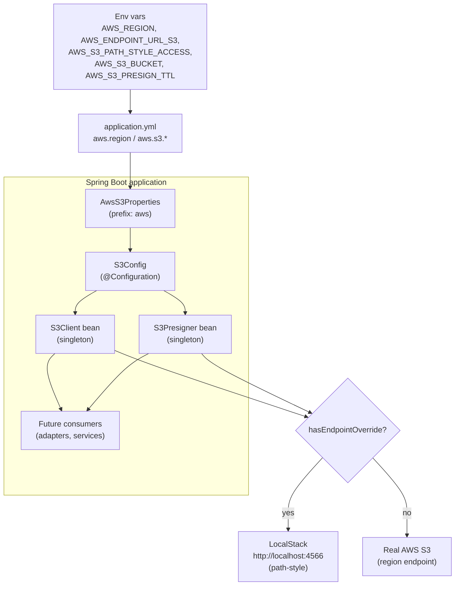

## Context

See `proposal.md` (Why) for motivation: `product_images` work (deferred by KAN-8) is blocked on
object storage, while the surrounding runway (LocalStack container on `127.0.0.1:4566`,
`develop-assets` bucket bootstrap via `localstack-resources`, commented-out AWS env vars in
`EndpointIntegrationTest`) is provisioned and unused. Nothing in `src/main/java` touches AWS today.

Constraints shaping this design:

- Capability contract: `specs/aws-s3-integration/spec.md` — 1 requirement
  ("Provide configurable S3 client beans") + 8 scenarios.
- Config surface (from `tmp/KAN-14-enriched-us-opus.md` §2.1/§4.2): `AwsS3Properties` is a
  `@ConfigurationProperties(prefix = "aws")` record with `region`, nested `S3` (`endpoint` as
  `URI`, `pathStyleAccess`, `bucket`, `presignTtl` as `Duration`) and a `hasEndpointOverride()` guard.
- Clean Architecture placement per `docs/backend-standards.md`: SpringBoot setup lives in
  `infrastructure/config`, alongside `JpaConfig`, `JsonConfig`, `OpenApiConfig`. No domain,
  application, or presentation layer changes.
- Build gates are strict: `spotless` (google-java-format + license header), SpotBugs, modernizer,
  enforcer, `duplicate-finder` (`failBuildInCaseOfConflict=true`, `checkRuntimeClasspath=true`),
  JaCoCo ≥ 90%, pitest.
- Test split: surefire excludes `**/integration/**`; failsafe includes only that package. Placement
  decides whether a test needs LocalStack running.
- `docs/data-model.md` is unaffected: no entity, migration, or Flyway change in this story.

## Goals / Non-Goals

**Goals:**

- Provide exactly one singleton `S3Client` bean and one singleton `S3Presigner` bean (AWS SDK v2),
  both built from `aws.region` / `aws.s3.*`, injectable via constructor injection.
- Support a LocalStack endpoint override (main: empty means real AWS; test: `http://localhost:4566`
  with path-style `true`) with zero code changes to switch LocalStack ↔ AWS.
- Resolve credentials exclusively via `DefaultCredentialsProvider`; create beans offline (no network
  calls at startup — fail-lazy).
- Handle the `S3Client` vs `S3Presigner` path-style asymmetry explicitly so presigned URLs resolve.
- Cover both override directions with tests (kills the pitest `NEGATE_CONDITIONALS` mutant) and prove
  the presigner with a real credential-free URL fetch.

**Non-Goals:**

Explicitly out of scope (follow-up stories, see `proposal.md` Non-Goals):

- `AssetStorage` domain port + `S3AssetStorageAdapter`.
- Product image upload endpoint (`product_images`).
- SQS consumer for `develop-products-assets-events-queue`.
- S3 Actuator health indicator (would couple `/health` to an external service without a
  readiness/liveness policy).
- Bucket security hardening (drop public-read, scope CORS).
- LocalStack Testcontainers module — `mvn verify` stays developer-managed `docker compose up`,
  consistent with Postgres-backed tests.
- `S3AsyncClient` / `S3TransferManager` — sync client only.

## Decisions

### D1 — Placement: `infrastructure/config`, no new layers

`AwsS3Properties.java` and `S3Config.java` go in
`src/main/java/com/example/demo/infrastructure/config/` next to `JpaConfig`, `JsonConfig`,
`OpenApiConfig`.

- Rationale (DDD skill): this is a Generic Subdomain concern (object-storage client bootstrap), not
  Core Domain logic. It belongs in infrastructure; domain/application/presentation layers are untouched.
  No port/adapter is introduced because there is no consumer yet — designing a port in a vacuum
  violates YAGNI.
- SOLID: SRP — `AwsS3Properties` owns binding, `S3Config` owns bean construction; DIP — future
  consumers depend on the `S3Client`/`S3Presigner` abstractions via constructor injection.
- Alternatives considered: `infrastructure/adapters/` placement — rejected, that package holds
  repository/third-party-access implementations, not SpringBoot setup; domain port now — rejected
  (no consumer, speculative).

### D2 — `AwsS3Properties` as an immutable record with `hasEndpointOverride()`

```java
@ConfigurationProperties(prefix = "aws")
@Validated
public record AwsS3Properties(@NotBlank String region, S3 s3) {
  public record S3(URI endpoint, boolean pathStyleAccess, String bucket, @NotNull Duration presignTtl) {}
  public boolean hasEndpointOverride() {
    return this.s3 != null && this.s3.endpoint() != null;
  }
}
```

Registered via `@EnableConfigurationProperties(AwsS3Properties.class)` on `S3Config`, not a broad
`@ConfigurationPropertiesScan` (minimal blast radius).

- Rationale: immutability (`URI`, `Duration`, `String` are immutable) sidesteps the SpotBugs
  `EI_EXPOSE_REP` family; `spring-boot-configuration-processor` is already wired in
  `maven-compiler-plugin` `annotationProcessorPaths`, so `aws.*` IDE completion comes free.
- Binding contract: `${AWS_ENDPOINT_URL_S3:}` resolves to `""`, and Spring binds `""` to a `URI` as
  **`null`** (empty means real AWS). This is relied upon deliberately and pinned by an explicit
  `ApplicationContextRunner` test (`aws.s3.endpoint=` → `null`), so a future Spring binding change
  fails loudly instead of silently pointing at real AWS.
- Alternatives considered: mutable `@Component` class — rejected (mutable config, SpotBugs exposure
  warnings); `@ConfigurationPropertiesScan` — rejected (unrelated, broader change).

### D3 — `S3Config`: two singleton beans, `Region.of` + `DefaultCredentialsProvider`, conditional override

```java
@Slf4j
@Configuration
@EnableConfigurationProperties(AwsS3Properties.class)
@RequiredArgsConstructor
public class S3Config {
  private final AwsS3Properties properties;

  @Bean
  public S3Client s3Client() {
    S3ClientBuilder builder = S3Client.builder()
        .region(Region.of(this.properties.region()))
        .credentialsProvider(DefaultCredentialsProvider.create());
    if (this.properties.hasEndpointOverride()) {
      log.info("Overriding S3 endpoint with {}", this.properties.s3().endpoint());
      builder.endpointOverride(this.properties.s3().endpoint())
          .forcePathStyle(this.properties.s3().pathStyleAccess());
    }
    return builder.build();
  }

  @Bean
  public S3Presigner s3Presigner() {
    S3Presigner.Builder builder = S3Presigner.builder()
        .region(Region.of(this.properties.region()))
        .credentialsProvider(DefaultCredentialsProvider.create());
    if (this.properties.hasEndpointOverride()) {
      builder.endpointOverride(this.properties.s3().endpoint())
          .serviceConfiguration(S3Configuration.builder()
              .pathStyleAccessEnabled(this.properties.s3().pathStyleAccess())
              .build());
    }
    return builder.build();
  }
}
```

Key points:

- **Path-style asymmetry (D3a):** `S3Client` uses `forcePathStyle(...)`; `S3Presigner` has **no**
  `forcePathStyle` method — path-style goes via
  `S3Configuration.builder().pathStyleAccessEnabled(...).build()` passed to `.serviceConfiguration(...)`.
  Without this, presigned URLs use virtual-host style (`develop-assets.localhost:4566`) and do not
  resolve. Proven by a unit test asserting the presigned path starts with `/develop-assets/` and an
  integration test fetching a presigned URL over plain HTTP.
- **Credentials (D3b):** `DefaultCredentialsProvider.create()` per bean. No `StaticCredentialsProvider`
  with `test`/`test` in `src/main` — that would ship fake credentials to production and break
  IAM-role/IRSA deployment. Tests supply `AWS_ACCESS_KEY_ID`/`AWS_SECRET_ACCESS_KEY=test` via
  junit-pioneer `@SetEnvironmentVariable` (the commented block in `EndpointIntegrationTest` already
  anticipates this).
- **Lifecycle (D3c):** both beans implement `SdkAutoCloseable` → Spring infers `close()` as the destroy
  method automatically. Do **not** set `destroyMethod = ""` and do **not** add an explicit
  `destroyMethod` — no override needed.
- **Offline builders (D3d):** `builder.build()` performs no network calls; the app boots with
  LocalStack/AWS unreachable (fail-lazy). Failures surface on the first S3 operation.
- **Logging (D3e):** `@Slf4j` per backend standards; one `INFO` line with the override endpoint
  ("which endpoint am I hitting" is the number-one debugging question). Never log credentials,
  presigned URLs (bearer capabilities), or full ARNs.
- DRY: the two `if (hasEndpointOverride())` branches share the guard method rather than duplicating
  null-check logic; no premature shared builder abstraction (the two builder types differ — Rule of
  Three, coincidentally-similar code serving different SDK types).
- Alternatives considered: startup `headBucket` probe (fail-fast) — rejected (trades boot resilience
  for early detection; spec requires fail-lazy); single shared credentials-provider bean — rejected
  (unnecessary indirection for two call sites).

### D4 — Configuration: env-driven `application.yml` (main + test)

Main (`src/main/resources/application.yml`):

```yaml
aws:
  region: ${AWS_REGION:us-east-1}
  s3:
    endpoint: ${AWS_ENDPOINT_URL_S3:}        # empty => real AWS
    path-style-access: ${AWS_S3_PATH_STYLE_ACCESS:false}
    bucket: ${AWS_S3_BUCKET:develop-assets}
    presign-ttl: ${AWS_S3_PRESIGN_TTL:PT15M}
```

Test (`src/test/resources/application.yml`, appended):

```yaml
aws:
  region: us-east-1
  s3:
    endpoint: http://localhost:4566
    path-style-access: true
    bucket: develop-assets
    presign-ttl: PT15M
```

- `AWS_ENDPOINT_URL_S3` reuses the variable name AWS SDK v2 and the AWS CLI already honour natively,
  shared with the `localstack-resources` bootstrap model.
- `bucket` / `presign-ttl` have no consumer in this story; they stabilise the config surface for
  follow-ups (droppable if the team prefers zero unused config).
- `EndpointIntegrationTest`: enable the AWS env-var block with `test`/`test` credentials via
  junit-pioneer (failsafe already declares the `--add-opens` argLine; junit-pioneer 2.2.0 is a test
  dependency).
- Alternatives considered: separate `AWS_S3_ENDPOINT` variable — rejected (two names for one concept).

### D5 — Build: BOM `2.46.7` + `s3` artifact only; strict-gate notes

```xml
<properties>
    <aws-sdk.version>2.46.7</aws-sdk.version>
</properties>
<dependencyManagement>
    <dependencies>
        <dependency>
            <groupId>software.amazon.awssdk</groupId>
            <artifactId>bom</artifactId>
            <version>${aws-sdk.version}</version>
            <type>pom</type>
            <scope>import</scope>
        </dependency>
    </dependencies>
</dependencyManagement>
<!-- AWS S3 (SDK v2) -->
<dependency>
    <groupId>software.amazon.awssdk</groupId>
    <artifactId>s3</artifactId>
</dependency>
```

- The project has no `<dependencyManagement>` today — it must be created; version pinned in
  `<properties>` like every other version in the pom.
- `software.amazon.awssdk:s3` transitively provides `S3Presigner` and the sync HTTP client — **no
  extra artifact required**.
- Jar weight: ~12–18 MB additional. If that matters later, exclude `netty-nio-client` in favour of
  `url-connection-client` — out of scope, noted only.
- Gate notes: run `mvn verify` **before** writing code to flush out duplicate-finder conflicts;
  offending pairs go to `<ignoredDependencies>`/`<ignoredResourcePatterns>` with PR justification
  (never silent widening). `mvn spotless:apply` before committing. Pitest requires override-set AND
  override-absent tests (D-tests § Testing Strategy). SpotBugs `EI_EXPOSE_REP2` on the record:
  prefer shape fixes over exclusions.

### D6 — Infra/docs: `wait-for-it` fix + doc updates

- `docker-compose.yml`: `wait-for-it.sh localstack:5432` → `localstack:4566`. `5432` is PostgreSQL;
  the script is not `--strict`, so today it times out after 10 s and runs the CloudFormation deploy
  anyway — "works by accident", flaky on slow machines (missing `develop-assets` bucket → red
  integration tests for no obvious reason).
- `README.md`: document the `aws.*` properties and the LocalStack workflow.
- `docs/backend-standards.md`: register S3 / AWS SDK v2 in the Technology Stack section.

### D7 — Testing strategy (TDD: failing test first, per TDD skill)

Unit (`infrastructure/config/S3ConfigTests.java`, no network, no Spring context — instantiate
`S3Config` directly; assert via `client.serviceClientConfiguration()`):

1. Client builds, region `us-east-1`.
2. Override applied when endpoint set (`endpointOverride()` present and equal).
3. No override when endpoint `null` (`Optional.empty()`) — kills the `NEGATE_CONDITIONALS` mutant
   together with (2).
4. Presigner builds; presigned `GetObjectRequest` URL host/port is `localhost:4566` and path starts
   with `/develop-assets/` (presigning is local HMAC — genuine unit test).
5. `ApplicationContextRunner` with `aws.s3.endpoint=` binds `null` (empty-string contract).
6. Non-default region (e.g. `eu-west-1`) honoured by both beans.

Integration (`integration/config/S3ConfigIntegrationTests.java`, LocalStack required,
`@SpringBootTest` + `@SetEnvironmentVariable` creds):

1. Both beans autowire.
2. `listBuckets()` contains `develop-assets` (bootstrap agreement).
3. `putObject` → `getObject` round trip on `products/kan-14-test.txt`; cleanup in `@AfterEach`.
4. Presigned `GET` fetched over plain HTTP with no credentials → `200` + matching body (acceptance
   proof for the presigner).

Regression: `EndpointIntegrationTest` (and every suite extending it) still starts green.

### Architecture diagram



## Risks / Trade-offs

- [Risk] **Duplicate-finder conflict** (`failBuildInCaseOfConflict=true`, `checkRuntimeClasspath=true`;
  AWS SDK v2 modules are a known source of duplicate `META-INF`/overlapping classes) → Mitigation:
  add the BOM first and run `mvn verify` before writing code; whitelist offending pairs with PR
  justification.
- [Risk] **Empty-string → `null` URI binding assumption** breaks silently if Spring changes binding →
  Mitigation: explicit `ApplicationContextRunner` test asserting the contract.
- [Risk] **Presigner path-style mistake** (wrong API builds fine, yields unresolvable URLs, fails only
  at URL-fetch time) → Mitigation: unit test on path prefix + integration test fetching the URL.
- [Risk] **Pitest `NEGATE_CONDITIONALS` survivor** on `if (hasEndpointOverride())` → Mitigation: tests
  for both override-set and override-absent directions.
- [Trade-off] `bucket`/`presign-ttl` declared with no consumer → stabilises config surface for
  follow-ups at the cost of temporarily unused config.
- [Trade-off] Fail-lazy boot → app starts with S3 unreachable (spec-required) but first-operation
  failures surface at runtime instead of startup.
- [Trade-off] ~12–18 MB jar weight for the `s3` artifact → accepted; slimming (`url-connection-client`)
  deferred.

## Migration Plan

No data migration (no entities, no Flyway scripts). Deployment steps:

1. Merge with `aws:` block present; production env leaves `AWS_ENDPOINT_URL_S3` unset → real AWS
   resolution, `us-east-1` default.
2. Local/dev sets `AWS_ENDPOINT_URL_S3=http://localhost:4566` (or relies on test `application.yml`).
3. Rollback: revert the change — no state to unwind; bucket bootstrap in LocalStack is untouched.

## Open Questions

None. Deferrable unknowns (production region confirmation, bucket hardening ticket, Testcontainers
module, async client need) are tracked as follow-ups in `proposal.md` and do not change the specs,
approach, or task breakdown.
