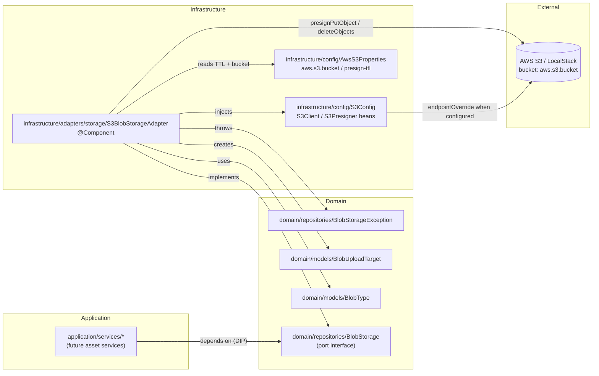
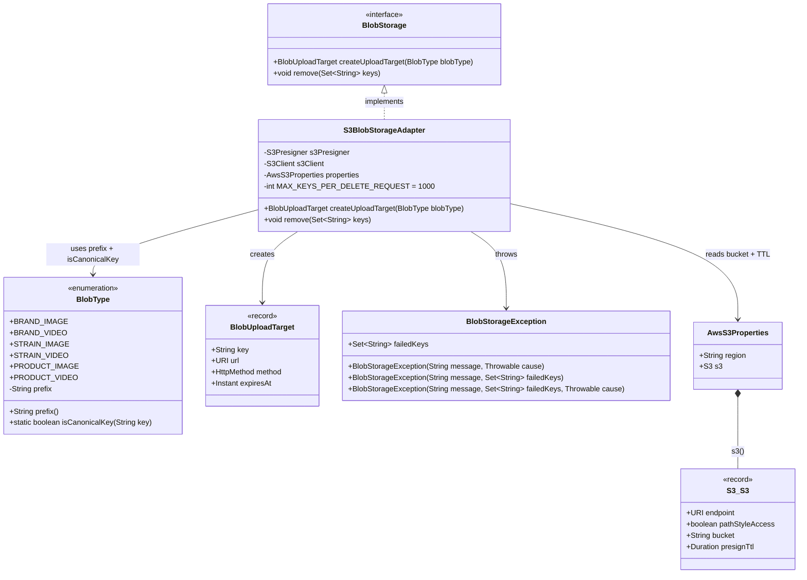
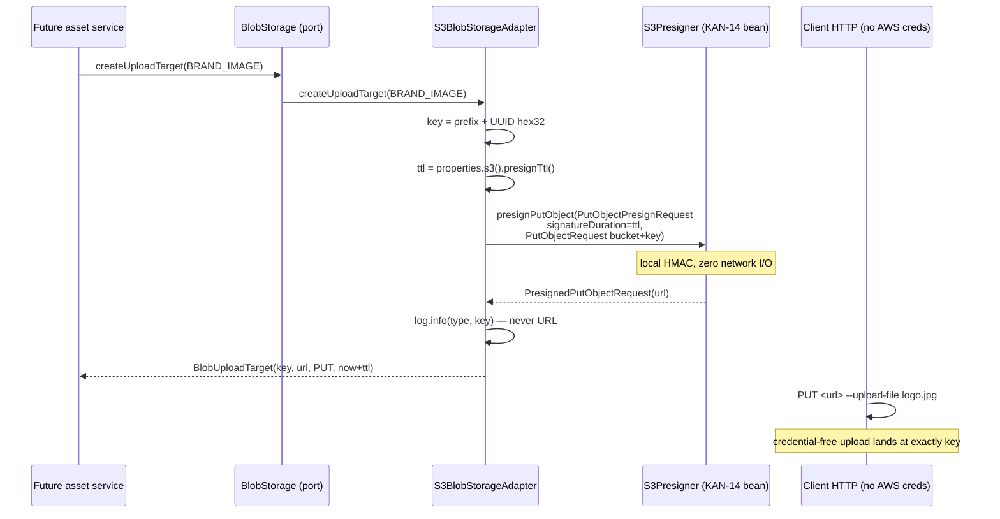
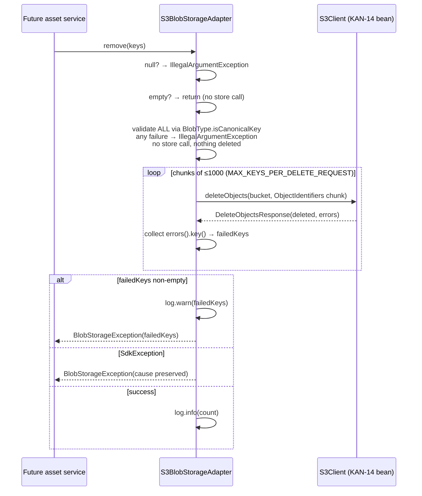

# Design: kan-10-blob-storage-port — Blob Storage Port + S3 Adapter

## 1. Overview

This change introduces a storage-agnostic `BlobStorage` port in the domain layer plus a
first AWS S3 implementation in the infrastructure layer, consuming the `S3Client` /
`S3Presigner` beans delivered by KAN-14.

Goals:

- Unblock the four queued asset stories (`brand_images`, `brand_videos`, `strain_images`,
  `product_images`) with one shared key-naming, TTL-handling, and error-translation contract.
- Keep binary traffic off the Spring application: upload via presigned PUT is a local HMAC
  computation (zero network I/O, target p95 < 5 ms).
- Cap vendor lock-in at exactly one class (`S3BlobStorageAdapter`), the only importer of
  `software.amazon.awssdk.*` outside `infrastructure/config`.
- Preserve the existing `products/`-filtered S3 → SQS notification contract on
  `develop-products-assets-events-queue`.

Non-goals (enforced, not built): HTTP endpoint, persistence entity / repository / service,
Flyway migration, upload size or content-type restriction, orphan-blob reclamation, second
storage implementation, new configuration property.

## 2. Architecture and Layering

DDD / Clean Architecture placement:

- `domain/models` — `BlobType` enum, `BlobUploadTarget` record (value objects, no
  infrastructure dependency except the protocol type `org.springframework.http.HttpMethod`,
  decision D4).
- `domain/repositories` — `BlobStorage` port interface, `BlobStorageException` domain error.
- `infrastructure/adapters/storage` — `S3BlobStorageAdapter` (Anti-Corruption Layer: translates
  the AWS SDK model into the ubiquitous language `BlobType` / `BlobUploadTarget` / `BlobStorageException`).
- `infrastructure/config` — unchanged `S3Config` beans (`S3Client`, `S3Presigner`), hardened
  `AwsS3Properties` (`@NotBlank` on `bucket`).
- `application/*` — future asset services depend only on the `BlobStorage` port (DIP). No
  application change in KAN-10.
- `presentation/*` — no change. `BlobStorageException` (unchecked) falls through to the existing
  `GlobalExceptionHandler.handleGeneric` → `500` with fixed body; no URL or signature material
  ever reaches the handler.





SOLID / DDD reading:

- SRP: `BlobType` owns prefixes and only prefixes; the adapter owns SDK translation and only
  that; validation (`isCanonicalKey`) lives with the data it validates.
- OCP: a seventh blob type is a one-line enum addition; the adapter and regex derive from the
  same `prefix` constants, so no adapter change is needed.
- ISP: the port exposes exactly two operations; no client is forced to depend on unused members.
- DIP: application depends on the `domain/repositories/BlobStorage` abstraction; the AWS
  concretion is injected by Spring (`@Component` + `@RequiredArgsConstructor` constructor injection).
- DRY: prefix strings exist once in `BlobType`. The adapter MUST NOT hardcode
  `^(brands|strains|products)/…` a second time. Bucket and TTL exist once in `AwsS3Properties`.
- Ubiquitous language: `BlobType`, `BlobUploadTarget`, `remove`, `failedKeys` are domain terms
  shared by specs, logs, and code; AWS terms (`DeleteObjects`, `PresignedPutObjectRequest`) never
  cross the adapter boundary.

## 3. Detailed Design

### 3.1 `BlobType` — single source of truth for prefixes

- Location: `src/main/java/com/example/demo/domain/models/BlobType.java`
- Package: `com.example.demo.domain.models`
- Type: `public enum BlobType`

| Constant        | Prefix             |
|-----------------|--------------------|
| `BRAND_IMAGE`   | `brands/images/`   |
| `BRAND_VIDEO`   | `brands/videos/`   |
| `STRAIN_IMAGE`  | `strains/images/`  |
| `STRAIN_VIDEO`  | `strains/videos/`  |
| `PRODUCT_IMAGE` | `products/images/` |
| `PRODUCT_VIDEO` | `products/videos/` |

Members:

- `private final String prefix` set by constructor; `public String prefix()` accessor.
- `private static final Pattern RANDOM_PART = Pattern.compile("[0-9a-f]{32}")`.
- `public static boolean isCanonicalKey(String key)`:
  - Returns `false` for `null` (and therefore for blank — blank never starts with a prefix nor
    matches the hex suffix; callers treating blank explicitly is covered by the same `false`).
  - Otherwise returns `true` iff some enum constant satisfies
    `key.startsWith(type.prefix)` AND `RANDOM_PART.matcher(key.substring(type.prefix.length())).matches()`.
  - Derived from the same `prefix` constants used for key construction — adding a blob type
    automatically extends validation (DRY, OCP).

Key format: `<prefix><32 lowercase hex chars>`, total 46–49 chars, far under the 1024-byte S3
limit. Keys are generated inside the port via `UUID.randomUUID().toString().replace("-", "")`
(122 bits of entropy); callers never supply key material, so the path-traversal surface is zero
and the key is safe to store verbatim in a `varchar` URL column.

### 3.2 `BlobUploadTarget` — immutable result value object

- Location: `src/main/java/com/example/demo/domain/models/BlobUploadTarget.java`
- Type: `public record BlobUploadTarget(String key, URI url, HttpMethod method, Instant expiresAt) {}`

Field contracts:

- `key` — canonical key as defined by `BlobType` for the requested type.
- `url` — presigned S3 PUT URL for the configured bucket and exactly `key`; credential-free
  until expiry. Type `java.net.URI` (immutable, no AWS type).
- `method` — always `org.springframework.http.HttpMethod.PUT` (decision D4: a protocol type, not
  a vendor type; the project already tolerates framework types in `domain/models`; reversible for
  a 6-line bespoke enum if the team wants a strictly framework-free domain).
- `expiresAt` — `Instant.now().plus(ttl)` where `ttl = properties.s3().presignTtl()`
  (decision D5; see §5 for the no-`Clock` rationale).

### 3.3 `BlobStorage` — the port

- Location: `src/main/java/com/example/demo/domain/repositories/BlobStorage.java`
- Type: `public interface BlobStorage`

```java
public interface BlobStorage {

  /** Issues a short-lived, pre-authorised upload target for a freshly generated key. */
  BlobUploadTarget createUploadTarget(BlobType blobType);

  /** Removes the given keys. Idempotent: unknown canonical keys are ignored. */
  void remove(Set<String> keys);
}
```

Contract:

- `createUploadTarget(null)` → `IllegalArgumentException`, no store call.
- `remove(null)` → `IllegalArgumentException`, no store call.
- `remove(Set.of())` → no-op, no store call.
- `remove` with any non-canonical key → `IllegalArgumentException` for the whole set, no store
  call, nothing deleted (validate-all-before-delete-any, see §4).
- No `software.amazon.awssdk` type in any signature, return type, parameter, or `throws` clause.

### 3.4 `BlobStorageException` — domain error with partial-failure context

- Location: `src/main/java/com/example/demo/domain/repositories/BlobStorageException.java`
- Type: `public class BlobStorageException extends RuntimeException`
- State: `private final Set<String> failedKeys` (empty when the failure is not a partial batch failure).

Constructors:

- `BlobStorageException(String message, Throwable cause)` — presign failures and whole-batch SDK
  failures; `failedKeys` is `Set.of()`.
- `BlobStorageException(String message, Set<String> failedKeys)` — partial batch failure without
  an SDK throwable; stores `Set.copyOf(failedKeys)`.
- `BlobStorageException(String message, Set<String> failedKeys, Throwable cause)` — partial batch
  failure retaining the cause; stores `Set.copyOf(failedKeys)`.
- `public Set<String> getFailedKeys()` returns the immutable copy.

The exception message MUST contain the key (for correlation) but MUST NEVER contain the presigned
URL or signature material. The vendor exception is retained as `cause` only. Surfaces via
`GlobalExceptionHandler.handleGeneric` → `500` with fixed body; no presentation change needed.

### 3.5 `S3BlobStorageAdapter` — the only AWS importer outside `infrastructure/config`

- Location: `src/main/java/com/example/demo/infrastructure/adapters/storage/S3BlobStorageAdapter.java`
- Stereotype: `@Component @Slf4j @RequiredArgsConstructor public class S3BlobStorageAdapter implements BlobStorage`
- Dependencies (constructor-injected, `final`): `S3Presigner s3Presigner`, `S3Client s3Client`,
  `AwsS3Properties properties`.
- Constant: `private static final int MAX_KEYS_PER_DELETE_REQUEST = 1000` (S3 `DeleteObjects`
  hard limit).

`createUploadTarget(BlobType blobType)`:

1. `Assert.notNull(blobType, "blobType must not be null")`.
2. `String key = blobType.prefix() + UUID.randomUUID().toString().replace("-", "")`.
3. `Duration ttl = this.properties.s3().presignTtl()`.
4. Build `PutObjectRequest` with `bucket(properties.s3().bucket())` and `key(key)`;
   wrap in `PutObjectPresignRequest.builder().signatureDuration(ttl).putObjectRequest(...).build()`.
5. `PresignedPutObjectRequest presigned = this.s3Presigner.presignPutObject(presignRequest)` —
   local HMAC, zero network I/O.
6. `log.info("Upload target issued for blob type {} with key {}", blobType, key)` — type and key
   only, never the URL.
7. Return `new BlobUploadTarget(key, presigned.url().toURI(), HttpMethod.PUT, Instant.now().plus(ttl))`.
8. On `SdkException | URISyntaxException` → `throw new BlobStorageException("Could not issue an upload target for key " + key, ex)` (cause preserved, no vendor type escapes, no URL in message).

`remove(Set<String> keys)`:

1. `Assert.notNull(keys, "keys must not be null")`.
2. If `keys.isEmpty()` → return immediately (no store call).
3. Validate ALL keys first: for each key,
   `Assert.isTrue(BlobType.isCanonicalKey(key), "Key is not a managed blob key: " + key)`.
   Any failure throws `IllegalArgumentException` before any `deleteObjects` call, so a rejected
   key never leaves a half-completed deletion behind.
4. Chunk the validated list into sub-lists of at most `MAX_KEYS_PER_DELETE_REQUEST` and, per chunk,
   call `s3Client.deleteObjects(DeleteObjectsRequest.builder().bucket(bucket).delete(Delete.builder().objects(chunk.stream().map(k -> ObjectIdentifier.builder().key(k).build()).toList()).build()).build())`.
   Chunk count is `ceil(n/1000)`: exactly 1000 keys → 1 call; 1001 keys → 2 calls (1000 + 1).
5. Collect every entry of every `DeleteObjectsResponse.errors()` into a `failedKeys` list
   (`Error.key()`). `errors()` MUST be read — `DeleteObjects` returns HTTP 200 with a per-key
   error list, and ignoring it is the classic silent-data-loss bug for this API.
6. If `failedKeys` is non-empty → `log.warn("Failed to remove blobs: {}", failedKeys)` then
   `throw new BlobStorageException("Could not remove blobs: " + failedKeys, Set.copyOf(failedKeys))`.
7. On `SdkException` (including `S3Exception` / `SdkClientException`) from any chunk →
   `throw new BlobStorageException("Could not remove blobs", ex)` with cause preserved.
8. On success → `log.info("Removed {} blobs", keys.size())`.
9. Unknown canonical keys with no stored object are a silent no-op (S3 semantics → idempotent).

### 3.6 `AwsS3Properties` hardening

- Location: `src/main/java/com/example/demo/infrastructure/config/AwsS3Properties.java`
- Change: add `@NotBlank` to the `bucket` component of the nested `S3` record:
  `public record S3(URI endpoint, boolean pathStyleAccess, @NotBlank String bucket, @NotNull Duration presignTtl) {}`.
- Rationale: `bucket` is now load-bearing (presign target + delete target). Fail fast at startup
  binding instead of mid-request. No new property is introduced; `aws.s3.bucket` (default
  `develop-assets`) and `aws.s3.presign-ttl` (default `PT15M`) are reused from KAN-14.

## 4. Interactions

### 4.1 presignPutObject flow



Key assertions for tasks: `ArgumentCaptor<PutObjectPresignRequest>` proves `bucket`, `key`, and
`signatureDuration` equal the configured values; consecutive calls yield different keys and URLs.

### 4.2 deleteObjects chunking + errors() collection flow



Validation-order invariant (test 5.2.9 pins it): a set mixing one valid and one invalid key
performs `verifyNoInteractions(s3Client)`.

## 5. Cross-Cutting Decisions

### 5.1 Logging discipline — key + type only, never URL

- `log.info("Upload target issued for blob type {} with key {}", blobType, key)`.
- `log.info("Removed {} blobs", keys.size())`; on partial failure `log.warn` with failed keys
  before throwing.
- A presigned URL is a bearer capability (any holder can write until expiry). URLs, query strings,
  and `X-Amz-Signature` material MUST NEVER appear in any log at any level, in any exception
  message, or in any metric tag. The `ListAppender` log test (5.2.14) enforces this.
- Lombok `@Slf4j` per backend logging standards; parameterized messages, no string concatenation.

### 5.2 Validation order — validate-all-before-delete-any

`remove` validates the entire set with `BlobType.isCanonicalKey` before the first chunk is sent.
Consequences: the operation is atomic from the caller's perspective on validation failure
(nothing deleted, no store call), at the cost of one extra pass over the key set (negligible vs.
`ceil(n/1000)` network round-trips). Precondition failures use Spring `Assert` →
`IllegalArgumentException`, consistent with the spec.

### 5.3 Time — `Instant.now()` + TTL tolerance, no `Clock` (YAGNI)

`expiresAt = Instant.now().plus(ttl)` directly in the adapter. Tests assert `expiresAt` inside a
tolerance window (`before(now+ttl+skew)` / `after(now+ttl-skew)`) instead of injecting a `Clock`
bean. Rationale (§8.7): no other consumer needs deterministic time today; a `Clock` bean is
revisited only if deterministic time becomes necessary elsewhere.

### 5.4 Error translation — cause preserved, vendor type contained

| Source condition                                              | Port outcome                                                        |
|---------------------------------------------------------------|---------------------------------------------------------------------|
| `blobType == null`, `keys == null`, non-canonical key         | `IllegalArgumentException` before any store call                    |
| Presigner throws `SdkException` / `SdkClientException`        | `BlobStorageException(message with key, cause)`                     |
| `presigned.url().toURI()` throws `URISyntaxException`         | `BlobStorageException(message with key, cause)`                     |
| `s3Client.deleteObjects` throws `SdkException` / `S3Exception`| `BlobStorageException(message, cause)`                              |
| `DeleteObjectsResponse.errors()` non-empty                    | `BlobStorageException(message, failedKeys)` (+ warn log)            |

No `software.amazon.awssdk` type appears in any port signature, return, parameter, or escaping
exception type. `BlobStorageException.getFailedKeys()` carries partial-failure context for the
future caller (recommended DB-first-then-blob ordering stays a caller concern, §8.8).

### 5.5 Reconciliation of the KAN-14 scope fence

The archived `aws-s3-integration` spec sentence *"SHALL NOT introduce a domain port, storage
adapter…"* was a KAN-14 construction-time fence, not an architectural prohibition. This change
updates that requirement text so the `S3Client` / `S3Presigner` beans are now consumed by the
first storage adapter, with bean construction, region resolution, endpoint handling, and
credential resolution unchanged. The delta spec `specs/aws-s3-integration/spec.md` in this change
already carries the reconciled wording plus the *"Beans consumed by the blob-storage adapter
without behavior change"* scenario.

## 6. Test Strategy (maps to enriched story §5)

TDD order, naming `should_[expected]_when_[condition]`, AAA, JaCoCo ≥ 90% on new classes, pitest
gate (empty-set guard branches, chunking boundary, `errors()` branch), Spotless / SpotBugs /
modernizer / enforcer / duplicate-finder green.

- Domain unit — `BlobTypeTests`: six-prefix distinctness (`@ParameterizedTest`), `products/`
  SQS-contract pin (PRODUCT_IMAGE/PRODUCT_VIDEO start with `products/`, brand/strain do not),
  canonical acceptance per type, rejection of unknown prefix / non-hex32 / null-or-blank /
  path-traversal (`products/images/../../secret`).
- Adapter unit — `S3BlobStorageAdapterTests` (Mockito `S3Presigner` + `S3Client`, real
  `AwsS3Properties`): canonical key + PUT per type, uniqueness across two calls,
  `ArgumentCaptor<PutObjectPresignRequest>` on bucket/key/`signatureDuration`, `expiresAt`
  tolerance window, null blob type → `IllegalArgumentException`, presigner failure →
  `BlobStorageException` with cause and no AWS escaping type, empty set →
  `verifyNoInteractions(s3Client)`, null set → `IllegalArgumentException`, mixed valid+invalid →
  `IllegalArgumentException` + `verifyNoInteractions`, exactly-1000 → 1 call, 1001 → 2 calls
  (1000 + 1), `errors()` → `BlobStorageException` carrying failed keys, `s3Client` throw →
  `BlobStorageException`, `ListAppender` log capture asserting key present and `X-Amz-Signature`
  absent.
- Adapter integration — `S3BlobStorageAdapterIntegrationTests` (real LocalStack,
  `@SpringBootTest`, `AWS_ACCESS_KEY_ID`/`AWS_SECRET_ACCESS_KEY=test`, `docker compose up`):
  credential-free PUT → `200` + `headObject` length match, `getObject` round-trip equality,
  `remove` → `headObject` throws `NoSuchKeyException`, unknown canonical key → silent success,
  3-uploads-one-`remove` → all gone, one-per-type upload → `listObjectsV2` per prefix returns
  exactly one, optional `@Tag("slow")` TTL-expiry (`PT1S` + 2 s wait → `403`). `@AfterEach`
  cleanup via `remove(...)` so the shared `develop-assets` bucket stays clean.
- Config binding: `bucket` blank → startup validation failure (`@NotBlank`).

Performance targets: presign p95 < 5 ms (local crypto, safe on any request thread under virtual
threads); `remove(n ≤ 1000)` p95 < 300 ms (one round-trip); no presigned-URL caching (each call
mints a fresh key).

## 7. Files Affected

New (5):

- `src/main/java/com/example/demo/domain/models/BlobType.java` — enum + `prefix()` + `isCanonicalKey`.
- `src/main/java/com/example/demo/domain/models/BlobUploadTarget.java` — immutable record.
- `src/main/java/com/example/demo/domain/repositories/BlobStorage.java` — port, 2 operations.
- `src/main/java/com/example/demo/domain/repositories/BlobStorageException.java` — unchecked error + `failedKeys`.
- `src/main/java/com/example/demo/infrastructure/adapters/storage/S3BlobStorageAdapter.java` — `@Component` adapter, `MAX_KEYS_PER_DELETE_REQUEST = 1000`.

Modified (3):

- `src/main/java/com/example/demo/infrastructure/config/AwsS3Properties.java` — `@NotBlank` on `bucket`.
- `README.md` — blob-type/prefix table, key convention, LocalStack upload walkthrough.
- `docs/backend-standards.md` — register `infrastructure/adapters/storage/` and the `BlobStorage` port convention.

Deleted (0). No Flyway migration, no entity, no repository, no service, no controller.

## 8. Risks and Mitigations

- Unbounded upload (no size/content-type condition on presigned PUT) — accepted per D1;
  follow-up ticket (POST policy / lifecycle guard / SQS validator), not built here.
- World-readable bucket (`PublicRead` + `s3:GetObject` to `*`) — pre-existing KAN-14 production
  blocker; acceptable for public marketing assets with 122-bit unguessable keys; bucket must never
  hold private content.
- Orphan blobs (issued-never-uploaded, uploaded-DB-write-failed) — no reclamation in KAN-10;
  follow-up ticket + orphan-rate metric (`blob.upload_target.issued` / `blob.removed` counters
  recommended, optional).
- No auth in codebase — auth story must precede any production endpoint wrapping the port.
- `STRAIN_VIDEO` / `PRODUCT_VIDEO` have no backing tables in `V0.1.0` — storable but not
  persistable; migrations are separate tickets (assumption 8.1).
- `DISPENSARY_IMAGE` absent from enum despite `dispensary_images` existing — confirm intentional
  (assumption 8.2); seventh type is a one-line change if unintended.
- Soft-delete vs `remove` ordering — product decision pending (assumption 8.3); KAN-10 supplies
  only the capability.
- `PRODUCT_*` prefix rename would silently break the SQS filter — pinned by test 5.1.2.

## 9. Open Questions

Carried from proposal assumptions §8 / enriched story §8 (require sign-off, none block design):

1. `STRAIN_VIDEO` / `PRODUCT_VIDEO` forward declarations — confirm intentional, migrations separate.
2. `DISPENSARY_IMAGE` omission — confirm intended, not an oversight.
3. Who calls `remove`, and when (soft-delete contract tension) — product decision.
4. Orphan-blob reclamation — follow-up ticket.
5. Auth story before production endpoint — prerequisite.
6. Single bucket for images and videos — confirmed; prefix-scoped lifecycle rules suffice.
7. No injected `Clock` — confirmed YAGNI.
8. `remove` not transactional with DB — recommended ordering DB-row-first-then-blob.

## 10. Alternatives Considered

- Presigned POST policy instead of PUT (D1): richer server-side size/content-type enforcement but
  a more complex contract and a mismatch with the existing `GET, PUT` CORS rule. Rejected; raised
  as hardening follow-up.
- Flat prefixes (`product-images/`) instead of nested (D2): would break the existing `products/`
  SQS filter. Rejected.
- Caller-supplied filenames / extensions (D3): larger attack surface (path traversal, sanitising);
  rejected in favour of opaque UUID keys with zero caller input.
- Bespoke `BlobHttpMethod` enum instead of `HttpMethod` (D4): strictly framework-free domain at
  the cost of a parallel one-constant type. Rejected for now; 6-line reversal available.
- Injected `Clock` for `expiresAt` (§8.7): deterministic time at the cost of a new bean and wider
  test fixture churn. Rejected (YAGNI); tolerance-window assertions suffice.
