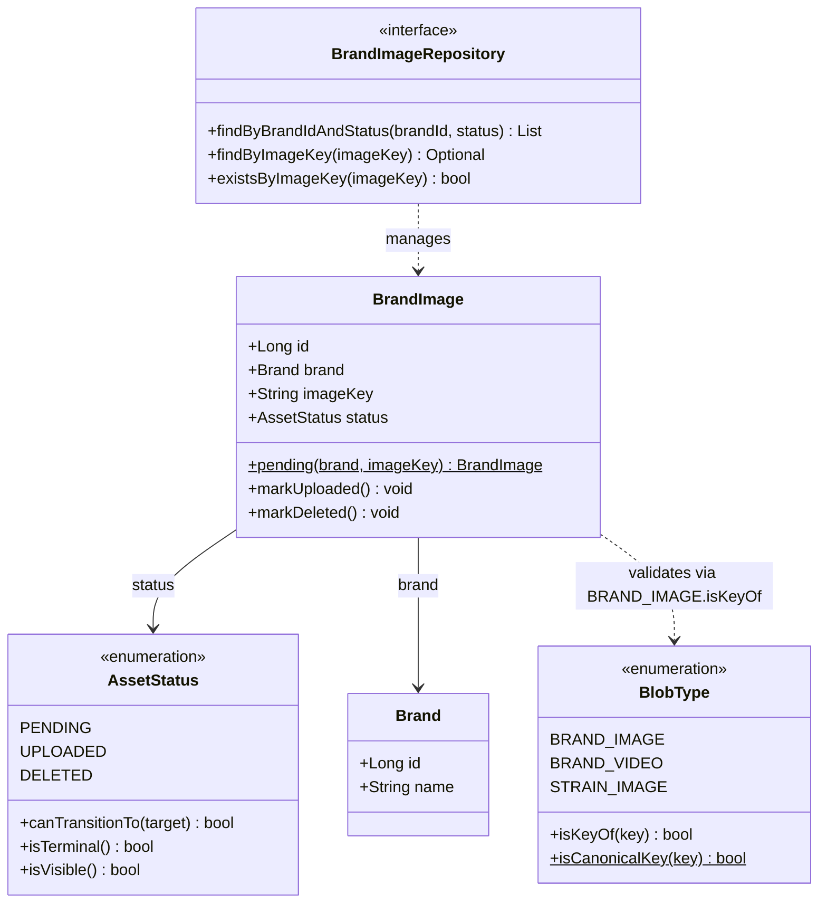

## Context

See `proposal.md` — Why for motivation. Current state shaping this design:

- KAN-10 delivered the storage half (`BlobStorage` port + `S3BlobStorageAdapter`): callers can mint
  presigned `PUT` targets for `BlobType.BRAND_IMAGE` (`brands/images/<32 hex>`), but nothing persists
  the blob reference. `brand_images` is a bare `(id, brand_id, image_url)` table with no entity, no
  repository, and no lifecycle.
- Domain conventions (grounded in code): entities live in `domain/models` / `domain/models/brand`,
  extend `BaseEntity` (`created_at`, `created_by`, `modified_at`, `modified_by`, `deleted_at`,
  `deleted_by` with `AuditingEntityListener` + `@PrePersist`/`@PreUpdate`/`@PreRemove`), follow the
  `Brand` pattern (`@Getter`/`@Setter`, `@Builder`, `@NoArgsConstructor`/`@AllArgsConstructor`,
  `IDENTITY` PK, `LAZY @ManyToOne`). Repositories live in `domain/repositories` as
  `JpaRepository<T, Long>` interfaces (e.g. `BrandRepository`).
- `BlobType` owns its prefixes as single source of truth; `isCanonicalKey(String)` validates
  "known prefix + 32 lowercase hex" by streaming over `values()`. `docs/data-model.md` §9 still
  documents `brand_images` as `(id, brand_id, image_url)` URL storage — stale after this change.
- Constraints: Clean Architecture + DDD layering; this slice stops at the domain boundary (no
  service, controller, DTO, `GlobalExceptionHandler`); Flyway locations
  `filesystem:flyway/release*` (Maven) and `classpath:flyway/release*` (tests) pick up new files
  under `flyway/release_0.1/` with no config change; `V0.1.0` has no seed rows in `brand_images`
  and no `src/` reference to `image_url`; all artifacts in English.

## Goals / Non-Goals

**Goals:**

- Establish the reusable shared asset lifecycle (`PENDING` → intent recorded before upload,
  `UPLOADED` → confirmed, only visible state; `DELETED` → terminal tombstone, blob may still
  exist) as a resource-agnostic domain type with zero framework leakage.
- Promote `brand_images` to a first-class DDD entity that protects its own invariants (guarded
  transitions, immutable unique canonical key, `PENDING`-only creation) with a minimal repository
  surface for the future read/confirm flows.
- Migrate the schema (`image_url` → `image_key`, `status` + `CHECK`, audit columns, targeted
  indexes) so Hibernate `validate` passes with zero drift on both fresh and `V0.1.0` databases.
- Prove behavior with TDD red-green coverage: unit tests for transitions/entity/key-ownership plus
  repository tests against real Postgres + Flyway (string persistence, `CHECK`, unique, FK proofs).

**Non-Goals (design-level boundaries; map to F1–F7):**

- No HTTP endpoint, no application service, no `PENDING → UPLOADED` confirm flow (`PATCH` vs S3
  notification undecided — §9.5).
- No rollout of `AssetStatus` to other asset tables; no shared mapped superclass / repeatable
  migration extraction yet (deferred to second occurrence — F5).
- No orphan-reclamation sweeper or `DELETED`-row blob-removal job (F4); no `BlobStorage.urlFor(key)`
  or CDN derivation (F3); no ordering/primary-image flags; no auth (absent codebase-wide).

## Decisions

### D1 — Clean/DDD layering: domain only, entity owns invariants

**Choice:** All new behavior lives in the domain layer: `AssetStatus` in `domain/models`,
`BrandImage` in `domain/models/brand`, `BrandImageRepository` in `domain/repositories`,
`BlobType.isKeyOf` extraction in `domain/models`. No service/controller/DTO in this slice.

**Rationale (DDD + SRP):** The anemic-model failure mode is the main risk — transition rules
scattered across future services would drift per asset table. Placing the transition table in the
enum (single source of truth, KAN-10 `BlobType` precedent) and guarding state changes inside the
entity (`markUploaded()` / `markDeleted()` only, `AccessLevel.NONE` setters) keeps the aggregate
always valid from birth (`pending()` factory). Ubiquitous language (`pending`, `markUploaded`,
`markDeleted`, `canTransitionTo`, `isTerminal`, `isVisible`) matches specs `asset-lifecycle` and
`brands-management` verbatim.

**Alternatives considered:** Service-level transition validation — rejected (duplicates rules in
every future asset flow); state-machine library — rejected (three states do not justify the
dependency; exhaustive `switch` gives compile-time safety for free).

### D2 — `AssetStatus`: enum-owned transition table, exhaustive switch, no framework leakage

**Choice:** `AssetStatus` with constants in order `PENDING`, `UPLOADED`, `DELETED`; methods
`canTransitionTo(AssetStatus)` (null → false, self → false, `PENDING → UPLOADED|DELETED`,
`UPLOADED → DELETED`, `DELETED → false`), `isTerminal()` (`DELETED` only), `isVisible()`
(`UPLOADED` only). Plain Java enum, no JPA/Spring imports. Exhaustive `switch` expression with no
`default` arm.

**Rationale (OCP + DRY):** Reuse verbatim by ≥4 future asset tables with zero changes (spec
scenario). Adding a fourth constant becomes a compile error, not silent fall-through — the OCP
tension (switch grows with states) is accepted deliberately because the state set is a closed
persistence contract guarded by a constant-count test. `isVisible()` is shipped now so every
future read endpoint expresses visibility identically instead of hardcoding comparisons.

**Alternatives considered:** Transition map / `EnumSet` table — equivalent expressiveness but less
readable for 3×3 matrix; boolean flags per transition — rejected (scatters the matrix).

### D3 — `BrandImage`: guarded entity, immutable key, `PENDING`-only factory

**Choice:** `@Entity @Table(name = "brand_images")`, extends `BaseEntity`; `LAZY @ManyToOne Brand`
via `brand_id NOT NULL`, no inverse `@OneToMany` on `Brand`; `imageKey` mapped to `image_key`
(`nullable = false, updatable = false, unique = true`, `AccessLevel.NONE` setter); `status`
mapped `@Enumerated(EnumType.STRING)`, `length = 16`, `nullable = false`, `AccessLevel.NONE`
setter. Sole sanctioned creation path `pending(brand, imageKey)`: rejects null/transient brand
and any key failing `BlobType.BRAND_IMAGE.isKeyOf`; sets `PENDING`. Mutations only via
`markUploaded()` / `markDeleted()` delegating to `status.canTransitionTo`, throwing
`IllegalStateException` on illegal moves. No `@SQLDelete` / `@SQLRestriction` — `status` is the
single delete marker.

**Rationale (DDD aggregate + JPA skill):** `updatable = false` makes key-swaps (silent blob
orphaning) structurally impossible; `AccessLevel.NONE` closes the Lombok backdoor an open
`setStatus` would leave. LAZY + no inverse collection avoids N+1 and unbounded collection loads
(per JPA skill guidance). Omitting `@SQLDelete`/`@SQLRestriction` avoids two competing "is it
deleted?" flags drifting apart; `DELETED` tombstone keeps removal auditable and retryable.

**Alternatives considered:** `@SQLDelete` soft-delete on `deleted_at` — rejected (duplicates the
status marker; `BaseEntity.@PreRemove` only fires on physical removal that must never happen);
eager brand association — rejected (N+1 on listings); `@Builder`-free construction — noted as
reviewer option (keep `@Builder` for fixture arrangement and Lombok consistency with
`Brand`/`Product`, production path is the factory).

### D4 — `BlobType.isKeyOf` extraction (behaviour-preserving, DRY)

**Choice:** Extract per-type `isKeyOf(String)` (canonical **and** owned-prefix check derived from
the same `prefix` + `RANDOM_PART` constants); global `isCanonicalKey` delegates via
`values()` stream (`anyMatch(isKeyOf)`). Null-safe. Existing `BlobTypeTests` must pass untouched.

**Rationale (DRY Iron Laws):** `BrandImage.pending` needs the same regex scoped to one type;
copying the pattern a second time creates a divergence point when a seventh blob type lands. The
prefix constants remain the single source of truth for construction and both predicates. This is a
genuine same-concept extraction (not coincidental similarity), so it satisfies the Rule of Three
safely at occurrence two.

**Alternatives considered:** Static `isKeyOf(BlobType, String)` — rejected (instance method reads
as ubiquitous language: `BRAND_IMAGE.isKeyOf(key)`).

### D5 — `BrandImageRepository`: three queries, `JpaRepository` convention kept

**Choice:** `BrandImageRepository extends JpaRepository<BrandImage, Long>` with
`findByBrandIdAndStatus(Long, AssetStatus)` (resolves through `brand.id`, served by the composite
index), `findByImageKey(String)`, `existsByImageKey(String)`. No custom `@Query`, no delete
methods added.

**Rationale (ISP tension resolved toward consistency):** `JpaRepository` matches
`BrandRepository`/`ProductRepository` project convention; the "never physically delete" invariant
is enforced by spec + review + absence of callers in this slice. A narrower `Repository`
interface would make physical deletion structurally impossible (ISP) — recorded as follow-up F6
rather than diverging from convention here, since Spring Data still exposes `delete()` through
the inherited type regardless.

**Alternatives considered:** Narrow `Repository<BrandImage, Long>` now — deferred to F6
(cross-cutting: touches `Brand`/`Product`/`Dispensary` expectations).

### D6 — DB: rename, `varchar(16)` + `CHECK` (not PG enum), three indexes, no silent default

**Choice:** Flyway `V0.1.1__brand_images_asset_lifecycle.sql`: `RENAME image_url → image_key`;
`ADD status varchar(16) NOT NULL DEFAULT 'PENDING'` then `DROP DEFAULT` after backfill;
`ADD CHECK (status IN ('PENDING','UPLOADED','DELETED'))`; add `BaseEntity` audit columns
(`created_at NOT NULL DEFAULT now()`, nullable `created_by/modified_at/modified_by/deleted_at/deleted_by`);
unique index on `image_key`; composite index on `(brand_id, status)`; partial index on
`created_at WHERE status = 'PENDING'`.

**Rationale per statement:**

- Rename (not second column): storing `brands/images/…` in `image_url` lies to every future reader;
  safe because `V0.1.0` has no seed rows and no `src/` reference (re-confirm per §9.1 if any
  environment was seeded manually).
- `varchar(16)` fits the longest name (`UPLOADED`, 8 chars) with headroom for one future value and
  bounds the `CHECK` comparison (one bounded check per write, negligible vs FK lookup).
- `CHECK` over native PG enum: `ALTER TYPE … ADD VALUE` cannot run in a transaction and values can
  never be removed; `varchar` + `CHECK` is diffable, reversible, trivially extended per asset
  table (registers the `@Enumerated(STRING)` + `varchar` + `CHECK`, never ordinals/enums
  convention in `backend-standards.md`).
- Dropping the `status` default: the entity always sets status explicitly; a forgotten assignment
  must fail loudly, not land silently as `PENDING`.
- `deleted_at`/`deleted_by` ship only because `BaseEntity` maps them; unused by design (status is
  the marker) — see assumption §9.3.
- Indexes: unique `image_key` (122-bit random keys; duplicate = bug/replay, DB is last defence);
  `(brand_id, status)` (Postgres does not auto-index FKs; serves every future visible-listing
  query); partial `PENDING` index (orphan sweeper `status = 'PENDING' AND created_at < now() - ttl`
  stays proportional to orphan count, not table size).

**Alternatives considered:** Shared PG enum type across asset tables — rejected (non-transactional
`ADD VALUE`, irreversible); single-column `brand_id` index instead of composite — rejected
(listings always filter the pair).

### D7 — Test strategy: TDD red-green, contract-first matrix, `validate` parity, DB-level proofs

**Choice:** Naming `should_[behavior]_when_[condition]`, Arrange/Act/Assert, ≥90% lines/branches
on new classes, 100% of the 3×4 transition matrix (incl. null target) asserted:

- `AssetStatusTests`: exact-three-constants guard, literal-name persistence contract (`PENDING` /
  `UPLOADED` / `DELETED` strings — a rename breaks a test, not production data), parameterized
  legal/illegal transitions, self/null rejection, `isTerminal`/`isVisible`.
- `BrandImageTests`: `PENDING` creation on canonical key; rejection of foreign-type keys
  (`strains/images/…`), null/blank/non-canonical/traversal keys, null/transient brand;
  `markUploaded`/`markDeleted` paths; double-confirm and deleted-transition `IllegalState`;
  reflection guard asserting no public `setStatus`/`setImageKey` (protects against future Lombok
  edits).
- `BlobTypeTests` (extend): `isKeyOf` ownership per all six types + cross-type rejection; existing
  `isCanonicalKey` tests pass untouched (regression proof of behaviour-preserving refactor).
- `BrandImageRepositoryTests` (real Postgres + Flyway): persist-and-reload `PENDING` with audit
  timestamps; native-query string proof (`SELECT status` returns `'PENDING'`, not `0`);
  `CHECK` proof (native `INSERT 'ARCHIVED'` → integrity violation); unique/FK/`NOT NULL` proofs;
  `findByBrandIdAndStatus` filtering with one row per status; `findByImageKey` hit/miss;
  transition round-trip with `modifiedAt` update; `DELETED` tombstone-keeps-row proof.
- Migration verification: every `@DataJpaTest` runs Flyway (broken migration fails the suite);
  explicit `ddl-auto: validate` run for mapping↔schema parity; manual gate `flyway:info` →
  `flyway:migrate` on a `V0.1.0` database (rename + add-column path, not fresh-create only).

**Rationale (TDD skill):** Red-first proves each test actually guards something (a test that never
failed proves nothing); DB-level proofs (not just JPA assertions) verify the `CHECK`/unique/FK
contracts the specs normatively require.

### D8 — NFRs by construction

- **Security:** No presigned URL persisted — only the opaque key (URLs are bearer capabilities per
  KAN-10; a stored URL is a long-lived credential). Key provenance validated in the domain
  (`isKeyOf` rejects traversal/cross-resource keys). Audit columns owned by
  `BaseEntity`/`AuditingEntityListener`, never accepted from outside. `DELETED` tombstones keep
  removal auditable. Never log keys beyond KAN-10 discipline; never log a presigned URL.
- **Performance:** All associations LAZY, no inverse collection on `Brand`. Single-row PK
  writes; index-backed reads (`(brand_id,status)`, unique `image_key`, partial `PENDING`).
  Target p95 < 20 ms for repository operations; `varchar(16)` + `CHECK` is one bounded comparison.
- **Observability (prepared, consumed by follow-ups):** Status column enables
  `pending_older_than_ttl` (orphan candidates), `deleted_awaiting_blob_removal`, and
  `PENDING → UPLOADED` conversion rate — defined now, dashboarded in F4/F2.
- **Maintainability/reuse:** Next asset table costs entity + migration only, zero `AssetStatus`
  changes (spec scenario). The repeated `(status, audit, CHECK, indexes)` migration block is a
  known second-occurrence extraction (shared Flyway fragment or `AssetEntity` superclass — F5,
  flagged not built per DRY Rule of Three).

### Diagram

## Risks / Trade-offs

- [Risk] Rename `image_url` → `image_key` breaks an environment seeded outside `V0.1.0` → Verify no
  manual seeds before migrate; fallback is keeping the old name with a comment (§9.1).
- [Risk] `BaseEntity` redundancy (`deleted_at`/`deleted_by` shipped but unused; `@PreRemove` fires
  only on physical removal that must never happen) confuses future readers → Document in
  `data-model.md`; structural fix deferred to F6 (split into `AuditableEntity` +
  `SoftDeletableEntity`).
- [Risk] Brand soft-delete does not cascade: `Brand` has `@SQLRestriction`, images stay `UPLOADED`,
  lazy proxy over a filtered brand row misbehaves → Needs product decision before the delete
  endpoint story (§9.4); no cascade added here by design.
- [Risk] `JpaRepository.delete()` remains technically reachable → Mitigated by spec prohibition +
  review + zero callers; structural narrowing deferred to F6.
- [Risk] Confirmation model undecided (`PATCH` vs S3→SQS; SQS filter is `products/`-only) →
  Must be decided at next-story refinement; shapes F2's subscription/filter change (§9.5).
- [Risk] Three states prove insufficient (`FAILED`/`EXPIRED`/`REMOVED` demanded within two stories)
  → Adding a state later touches every asset table's `CHECK`; revisit before the third asset table
  if product signals need (§9.7, D8).
- [Risk] Blob outlives tombstone (storage cost accrues until F4) → Accepted for this slice; partial
  `PENDING` index already ships to keep the sweeper cheap.
- [Trade-off] `varchar` + `CHECK` per table repeats a small block across future asset tables vs a
  shared PG enum → Chose reversibility/diffability; extraction at second occurrence (F5).
- [Trade-off] Keeping `@Builder` on the entity leaves a non-factory construction path vs dropping
  it for zero back doors → Kept for fixture arrangement + Lombok consistency; production path is
  `pending()` and the reflection test guards the setter invariant.

## Migration Plan

1. Deploy `V0.1.1__brand_images_asset_lifecycle.sql` via standard Flyway migrate (applies on top
   of `V0.1.0` — rename + add-column path — and on fresh DBs; picked up by Maven plugin and test
   classpath with no config change).
2. Verify: `mvn flyway:info` shows `V0.1.1` pending → `mvn flyway:migrate` applies cleanly on a
   `V0.1.0` database; repository suite green; explicit `ddl-auto: validate` run passes (zero
   drift).
3. Rollback: Flyway has no down-migration; rollback is restore-from-backup plus redeploy of the
   prior release. Forward-fix preference: the migration is additive except the rename (empty table
   per §9.1, so rename is safe).
4. Docs in the same change: `docs/data-model.md` §9 (*Brand Images* + ER block: `image_key`,
   `status`, audit columns) and `docs/backend-standards.md` enum-persistence convention
   (`@Enumerated(STRING)` + `varchar` + `CHECK`, never ordinals, never native PG enums).

## Open Questions

None. All questions that would change specs, approach, or task breakdown are resolved above;
remaining unknowns (§9 in enriched context: public-URL derivation ownership, confirmation model,
cascade semantics, `BaseEntity` split) are explicitly deferred to follow-ups F1–F7 and do not
block this slice.
