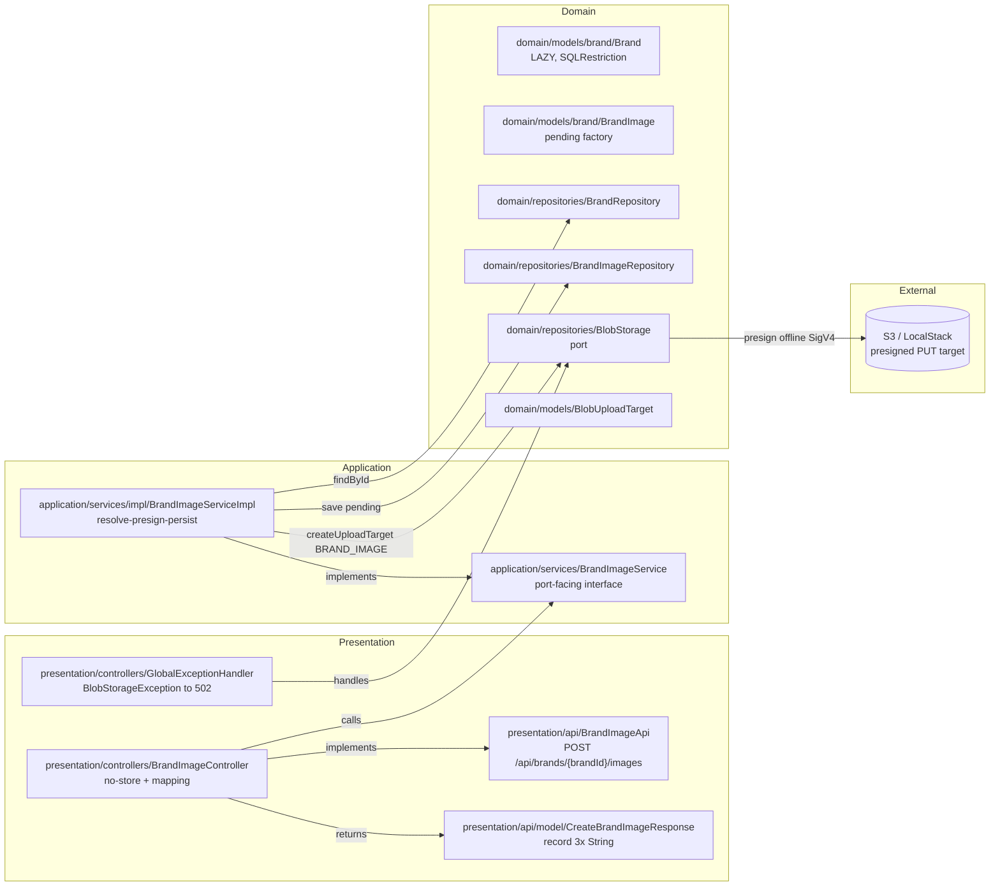
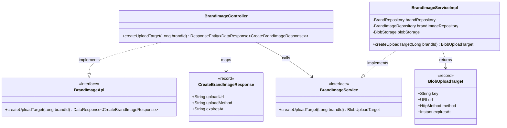
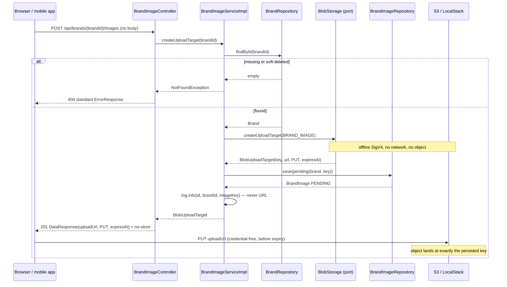
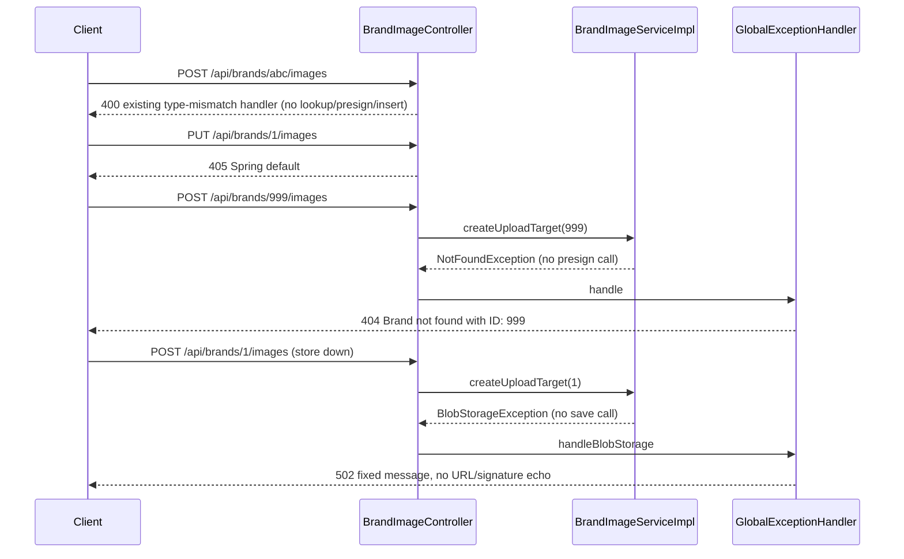

# Design: kan-11-brand-image-upload-target — Brand Image Upload Target Endpoint

## Context

See `proposal.md` (Why / What Changes) for motivation and `specs/brands-management/spec.md` /
`specs/blob-storage/spec.md` for the behavioral contract — not restated here.

Current state shaping this design:

- `BlobStorage.createUploadTarget(BlobType)` (KAN-10) mints a canonical key
  `brands/images/<32 hex>` plus a credential-free presigned `PUT` URL. `S3BlobStorageAdapter`
  proves the presign path is an **offline SigV4 computation** (`S3Presigner.presignPutObject`,
  no `S3Client` call) — load-bearing for §4.
- `BrandImage.pending(brand, imageKey)` + `BrandImageRepository` + `brand_images.status`
  lifecycle (KAN-12) is the sole sanctioned creation path. `Brand.brand` is a
  `FetchType.LAZY @ManyToOne`; `Brand` carries `@SQLRestriction("deleted_at IS NULL")`, so one
  `findById` covers missing and soft-deleted.
- `JsonConfig` exposes a bare `new ObjectMapper()` with no `JavaTimeModule`; `HttpMethod`
  serializes as `{"name":"PUT"}`. Response DTO types are therefore load-bearing (§4.3).
- `GlobalExceptionHandler` has no `BlobStorageException` case today (falls through to
  `handleGeneric` → `500`). The existing `MethodArgumentTypeMismatchException` handler already
  covers non-numeric `brandId` → `400`.
- `localstack-resources.yml` bucket already has a permissive CORS rule
  (`GET, PUT`, `AllowedHeaders: *`, `AllowedOrigins: *`); the confirmed browser caller makes an
  explicit, forward-compatible rule a definition-of-done item (§6).

## Goals / Non-Goals

**Goals:**

- Wire resolve → presign → persist behind `POST /api/brands/{brandId}/images` returning `201`
  with exactly `uploadUrl` / `uploadMethod` / `expiresAt` (all `String`) and
  `Cache-Control: no-store`, establishing the reusable asset-creation template.
- Return `BlobUploadTarget` from the service so the controller never touches the entity
  (lazy-proxy trap neutralised structurally).
- Map `BlobStorageException` → `502` with a fixed non-echoing message; never log, persist, or
  exemplify a presigned URL.
- Keep the diff minimal: 5 new main files + 1 handler case + CORS; no migration, no new package.

**Non-Goals:**

- Confirmation `PENDING → UPLOADED` (KAN-12 F2, now forced to S3 → SQS by D2), listing/reading
  + `urlFor(key)` (F3), delete/reclaim/sweep (F4), declared MIME type (F12 — a contract change
  to this endpoint), size limits / virus scan (F7), auth / rate limiting (production gate),
  soft-delete cascade, ordering / primary-image, generic `AssetUploadService<T>` (deferred per
  DRY Rule of Three to the 2nd/3rd asset occurrence).
- No `Location` header (would expose the withheld identifier and point at a read endpoint that
  does not exist until F3). No cap on concurrent `PENDING` rows (D4: no auth exists, so a cap
  is not a real control; accepted risk, F4 sweeps via `ix_brand_images_pending_created`).

## Decisions

### D1 — `POST` + `201`, no body, `PUT` → `405` (closed, from proposal D1)

Non-idempotent collection create; matches `docs/backend-standards.md` and all three existing
creates. Alternatives (`PUT` on collection) rejected: RFC 9110 §9.3.4 semantics + no request
body. Spring's default `405` covers AC13 with no code.

### D2 — Response is exactly three `String` fields; row is an invisible side effect (closed, from proposal D2)

`CreateBrandImageResponse(String uploadUrl, String uploadMethod, String expiresAt)` — no `id`,
`brandId`, `imageKey`, `status`. `status` is always `PENDING` (constant noise); `imageKey` is an
internal scheme; `id` is deliberately withheld (forces F2 to S3 → SQS). Consequences:
`BrandImageUploadTicket` / `application/services/model/` package dissolved (D5); `Location`
header dissolved (D3); controller never touches `BrandImage` (§6.2 trap neutralised).

### D3 — Separate `BrandImageService`, not a 5th method on `BrandService` (proposal D6 → adopted)

SRP + ISP (`docs/backend-standards.md`): `BrandService` is already wide; confirm/list/delete
(F2/F3) land next to this method, not next to brand CRUD.

### D4 — Service returns `BlobUploadTarget` directly (proposal D5 dissolved by D2)

No ticket/result record, no new package, no project-structure doc change. DIP preserved:
application depends on the `BlobStorage` port abstraction, never the S3 concretion.

### D5 — `BlobStorageException` → `502` fixed message (first HTTP exposure of the port)

`502` (upstream dependency failure), not `500` (our bug) nor `503` (no retry-after known).
Client message is the fixed string `Blob storage is currently unavailable` — never
`ex.getMessage()` (embeds blob key / failed-key set). `log.error` keeps the stack trace; the
port never logs URLs so key-only discipline holds.

### D6 — In-transaction presign is an explicit, justified exception

Presigning inside `@Transactional` is normally an anti-pattern (external call holding a DB
connection). It is acceptable **only** because `S3Presigner.presignPutObject` is a verified
offline HMAC computation — no `S3Client` call on that path, target p95 < 5 ms. This keeps the
resolve → presign → persist ordering atomic (insert failure rolls back before any URL is
disclosed, AC9) at zero connection-hold cost. **Guard:** if the port ever gains network I/O
on this path, the presign must move outside the transaction (recorded in §9 Open Questions).

### D7 — `String` DTO types are load-bearing, not cosmetic (§6.1 traps)

`uploadMethod` is `target.method().name()` (`String`), never `HttpMethod`; `expiresAt` is
`target.expiresAt().toString()` (ISO-8601 UTC `String`), never `Instant` — same precedent as
`ErrorResponse.timestamp`. Registering `JavaTimeModule` globally is a cross-cutting change
deferred to F9. Exact-JSON assertions (not status-only) pin this.

### D8 — `IllegalArgumentException` from `BrandImage.pending()` stays `500`

Unreachable programming error under the §4 ordering (brand resolved, key port-issued and
factory re-validated via `BRAND_IMAGE.isKeyOf`). Do **not** add an
`IllegalArgumentException → 400` handler — it would convert real bugs into client errors
codebase-wide. A unit test pins that a non-canonical key never reaches the factory.

## Architecture and Layering

DDD / Clean Architecture placement (mirrors `BrandApi` / `BrandController` conventions):

- `presentation/api` — `BrandImageApi` (`@RequestMapping("/api/brands/{brandId}/images")`,
  `@Tag(name = "Brand Images")`, `@Validated`, one `@PostMapping` → `@ResponseStatus(CREATED)`).
- `presentation/api/model` — `CreateBrandImageResponse` record (3 `String`s).
- `presentation/controllers` — `BrandImageController implements BrandImageApi`
  (`@RestController`, ticket-to-DTO mapping, `Cache-Control: no-store` on the success response).
- `application/services` — `BrandImageService` (`BlobUploadTarget createUploadTarget(Long brandId)`)
  + `BrandImageServiceImpl` (`@Service @RequiredArgsConstructor @Slf4j`, orchestration §4).
- `presentation/controllers/GlobalExceptionHandler` — new `BlobStorageException → 502` case.
- `localstack-resources.yml` — explicit bucket `CorsConfiguration` (PUT, app origins, `content-type`
  allowed header for F12 forward-compatibility).
- Untouched: `BrandImage`, `BrandImageRepository`, `AssetStatus`, `BlobType`, `BlobStorage`,
  `S3BlobStorageAdapter`, `BrandService`, `BrandRepository`, `JsonConfig`. **No Flyway migration**
  (`brand_images` correct as of `V0.1.1` — a migration here is a review-blocking smell).
  **No new package** (D5 dissolved).





SOLID / DDD reading:

- SRP: `BrandImageService` owns only asset-target orchestration; `BrandService` untouched;
  `BlobType` still owns prefixes alone; validation (`isKeyOf`) lives with the data.
- OCP: a second asset table copies the controller/service/DTO triple verbatim; generic
  `AssetUploadService<T>` extracted only at the 2nd/3rd occurrence (DRY Rule of Three).
- ISP: service exposes exactly one operation; no client depends on unused members.
- DIP: service depends on the `BlobStorage` port abstraction; S3 concretion injected by Spring.
- DRY: key scheme exists once in `BlobType`; TTL/bucket once in `AwsS3Properties`; no new
  package, no ticket record, no duplicated prefix regex.
- Ubiquitous language: `upload target`, `PENDING`, `imageKey`, `BlobUploadTarget` shared by
  specs, logs, and code; AWS terms never cross the port boundary.

## Detailed Design

### 4.1 `BrandImageApi` — new presentation port

- Location: `src/main/java/com/example/demo/presentation/api/BrandImageApi.java`
- `@RequestMapping("/api/brands/{brandId}/images")`, `@Tag(name = "Brand Images",
  description = "Brand image asset endpoints")`, `@Validated`.
- One method: `@PostMapping` + `@ResponseStatus(CREATED)`,
  `DataResponse<CreateBrandImageResponse> createUploadTarget(@PathVariable Long brandId)`,
  with `@Operation` + `@ApiResponses` for `201/400/404/502` matching `BrandApi` style. No
  `@RequestBody` — a body sent by the client is ignored; the key is never caller-supplied.

### 4.2 `CreateBrandImageResponse` — 3-`String` record

- Location: `src/main/java/com/example/demo/presentation/api/model/CreateBrandImageResponse.java`
- `public record CreateBrandImageResponse(String uploadUrl, String uploadMethod, String expiresAt) {}`
- Mapping: `uploadUrl = target.url().toString()`, `uploadMethod = target.method().name()`
  (literal `"PUT"`), `expiresAt = target.expiresAt().toString()`. OpenAPI `uploadUrl` example is
  a **placeholder** (e.g. `https://example.invalid/brands/images/placeholder`), never a real
  presigned URL.

### 4.3 `BrandImageController` — bearer-capability handling

- Location: `src/main/java/com/example/demo/presentation/controllers/BrandImageController.java`
- `@RestController implements BrandImageApi`; calls the service, maps `BlobUploadTarget` to the
  DTO, returns `ResponseEntity` with `Cache-Control: no-store` and status `201`. Never touches
  `BrandImage` or the lazy `Brand` proxy (open-in-view-proof by construction). No `Location`
  header. Never logs the URL.

### 4.4 `BrandImageService` + `BrandImageServiceImpl` — ordering is the design

- Locations: `src/main/java/com/example/demo/application/services/BrandImageService.java`,
  `.../services/impl/BrandImageServiceImpl.java`
- `@Transactional(rollbackFor = Exception.class, propagation = Propagation.REQUIRED)`.
- Steps: (1) resolve brand first — single `findById`, `@SQLRestriction` covers missing +
  soft-deleted → `NotFoundException("Brand not found with ID: " + brandId)` → `404` (AC5), no
  key minted on bad request (AC7); (2) `blobStorage.createUploadTarget(BlobType.BRAND_IMAGE)` —
  local SigV4, no network, no object created; `BlobStorageException` → `502`, nothing persisted
  (AC8); (3) `brandImageRepository.save(BrandImage.pending(brand, target.key()))` — factory
  re-validates key ownership and forces `PENDING`; (4) `log.info` with
  `saved.getId(), brandId, saved.getImageKey()` — **key only, never URL** (AC11); return `target`.
- `BRAND_IMAGE` literal pinned by an `ArgumentCaptor<BlobType>` test (copy-paste guard).
- `IllegalArgumentException` from the factory is unreachable and stays `500` (D8).
- In-transaction presign justification: see D6.

### 4.5 `GlobalExceptionHandler` — `BlobStorageException` → `502`

- New `@ExceptionHandler(BlobStorageException.class)` returning `502 BAD_GATEWAY` with the
  standard `ErrorResponse` and the fixed message `Blob storage is currently unavailable`
  (`field: "general"`). `log.error("Blob storage operation failed", ex)` — stack trace kept,
  URL/signature material never echoed (port messages carry key only; defence in depth for AC11).

### 4.6 `localstack-resources.yml` — explicit CORS (hard prerequisite)

- Narrow the existing permissive rule to the documented minimum:
  `AllowedMethods: [PUT]`, `AllowedOrigins: [<app origins>]` (`*` acceptable locally only),
  `AllowedHeaders: [content-type]` (F12 forward-compatibility), `MaxAge: 3000`. Production
  bucket rule rides the infrastructure track (KAN-14 / KAN-12 F7).

## Interactions

### 5.1 Happy path — resolve → presign → persist → return



### 5.2 Failure paths



Key assertions for tasks: `verify(blobStorage, never())` on 404 (AC7);
`verify(brandImageRepository, never()).save(any())` on presign failure (AC8); transaction
rollback with no URL disclosed on insert failure (AC9); each call yields a distinct key/row/URL
(AC4).

## API Contract

Request: `POST /api/brands/{brandId}/images`, no body, no caller-supplied key.

Success `201 Created` (`Cache-Control: no-store`):

```json
{
  "data": {
    "uploadUrl": "https://example.invalid/brands/images/placeholder",
    "uploadMethod": "PUT",
    "expiresAt": "2026-09-22T10:15:30Z"
  }
}
```

Error matrix (all in the existing `ErrorResponse` shape): `400` non-numeric `brandId`
(existing handler, no side effects); `404` missing/soft-deleted (existing `NotFoundException`
handler); `405` wrong verb (Spring default); `502` presign failure (new fixed-message handler);
`500` anything else (existing `handleGeneric`).

OpenAPI: `@Tag(name = "Brand Images", ...)` on the new API interface plus `@Operation` /
`@ApiResponses` for `201/400/404/502` in `BrandApi` style; schema example for `uploadUrl` is a
placeholder only.

## Test Strategy (hooks for opsx-tasks; TDD red-first)

- Service unit (`BrandImageServiceTests`, all mocks; `ServiceTest` mock bag gains
  `@MockitoBean BrandImageRepository` + `@MockitoBean BlobStorage`, then re-run
  `BrandServiceTests`/`ProductServiceTests`/`DispensaryServiceTests` unchanged): captor on
  `save` proves `status == PENDING` and `imageKey == target.key()` (row invisible in response,
  so **ArgumentCaptor is PENDING-required**); returns exactly the port target; 404 missing +
  404 soft-deleted (mock `findById` empty); `never()` presign on 404; `never()` save on
  `BlobStorageException`; exception not swallowed; `BRAND_IMAGE` captor; **ListAppender over the
  service logger asserting no URL** (pattern from `S3BlobStorageAdapterTests` ~line 255).
- Controller (`BrandImageControllerTests`, `@WebMvcTest` mocked service): `201` + **exact JSON**
  (`uploadMethod == "PUT"`, `expiresAt` is string, `$.data` has exactly 3 keys, `id/brandId/
  imageKey/status` absent — D2 regression guard); `no-store`; `404` standard shape; `400` on
  `/api/brands/abc/images`; `502` on `BlobStorageException`; `405` on `PUT`.
- Handler (`GlobalExceptionHandlerTest` extend): `502` case asserting the body carries the fixed
  message and **not** the exception's own text.
- Integration (`BrandImageEndpointsTests`, real Postgres + LocalStack, `EndpointIntegrationTest`
  pattern): `201` + one `PENDING` row; real credential-free `HttpClient PUT` → `headObject` at
  the key **read from the row via `findByBrandIdAndStatus(..., PENDING)`** (never parsed from
  `uploadUrl`); twice → distinct URLs/keys; 404 soft-deleted + 404 missing with row-count
  assertions; native `SELECT *` proves no column holds `X-Amz-Signature`. `@AfterEach` runs
  `DELETE FROM brand_images` **before** `DELETE FROM brands` (**FK delete order** — `Brand`
  `@SQLDelete` soft-deletes, `BrandImage` has none).
- Coverage gate 90% branches/lines on new classes. AC14 (browser preflight) is **not provable**
  by the suite (LocalStack ignores CORS; MockMvc/`HttpClient` are not browsers) — mandatory
  manual browser `fetch PUT` from the real app origin, recorded in `reports/` with the `curl`
  verification (KAN-8/KAN-12 precedent); missing browser check = incomplete DoD.

## Files Affected

New (5 main + 3 test):

- `src/main/java/com/example/demo/presentation/api/BrandImageApi.java`
- `src/main/java/com/example/demo/presentation/api/model/CreateBrandImageResponse.java`
- `src/main/java/com/example/demo/presentation/controllers/BrandImageController.java`
- `src/main/java/com/example/demo/application/services/BrandImageService.java`
- `src/main/java/com/example/demo/application/services/impl/BrandImageServiceImpl.java`
- `src/test/.../application/services/BrandImageServiceTests.java`
- `src/test/.../presentation/controllers/BrandImageControllerTests.java`
- `src/test/.../integration/endpoints/BrandImageEndpointsTests.java`

Modified (4):

- `src/main/java/com/example/demo/presentation/controllers/GlobalExceptionHandler.java`
  (new `BlobStorageException → 502` case)
- `src/test/.../application/services/ServiceTest.java` (add 2 `@MockitoBean`s)
- `src/test/.../presentation/controllers/GlobalExceptionHandlerTest.java` (`502` case)
- `localstack-resources.yml` (explicit `CorsConfiguration`)

Deleted (0). No Flyway migration. No new package. No changes to the explicitly-untouched list
in Architecture above; diffs there mean scope creep.

## Risks / Trade-offs

- [Risk] Browser preflight fails while the suite stays green (highest risk; LocalStack does not
  enforce CORS) → Mitigation: explicit CORS rule in scope + mandatory manual browser check as DoD.
- [Risk] Unauthenticated capability minting (no auth codebase-wide; browser-reachable here, no
  longer theoretical) → Mitigation: accepted risk behind the no-production-exposure gate (D4);
  F8 (auth + rate limiting) gates production.
- [Risk] In-transaction presign becomes a connection-holding anti-pattern if the port gains
  network I/O → Mitigation: D6 documents the offline-SigV4 exception + guard; move presign out
  if the adapter changes.
- [Risk] `PENDING` orphans from unconfirmed uploads / mobile retries on short TTL → Mitigation:
  accepted debt; `ix_brand_images_pending_created` ready for F4 sweeper; F11 sizes TTL vs blast radius.
- [Risk] Wrong/missing `Content-Type` on objects until F12 (presign is unsigned) degrades F3 reads;
  not retroactively fixable from the key → Mitigation: F12 scheduled as a contract change before
  F3 if possible; CORS already forward-compatible.
- [Risk] `ServiceTest` shared mock bag churn → Mitigation: re-run all service suites unchanged;
  split logged as F10.
- [Trade-off] Withheld `id` forces F2 to the larger S3 → SQS model (+ widen `products/`-only
  filter) → Accepted: keeps response minimal, key scheme free, no enumeration surface.
- [Trade-off] No `PENDING` cap → Accepted per D4 (cap without auth is not a control).

## Migration Plan

Zero migration: no schema change, additive code only. Deploy: merge service + controller +
handler + CORS config; restart local stack to pick up `CorsConfiguration`. Rollback: revert the
change; previously issued presigned URLs expire via `aws.s3.presign-ttl`; orphaned `PENDING`
rows await F4 sweep. No data backfill.

## Open Questions

1. Presign TTL sizing for backgrounded mobile uploads (F11) — input to F4's retention window;
   deferrable, does not change this design.
2. F12 MIME story will change this endpoint's contract (port signature + request body +
   allow-list `400` + likely migration) — noted, not designed here.
3. Confirm no image metadata (alt text, caption, position) is needed at creation — else the
   endpoint gains a body + migration.
