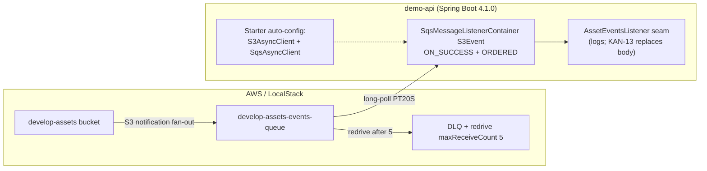
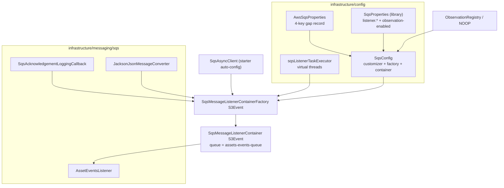
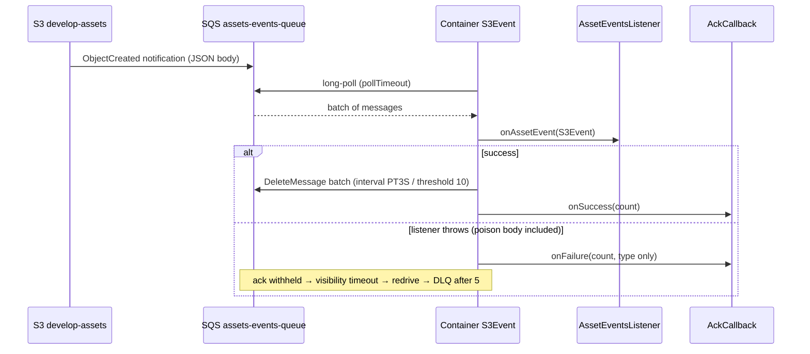

# Design: kan-16-spring-cloud-aws-foundation

## Overview

Adopt the managed Spring Cloud AWS async foundation **before** the first
consumer (KAN-13 rework) is written. The starters auto-configure singleton
`S3AsyncClient` and `SqsAsyncClient` beans from `spring.cloud.aws.*`
(region, endpoint, default credential chain). One managed
`SqsMessageListenerContainer<S3Event>` consumes the already-provisioned
`develop-assets` bucket → `develop-assets-events-queue` fan-out
(DLQ + redrive `maxReceiveCount: 5` in `localstack-resources.yml`) with
`ON_SUCCESS` + `ORDERED` batch acknowledgement, throughput-adaptive polling,
and Micrometer observation. The existing hand-rolled `@Scheduled` poller
designed in KAN-13 is **superseded and MUST NOT be implemented**.

This is pure infrastructure: no business logic, no REST endpoint, no Flyway
migration. KAN-13 consumes the `AssetEventsListener` seam.

## Goals / Non-Goals

**Goals:**

- Starter-owned async clients with exactly one region/endpoint source of truth
  (`spring.cloud.aws.*`).
- One fail-lazy listener container with externalised tuning and observability.
- Migration of `AwsS3Properties` / `S3Config` (KAN-14) onto the same keys.
- LocalStack parity (one env var covers both services) and zero new operator
  env vars.

**Non-goals (explicit follow-ups):**

- Any business handling of `S3Event` (KAN-13 `BrandImageConfirmService`,
  `BlobUploadEvent` derivation, key validation).
- REST endpoints, Flyway migrations, `SqsTemplate` producers, DLQ alarms,
  production queue-policy scoping, SQS Actuator health indicator, orphan
  sweeper, strain/product consumers.

## Architecture

### Context



### Container wiring (component view)



### Sequence (steady state + failure)



## Detailed Design

### D1 — `pom.xml`: BOM 4.1.0 + starters + lambda-events 3.16.0

Pin in `<properties>` (never floating):

- `spring-cloud-aws.version = 4.1.0` (latest at refinement, pairs with
  Spring Cloud `2025.1.x` / Boot `4.x` / Framework `7.x` / SDK BOM `2.55.1`).
  Re-verify on Maven Central at implementation time; if a newer `4.1.x`
  exists, take it and record it in the PR.
- `aws-lambda-events.version = 3.16.0` (any `3.11.1+` deserialises `S3Event`;
  pin exactly one).

`dependencyManagement` (existing AWS SDK BOM stays **first**):

- `software.amazon.awssdk:bom:${aws-sdk.version}` (import).
- `io.awspring.cloud:spring-cloud-aws-dependencies:${spring-cloud-aws.version}`
  (import).

Compile dependencies:

- `io.awspring.cloud:spring-cloud-aws-starter-s3` (no version — BOM managed).
- `io.awspring.cloud:spring-cloud-aws-starter-sqs` (no version — BOM managed).
- `com.amazonaws:aws-lambda-java-events:${aws-lambda-events.version}`
  (provides `com.amazonaws.services.lambda.runtime.events.S3Event`).

**Duplicate-finder risk (top build risk):** the gate runs with
`failBuildInCaseOfConflict=true` + `checkRuntimeClasspath=true`. Spring Cloud
AWS brings Jackson/Netty/Micrometer artefacts overlapping the SDK. Procedure:
add dependencies **first**, run `mvn verify` before writing code. If a
conflict appears, add a justified `<ignoredDependencies>` entry in the PR —
never widen silently.

### D2 — Properties: `AwsSqsProperties` (4-key gap record) + `AwsS3Properties` shrink

**New** `infrastructure/config/AwsSqsProperties.java`:

```java
@ConfigurationProperties(prefix = "aws.sqs")
@Validated
public record AwsSqsProperties(
    @NotBlank String assetsEventsQueue,
    @NotNull Duration acknowledgementInterval,
    @Positive int acknowledgementThreshold,
    @NotNull Duration apiCallTimeout) {}
```

Registered via `@EnableConfigurationProperties(AwsSqsProperties.class)` on
`SqsConfig`. Carries **only** what the library does not model:
queue name (domain concern), ack interval/threshold (no
`SqsProperties.Listener` fields — verified against source), API timeout
(needs a customizer). Everything else (concurrency, poll size, poll timeout,
backoff, auto-startup, observation toggle) is read from the injected
library `SqsProperties` — never re-declared here (DRY, §3.1 migration map).

**Modified** `infrastructure/config/AwsS3Properties.java` — shrink to the
domain gap:

```java
@ConfigurationProperties(prefix = "aws.s3")
@Validated
public record AwsS3Properties(@NotBlank String bucket, @NotNull Duration presignTtl) {}
```

Deleted as sources of truth: `region`, `endpoint`, `pathStyleAccess`
(now `spring.cloud.aws.region.static` /
`spring.cloud.aws.s3.endpoint` + global `spring.cloud.aws.endpoint` fallback /
`spring.cloud.aws.s3.path-style-access-enabled`). Env-var surface is unchanged
(YAML maps `AWS_REGION`, `AWS_ENDPOINT_URL_S3`, `AWS_S3_PATH_STYLE_ACCESS` onto
the new keys). Ack mode (`ON_SUCCESS`) and ordering (`ORDERED`) stay hardcoded
enums per ticket (see D9).

### D3 — `S3Config` migration: Option A (preferred) vs Option B (minimal diff)

Current state builds `S3Client`/`S3Presigner` by hand with
`Region.of(properties.region())` + `DefaultCredentialsProvider.create()` +
`hasEndpointOverride()` branches. Both options below remove the second source
of truth; pick **one**, do not mix:

| | Option A — delegate to starters (preferred) | Option B — re-source beans (minimal diff) |
|---|---|---|
| Change | Delete manual `S3Client`/`S3Presigner` `@Bean` methods. Starters auto-configure `S3Client`, `S3AsyncClient`, `S3Presigner` from `spring.cloud.aws.*`. Keep only bucket/TTL domain config in application code. | Keep `@Bean` methods but inject the library `AwsRegionProvider` (+ `@Value("${spring.cloud.aws.s3.endpoint:}")` / `@Value("${spring.cloud.aws.endpoint:}")` with service-over-global precedence + `path-style-access-enabled`). Never `Region.of(...)` from own properties again. |
| Pros | Zero hand-rolled builders; single ownership; less code to test. | Smaller diff; keeps explicit bean shape for review. |
| Cons | Larger deletion in one step (still mechanical). | Hand-rolled builders survive; higher clash/ drift risk. |
| Tests | Delete/retire old override tests; rely on starter contract + new endpoint-both-ways tests through library keys. | Update existing both-ways override tests to `spring.cloud.aws.s3.endpoint` (set vs absent); move empty-string → `null` contract to library keys. |

Either way, hard rules:

- No `DefaultCredentialsProvider.create()` in application code (starters wire
  the default chain when `spring.cloud.aws.credentials.*` is absent).
- No `aws.region` / `aws.s3.endpoint` reads.
- No network probe at bean creation (`listBuckets`/`headBucket` forbidden).
- `S3AsyncClient` needs **no new `S3AsyncConfig` class** — it arrives with the
  starter; add a customizer only if S3 needs non-default tuning (it does not
  in this slice).
- **Clash warning:** a manual `S3AsyncClient`/`SqsAsyncClient` `@Bean` next to
  the starters causes duplicate-bean/conditional surprises. Customizers are
  the supported extension point. DoD greps for
  `S3AsyncClient.builder()` / `SqsAsyncClient.builder()` outside tests.

### D4 — `SqsConfig`: customizer, factory, container (no manual client bean)

**No manual `SqsAsyncClient` `@Bean`.** The starter auto-configures it from
`spring.cloud.aws.*`. `SqsConfig` only customizes and builds the listener:

- `AwsClientCustomizer<SqsAsyncClientBuilder> sqsApiTimeoutCustomizer()` —
  applies `overrideConfiguration(cfg -> cfg.apiCallTimeout(properties.apiCallTimeout()))`
  (1.5 s ticket requirement). Unit-testable without network by applying the
  customizer to a builder and asserting the override.
- `SqsMessageListenerContainerFactory<S3Event> sqsListenerContainerFactory(...)`
  — builder options contract (option set is normative; fluent spelling must be
  adapted to the `4.1.0` javadoc — `SqsContainerOptionsBuilder` naming moved
  between 3.x and 4.x):
  - `acknowledgementMode = ON_SUCCESS` (fixed enum).
  - `acknowledgementOrdering = ORDERED` (fixed enum).
  - `acknowledgementInterval` / `acknowledgementThreshold` from the 4-key gap
    record (`PT3S` / `10` defaults).
  - `maxConcurrentMessages` / `maxMessagesPerPoll` / `pollTimeout` /
    `maxDelayBetweenPolls` / `autoStartup` from injected library
    `SqsProperties.getListener()` — the same values the auto-config maps onto
    its default factory (`SqsAutoConfiguration.configureProperties`). This
    keeps one source of truth while giving the custom factory full control.
  - `backPressureHandler = new ThroughputBackPressureHandler()` (adapts poll
    rate to throughput; replaces KAN-13's fixed `PT5S` delay).
  - `acknowledgementResultCallback` = logging callback (D5).
  - `taskExecutor` = virtual-threads executor (D6).
  - `messageConverter = new JacksonJsonMessageConverter()` (maps S3→SQS JSON
    body to `S3Event`; poison body surfaces as listener exception → ack
    withheld → redrive → DLQ, never swallowed).
  - `observationRegistry` = injected registry when
    `sqsProperties.isObservationEnabled() == true`, else
    `ObservationRegistry.NOOP` (ternary — both branches covered by tests;
    mirrors the auto-config gating; guards the library default-`false` trap).
- `SqsMessageListenerContainer<S3Event> assetEventsContainer(factory, listener)` —
  always created (no `@ConditionalOnProperty` suppression);
  `factory.createContainer("asset-events")`,
  `setQueueNames(properties.assetsEventsQueue())`,
  `setMessageListener(listener::onAssetEvent)`. Lifecycle managed by Spring.
  The logical queue name (`develop-assets-events-queue`) is resolved to a URL
  via `GetQueueUrl` (works against LocalStack). Tests set
  `auto-startup: false` (created-but-stopped, started manually).

### D5 — `SqsAcknowledgementLoggingCallback`

`infrastructure/messaging/sqs/SqsAcknowledgementLoggingCallback.java`,
`@Component`, implements `AcknowledgementResultCallback<S3Event>`:

- `onSuccess`: `log.debug("Acknowledged {} asset-event message(s)", size)`.
- `onFailure`: `log.error("Failed to acknowledge {} asset-event message(s): {}",
  size, throwable.toString())`.

Rules: generic type **must** match the container (`<S3Event>` — a raw-type
callback compiles but never fires). Never log payloads, keys, URLs, queue URLs
with account IDs, or exception messages embedding key material — counts and
exception type only (grep-verified in DoD).

### D6 — Virtual-threads `TaskExecutor`

```java
@Bean
public TaskExecutor sqsListenerTaskExecutor() {
  return Executors.newVirtualThreadPerTaskExecutor();
}
```

Placed in `SqsConfig` or a small `SqsListenerTaskExecutorConfig` (either is
fine; one bean, one place). Aligns with `spring.threads.virtual.enabled=true`
(Java 21). `TaskExecutor` adapts `ExecutorService` via `TaskExecutorAdapter`
on Boot 4 — check the factory's expected type (`TaskExecutor` vs `Executor`)
in `4.1.0` and adapt without introducing a `ThreadPoolTaskExecutor`
(virtual threads are uncapped by design; concurrency is governed by
`maxConcurrentMessages`, not pool size). SRP: executor provisioning is
separate from container options.

### D7 — `AssetEventsListener` seam (KAN-13 hook)

`infrastructure/messaging/sqs/AssetEventsListener.java`, `@Component`:

- `void onAssetEvent(S3Event event)` — logs
  `event.getRecords().size()` at DEBUG, delegates to a hook. KAN-13 replaces
  the body with `BlobUploadEvent` derivation +
  `BrandImageConfirmService.confirmUploaded`.
- No DB access in this slice. Downstream must URL-decode
  `record.getS3().getObject().getKey()` and validate every key through
  `BlobType` prefix match (never trust a sender-supplied blob-type field).
  `S3Event.getRecords()` → `S3EventNotificationRecord` →
  `record.getS3().getBucket().getName()` / `...getObject().getKey()`.

### D8 — `application.yml` (main + test) with env mappings, credentials absent

Main (`src/main/resources/application.yml`) — append alongside existing `aws`
block (replacing `aws.region` / `aws.s3.endpoint` / `aws.s3.path-style-access`
as sources of truth):

```yaml
spring:
  cloud:
    aws:
      region:
        static: ${AWS_REGION:us-east-1}
      endpoint: ${AWS_ENDPOINT_URL:}                       # global LocalStack override (empty => real AWS)
      s3:
        endpoint: ${AWS_ENDPOINT_URL_S3:${AWS_ENDPOINT_URL:}} # service override wins over global
        path-style-access-enabled: ${AWS_S3_PATH_STYLE_ACCESS:false}
      sqs:
        endpoint: ${AWS_ENDPOINT_URL_SQS:${AWS_ENDPOINT_URL:}}
        observation-enabled: true                   # library default is false; must opt in
        listener:
          max-concurrent-messages: ${AWS_SQS_MAX_CONCURRENT_MESSAGES:10}
          max-messages-per-poll: ${AWS_SQS_MAX_MESSAGES_PER_POLL:10}
          poll-timeout: ${AWS_SQS_POLL_TIMEOUT:PT20S}
          max-delay-between-polls: ${AWS_SQS_MAX_DELAY_BETWEEN_POLLS:PT10S}
          auto-startup: ${AWS_SQS_AUTO_STARTUP:true}
      # credentials intentionally absent => SDK default chain (IRSA / instance profile / env in prod)

aws:
  s3:
    bucket: ${AWS_S3_BUCKET:develop-assets}
    presign-ttl: ${AWS_S3_PRESIGN_TTL:PT15M}
  sqs:
    assets-events-queue: ${AWS_SQS_ASSETS_EVENTS_QUEUE:develop-assets-events-queue}
    acknowledgement-interval: ${AWS_SQS_ACK_INTERVAL:PT3S}
    acknowledgement-threshold: ${AWS_SQS_ACK_THRESHOLD:10}
    api-call-timeout: ${AWS_SQS_API_CALL_TIMEOUT:PT1.5S}
```

Test (`src/test/resources/application.yml`):

```yaml
spring:
  cloud:
    aws:
      region:
        static: us-east-1
      endpoint: http://localhost:4566
      s3:
        path-style-access-enabled: true
      sqs:
        observation-enabled: true
        listener:
          max-concurrent-messages: 2
          max-messages-per-poll: 10
          poll-timeout: PT5S
          max-delay-between-polls: PT2S
          auto-startup: false                     # created but not started; tests start manually

aws:
  sqs:
    assets-events-queue: develop-assets-events-queue
    acknowledgement-interval: PT1S          # faster batching in tests
    acknowledgement-threshold: 2
    api-call-timeout: PT1.5S
```

Credentials for tests are env vars (`AWS_ACCESS_KEY_ID=test`,
`AWS_SECRET_ACCESS_KEY=test`) so the default chain resolves them — never
`StaticCredentialsProvider`, never `spring.cloud.aws.credentials.*` in
`src/main`. Operator impact: zero new env vars; one export
(`AWS_ENDPOINT_URL=http://localstack:4566`) covers both services unless a
service-level var overrides it.

### D9 — Package placement and dependency hygiene (Clean Architecture / ACL)

- Spring setup in `infrastructure/config/` (`SqsConfig`, `AwsSqsProperties`,
  migrated `S3Config`/`AwsS3Properties`, executor bean).
- AWS specifics in `infrastructure/messaging/sqs/` (callback, listener seam,
  converter wiring).
- **No `software.amazon.awssdk` / `io.awspring` import outside those two
  packages** (storage-port convention extended to messaging; mirrors the
  `BlobStorage` ACL). No vendor type in any domain/application signature or
  port.
- DDD reading: this change is a **Generic Subdomain** (messaging transport) —
  buy/adapt via starters, keep the domain untouched. `AssetEventsListener` is
  the Anti-Corruption Layer boundary: vendor `S3Event` enters here and is
  translated to ubiquitous language (`BlobUploadEvent`) by KAN-13.
- SOLID: SRP per class (properties / factory / callback / executor /
  listener); OCP via customizer extension point (no client-bean modification);
  DIP via constructor injection of `SqsProperties`, `ObservationRegistry`,
  `TaskExecutor`.
- DRY: single source of truth per knob (§3.1 migration map); Rule-of-Three
  respected — the 4-key gap record exists only because the library provably
  lacks those fields.

## Testing Strategy (maps to enriched §6; TDD, `should_*_when_*`, AAA)

Coverage ≥ 90% lines/branches on all new classes; `mvn verify` green with
LocalStack up (surefire excludes `integration/**`, failsafe includes it).

| Design element | Test (enriched §) | Type |
|---|---|---|
| 4-key gap binding | `should_bindGapKnobs_when_ymlBlockIsPresent` | `ApplicationContextRunner`, no network (6.1.1) |
| Threshold validation | `should_rejectInvalidThreshold_when_ackThresholdIsNotPositive` | same (6.1.2) |
| Library migration guard | `should_readListenerTuningFromLibrary_when_springCloudKeysAreSet` | same (6.1.3) |
| Default-chain contract | `should_leaveCredentialsUnset_when_noStaticKeysAreConfigured` | same (6.1.4) |
| Observation opt-in guard | `should_defaultObservationDisabled_when_libraryFlagIsAbsent` | same (6.1.5) |
| 1.5 s timeout | `should_applyApiCallTimeout_when_customizerRuns` | `SqsConfig` unit, hand-built props, no context (6.2.1) |
| Options contract | `should_buildFactoryWithOrderedOnSuccess_when_propertiesAreValid` | same (6.2.2) |
| Wiring | `should_wireBackpressureAndCallbackAndExecutor_when_factoryIsBuilt` | same (6.2.3) |
| Observation ternary | `should_useNoopRegistry_when_libraryObservationIsDisabled` (+ enabled branch) | same (6.2.4, kills mutants) |
| S3 migration | Override both-ways tests through `spring.cloud.aws.s3.endpoint` | updated existing suites (6.2) |
| Callback | `should_logWithoutPayload_when_ackSucceeds` / `should_logErrorWithoutPayload_when_ackFails` | unit, no network (6.3.1–6.3.2) |
| Converter | `should_deserialiseS3Event_when_bodyIsS3NotificationJson` (fixture `s3-notification.json`, `brands%2Fimages%2F<32-hex>`) | unit (6.3.3) |
| Seam | `should_completeWithoutThrow_when_listenerReceivesEvent` | unit (6.3.4) |
| Round trip | `should_injectAsyncClientsAndContainer_when_contextStarts`; `should_deliverS3EventToListener_when_objectIsUploaded` (`putObject` → latch via Awaitility; assert bucket + decoded key); `should_startEmpty_when_queueHasNoMessages` | `@SpringBootTest` + LocalStack SQS+S3, `auto-startup: false`, `AWS_*=test` (6.4) |
| Regression | `EndpointIntegrationTest` and all extending suites stay green | `mvn verify` (6.5) |

Fail-lazy proof (DoD 8): boot with LocalStack stopped — context starts, no
bean creation network call; container logs and retries on backoff.

## Observability

- Container observation gated by library `spring.cloud.aws.sqs.observation-enabled`
  (default `false`; our YAML opts in `true`). Custom factory mirrors the
  auto-config gating (`ObservationRegistry` vs `NOOP` ternary, both branches
  tested).
- `management.endpoints.web.exposure.include` already covers
  `metrics`/`health`; listener timers/traces land in Micrometer. Dashboards
  are a KAN-13 follow-up — this ticket proves the registry is wired.
- Callback logs counts at INFO/DEBUG, failures at ERROR (truncated key only,
  never payload).

## Security

- Credentials exclusively via SDK default chain (`spring.cloud.aws.credentials.*`
  left unset in `src/main`; prod resolves IAM role/IRSA; tests use env
  `AWS_ACCESS_KEY_ID/SECRET_ACCESS_KEY=test`). Never commit static keys, never
  `StaticCredentialsProvider` in `src/main`.
- Never log bodies, keys, presigned URLs, queue URLs with account IDs, or
  `ex.getMessage()` embedding key material (grep-verified in DoD).
- SQS payload is untrusted: seam does no DB access; KAN-13 validates every key
  via `BlobType` before lookup.
- Endpoints from `spring.cloud.aws.*`/env only, never from a request.
- Queue policy `AWS: "*"` in `localstack-resources.yml` is local-only; scoping
  before production is a separate infra ticket (already flagged in KAN-13).

## Decisions

| # | Decision | Rationale | Alternatives rejected |
|---|---|---|---|
| D1 | BOM `4.1.0` + `lambda-events` `3.16.0`, pinned | Latest verified pairing with Boot `4.1.0` / SDK `2.55.1`; reproducible builds | Floating versions (non-reproducible); older BOM (API drift anyway) |
| D2 | 4-key `AwsSqsProperties` gap record; rest from library `SqsProperties` | Library provably lacks ack-batching/timeout fields; avoids dual source of truth | Re-declaring listener knobs in `aws.*` (DRY violation, diverges silently) |
| D3 | Migrate `AwsS3Properties`/`S3Config` in this ticket (clean cut) | One region/endpoint truth; classic `PermanentRedirect`/wrong-endpoint bug eliminated | Strangler aliases (doubles test matrix; needs team sign-off if preferred — see assumption 8) |
| D4 | Option A preferred (delegate S3 clients to starters) | Fewest hand-rolled builders; lowest clash risk | Option B minimal diff (kept as fallback; pick one, do not mix) |
| D5 | No manual `SqsAsyncClient`/`S3AsyncClient` beans; customizers only | Supported extension point; avoids duplicate-bean/conditional clash | Manual builders (rejected — would clash with auto-config) |
| D6 | `ON_SUCCESS` + `ORDERED` hardcoded enums | Ticket contract; correctness-first (at-least-once + idempotent consumer assumed) | Externalised enums / `PARALLEL` (one-line change later if throughput demands) |
| D7 | `ThroughputBackPressureHandler` + virtual threads; concurrency via `maxConcurrentMessages` | Adaptive polling; virtual threads cheap at `10` concurrent; no pool sizing math | Fixed-delay poller (KAN-13 superseded); `ThreadPoolTaskExecutor` (wrong model for virtual threads) |
| D8 | Container always created; `autoStartup` governs lifecycle | Library-idiomatic; tests use `false` + manual start | `@ConditionalOnProperty` suppression (rejected — hides wiring) |
| D9 | Package lock: vendor imports only in `infrastructure/config` + `infrastructure/messaging/sqs` | Ports-and-adapters ACL; domain stays vendor-free | Scattering SDK imports (rejected) |
| D10 | Observation via library flag ternary (`registry` / `NOOP`) | Mirrors auto-config gating; both branches tested (pitest-clean) | Always-on registry (fights library default `false`) |

## Tradeoffs

- **Clean-cut migration vs strangler:** clean cut removes `aws.region`-style
  keys in one step (smaller long-term surface, bigger review). If the team
  prefers aliases-first, record it before implementation.
- **Hardcoded mode/ordering vs externalised:** hardcoding honors the ticket and
  keeps the record at 4 keys; externalising adds two enum properties for a
  need not yet demonstrated.
- **ORDERED correctness vs PARALLEL throughput:** `ORDERED` serialises ack
  batches per partition; `PARALLEL` is a one-line change if load ever demands
  it.
- **Batching latency:** `3 s` / `10` msgs bounds `DeleteMessage` calls to
  ~1/batch but bounds crash-redelivery latency to ~3 s (confirm acceptable
  for "image becomes visible" UX).

## Risks

| # | Risk (enriched §8.3 + new) | Likelihood / Impact | Mitigation |
|---|---|---|---|
| R1 | `duplicate-finder` conflict (Jackson/Netty/Micrometer overlap) | High / build-break | Add deps first, `mvn verify` before code; justified exclusions only |
| R2 | Boot 4.1 API drift (`SqsMessageListenerContainerFactory` / `SqsContainerOptions` naming 3.x→4.x) | High / medium | Option set is normative, spelling adaptive; verify against `4.1.0` javadoc at implementation |
| R3 | Auto-config clash (manual client bean survives next to starters) | Medium / context-break | DoD grep; zero manual builders; customizers only |
| R4 | Silent observability loss (library default `observation-enabled: false`) | Medium / medium | YAML opts in `true`; both ternary branches tested |
| R5 | `pitest` survivors on customizer lambda / ternary | Low / low | Both branches covered (6.2.1 + 6.2.4) |
| R6 | `spotless` (google-java-format + license header) at `validate` | Low / low | Run `mvn spotless:apply`; keep headers |
| R7 | Queue/bucket rename drift vs `localstack-resources.yml` | Low / high | Confirm `develop-assets` / `develop-assets-events-queue` stable pre-merge |
| R8 | Poison-message loop before KAN-13 validation exists | Low / low | Ack withheld → redrive → DLQ after 5; seam does no DB writes |

## Open Questions

1. Confirm KAN-13 poller superseded + refinement note updated (assumption 1).
2. Confirm `ORDERED`, `3 s`/`10`, hardcoded mode/ordering acceptable
   (assumptions 2, 3, 5).
3. Confirm clean-cut migration (assumption 8) vs strangler.
4. Confirm queue/bucket names stable (assumption 6).

None blocks design; all are recorded for the tasks phase / PR checklist.

## Files Affected

- **New (6):** `infrastructure/config/AwsSqsProperties.java`,
  `infrastructure/config/SqsConfig.java`,
  `infrastructure/messaging/sqs/SqsAcknowledgementLoggingCallback.java`,
  executor bean (`SqsListenerTaskExecutorConfig` or inside `SqsConfig`),
  `infrastructure/messaging/sqs/AssetEventsListener.java`,
  `integration/messaging/SqsContainerIntegrationTests.java` (+ unit test files,
  fixture `s3-notification.json`).
- **Modified (7):** `pom.xml`, `infrastructure/config/AwsS3Properties.java`,
  `infrastructure/config/S3Config.java`,
  `src/main/resources/application.yml`,
  `src/test/resources/application.yml`, `README.md`,
  `docs/backend-standards.md` (Messaging/SQS convention).
- **Deleted (0).**

## Scope Verification

- Stays in proposal scope: foundation only; KAN-13 business logic, REST, Flyway,
  `SqsTemplate`, DLQ alarms, prod policy scoping all explicitly out.
- Readable: diagrams + option tables + normative contracts (§5.4 option set,
  §3.3/§3.4 YAML) carry forward verbatim so implementers need no re-derivation.
- No code written in this phase (design only).

## References

- Proposal: `openspec/changes/kan-16-spring-cloud-aws-foundation/proposal.md`.
- Enriched source: `tmp/KAN-16-enriched-us.md` (§5 details, §3.3–3.4 YAML,
  §6 tests, §8 risks).
- Standards: `AGENTS.md`, `docs/backend-standards.md`, `docs/data-model.md`,
  `docs/documentation-standards.md`.
